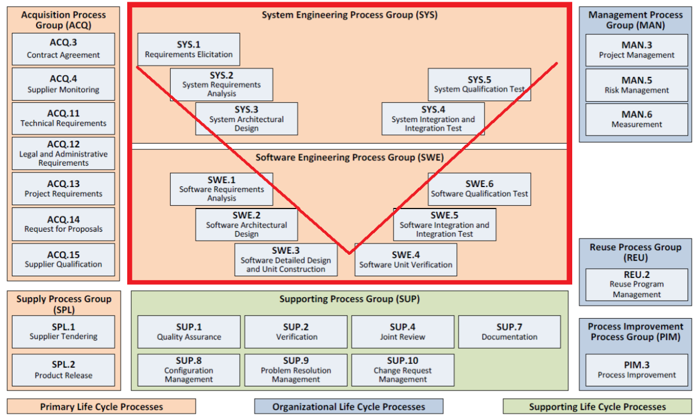
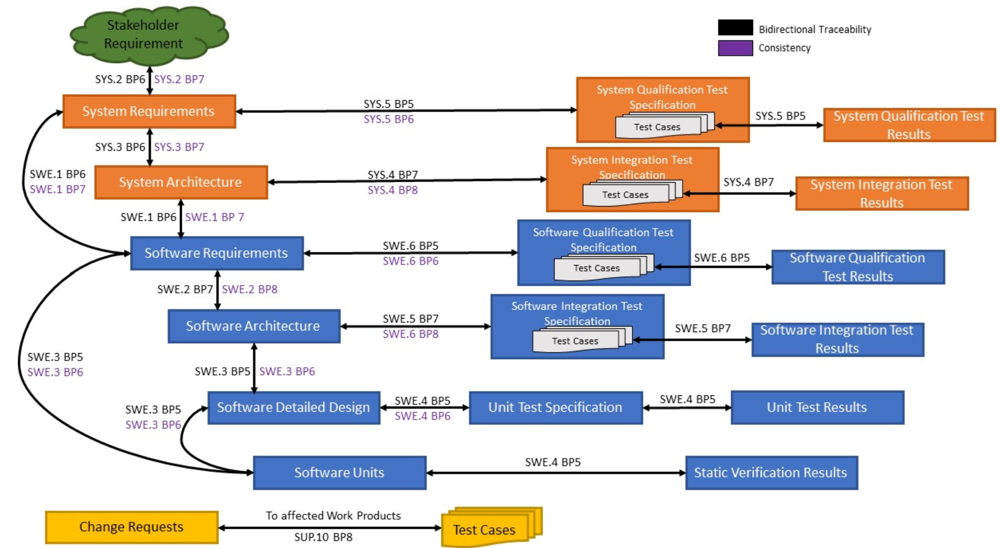

# 1.1 Automotive SPICE (ASPICE) Overview

[← Home](0.0-Introduction.md)

## Concept Introduction

- **Automotive SPICE (ASPICE)** is a domain-specific adaptation of ISO/IEC 33002 (process assessment) combined with a **Process Reference Model (PRM)** and **Process Assessment Model (PAM)** tailored to automotive software/system engineering.
- It does **not** prescribe *how* to do engineering — it defines **what outcomes** a process must produce (work products, base practices) so that an assessor can rate a project's **capability level** per process, from Level 0 (Incomplete) to Level 5 (Innovating).
- OEMs commonly require Tier-1/Tier-2 suppliers to demonstrate **Capability Level 2 or 3** on a defined process scope (a "VDA scope" of ~15 processes) as a contractual gate.
- Current model version widely used: **Automotive SPICE PAM v4.0** (aligned with ISO/IEC 33020:2019 measurement framework), superseding v3.1.

## Scope — Process Groups

ASPICE groups processes by engineering concern. 

- **SYS — System Engineering**: SYS.1 Requirements Elicitation, SYS.2 System Requirements Analysis, SYS.3 System Architectural Design, SYS.4 System Integration & Test, SYS.5 System Qualification Test.
- **SWE — Software Engineering** (the primary home for day-to-day engineering work):
  - SWE.1 Software Requirements Analysis
  - SWE.2 Software Architectural Design
  - SWE.3 Software Detailed Design and Unit Construction
  - SWE.4 Software Unit Verification
  - SWE.5 Software Integration and Integration Test
  - SWE.6 Software Qualification Test
- **SUP — Support processes**: SUP.1 Quality Assurance, SUP.8 Configuration Management, SUP.9 Problem Resolution Management, SUP.10 Change Request Management.
- **MAN — Management processes**: MAN.3 Project Management, MAN.5 Risk Management.
- **ACQ / SPL — Acquisition / Supplier**: relevant when the team itself is a sub-supplier or sources components.

### Capability Level (a.k.a. Process Maturity)

- ASPICE rates **capability** per individual process on a 0–5 scale; source [3] introduces these levels as **"process maturity"**
- **CL0 Incomplete → CL1 Performed**: the process either fails outright or produces inconsistent, ad-hoc results with no systematic management.
- **CL2 Managed**: the process is planned, tracked, and resourced, and **traceability to requirements is established** — this is the industry-standard contractual minimum (see roadmap below).
- **CL3 Established**: the process is defined and tailored from an organization-wide standard process, with systematic process improvement — commonly required for safety-relevant software.
- **CL4 Predictable / CL5 Innovating**: quantitatively managed and continuously optimized respectively; rarely mandated in practice outside very mature suppliers.

### Roadmap to Capability Level 2

- Per [4], reaching CL2 centers on one core capability: **traceability** — the ability to track *who did what and why*, end-to-end from requirements to tests.
  - **What it means** (per [5]): traceability addresses the *relation and coverage* between elements across different work products — it's what enables coverage analysis, impact analysis, and requirement status tracking. This is distinct from **consistency**, which addresses *content and semantics* from one process to the other (i.e., the linked items don't just point at each other, they actually agree).
  - **Where bidirectional traceability is required** (per [5], kept general — the point is the *direction and span* of the links, not memorizing every specific work-product pair):
    - In the engineering processes: between affected work products **on the left side of the V-model**, between **left-side and corresponding right-side** work products, and between **test cases and test results** on the right side.
    - In change request management (SUP.10): between a **change request and the work products it affects**, and between the **change request and its corresponding problem report(s)**.

    

  - **How to implement it**:
    - Maintain these links in a dedicated **Requirements Traceability Matrix (RTM)**, either inside an ALM/requirements-management tool (e.g. DOORS NG, Polarion, Jama, codeBeamer — each with built-in traceability/link views) or, for smaller teams, a well-structured spreadsheet (per [6]: Excel/Google Sheets are explicitly viable if disciplined).
    - Per [6], give every item a **unique, stable ID** (e.g. `SWE-001`) and **never renumber** it — if a requirement is removed, mark it `[DELETED]` rather than deleting the row, so historical links stay valid.
    - Add explicit **status/consistency-check columns** (e.g. `Draft` / `Customer Review` / `Agreed` / `Baselined`, or flags like `MISSING_ID` / `NO_TEST_LINKED`) so gaps are visible at a glance instead of discovered during an assessment.
    - Record **parent traces** (which system requirement a software requirement came from), **component allocation** (which architecture element implements it), and **test linkage** (which test case(s) verify it) as separate, queryable columns/links rather than free-text notes.
    - Update the matrix as part of each work item's **definition-of-done** — e.g. a merge request isn't complete until its requirement/test links are updated — rather than reconstructing traceability retroactively right before an assessment.
- **How the organization gets audited**: a formal assessment run by an **intacs-certified assessor**, typically over 3–5 days:
  1. **Preparation** — define the assessment scope (which processes, which project(s)) and select the assessor.
  2. **Execution** — the assessor interviews practitioners, reviews work products, and observes how the process is actually performed, not just how it's documented.
  3. **Scoring** — each process gets a capability rating built from individual base/generic practices, each rated Not / Partially / Largely / Fully achieved.
  4. **Reassessment** — scheduled if non-conformities are found, to re-check after corrective action.
- **Evidence to provide for CL2**: process descriptions/templates actually in use (not written for show), real work products from a real project, documentation showing the process being *planned, monitored, and adjusted* over time, the traceability matrices themselves, and team members available for interview to confirm the process is followed in practice and not only on paper.

## Member Responsibility

- **Requirements-to-architecture (SWE.1/SWE.2)**: translate customer requirements into a software architecture — component breakdown, interfaces, allocation to AUTOSAR layers — and defend that design together in customer reviews.
- **Design & code quality (SWE.3/SWE.4)**: agree on a coding-guideline/MISRA compliance bar and run code reviews before every merge, so quality is a shared gate rather than one person's judgment call.
- **Problem resolution (SUP.9)**: triage field/integration defects collaboratively, prioritize fixes together, and route technical escalations to whoever has the relevant context rather than funneling everything through a single point.
- **Change request handling (SUP.10)**: jointly assess impact, feasibility, and risk of customer change requests before committing to scope or schedule.
- **Project & risk input (MAN.3/MAN.5)**: feed technical estimates and risk input into the project plan as a team, surfacing technical risk early rather than after commitments are already made.
- **Quality assurance interface (SUP.1)**: keep review records, traceability, and unit test evidence current on an ongoing basis, so the team is always audit-ready instead of reconstructing evidence under pressure.

## ASPICE, ISO 26262 & the V-Cycle

- The **V-Cycle** is the structural backbone connecting both standards: **ASPICE governs process rigor and traceability** at each V-Cycle phase, while **ISO 26262 governs functional-safety content** (hazard analysis, ASIL classification, safety mechanisms) at those same phases — neither standard replaces the V-Cycle, both attach their own requirements onto it.
- Per [7]: *"the V-Cycle model is an invaluable framework for the development of safety-critical automotive systems, particularly when combined with the stringent processes outlined by ASPICE and ISO 26262. Each phase of the V-Cycle has corresponding standards-driven verification activities, ensuring that systems are developed with safety, reliability, and compliance at the forefront."*
- In practice, at every phase of a safety-relevant program, two different questions need answering at once: ASPICE asks *"is this phase's work product traceable, reviewed, and consistent with its neighbors?"*, while ISO 26262 asks *"does this phase's work product satisfy the safety goals derived from the hazard analysis, at the rigor its ASIL rating demands?"*

### V-Cycle Phases and Corresponding Standards

- The table below maps each V-Cycle phase to its ASPICE focus and its ISO 26262 focus side by side — a quick reference for what each standard actually expects at a given phase. Reproduced from [7] (credit: mbse.dev, *V-Cycle Development in Automotive with ASPICE and ISO 26262: A Comprehensive Guide*); see that article for the full narrative behind each row.

| V-Cycle Phase                  | Description                                                                  | ASPICE Focus                                               | ISO 26262 Focus                                                   |
| ------------------------------ | ---------------------------------------------------------------------------- | ---------------------------------------------------------- | ----------------------------------------------------------------- |
| System Requirements Definition | Define the high-level system requirements based on customer needs.           | Requirements management, traceability, impact analysis     | Define safety goals, identify hazards (HARA), ASIL classification |
| System Design                  | High-level design of the system architecture, breaking down into subsystems. | Architecture design, consistency checks                    | Functional safety concept, allocation of safety requirements      |
| Software/Hardware Requirements | Define specific requirements for hardware and software components.           | Detailed requirements for HW/SW, traceability to system    | Safety requirements for hardware and software components          |
| Software/Hardware Architecture | Define the architecture of the hardware and software systems.                | Modeling, architecture verification                        | Safety measures to prevent hazardous failure modes                |
| Component Design               | Detailed design of individual components (e.g., ECUs).                       | Traceability from design to requirements                   | Component-level safety requirements (ASIL-based)                  |
| Component Implementation       | Implementation of the design (coding, building).                             | Adherence to coding standards, test readiness              | Safety mechanisms implemented and tested                          |
| Component Testing              | Test individual components (unit testing).                                   | Code coverage, functional testing, requirements validation | Verification against safety requirements (ASIL-based)             |
| Integration Testing            | Integration of components into subsystems and system testing.                | Integration consistency, traceability                      | Safety-critical functionality validation at subsystem levels      |
| System Testing                 | Perform full system-level testing.                                           | Full coverage of requirements, system validation           | Validation of safety requirements, failure mode testing           |
| Validation Testing             | Validate the system against original requirements and standards.             | Complete validation and final verification                 | Safety goals met (ISO 26262 compliance)                           |

- This table maps onto the same V-model phases as [6.1 ECU Development Lifecycle](6.1-ECU-Development-Lifecycle.md) — read that file for the ASPICE-process-ID view (SYS.x/SWE.x) of the same lifecycle, alongside this table's ISO 26262 view.

## Q&A

1. **Q: Why does engineering work itself need to care about ASPICE at all if there's a dedicated Quality/Process engineer?**
   A: Process engineers facilitate and audit; they cannot manufacture evidence of good engineering. Traceability, review records, and consistent architecture decisions are produced by the engineering work itself — normal SWE.2/SWE.3 activity is what actually generates compliant work products, not the audit that checks for them.
2. **Q: How does ASPICE relate to ISO 26262 (functional safety)?**
   A: They are complementary, not the same. ASPICE governs *process capability*; ISO 26262 governs *safety lifecycle and safety-case content*. A safety-relevant ECU project is usually assessed against both, and many ISO 26262 work products (e.g. safety requirements) slot into the same SWE.1–SWE.6 backbone. Refer to [2].

## References

1. [Automotive SPICE Pocket Guide (PDF)](https://www.ul.com/sites/default/files/2024-10/Automotive_Spice_Pocket_Guide.pdf) — walks through each ASPICE process, its expected outcomes and base practices, and how process capability is rated.
2. [ASPICE vs ISO 26262](https://autosar.io/en/insights/aspice-vs-iso26262) — contrasts ASPICE's process-capability scope against ISO 26262's safety-lifecycle/safety-case scope; cited in Q&A #3 above.
3. [ASPICE Capability Levels and Key Process Areas](https://autosar.io/en/insights/aspice-guide) — explains the CL0–CL5 scale (using "process maturity" interchangeably with "capability level") and the SWE process group; source for the Capability Level subsection above.
4. [Roadmap to Achieve CL2](https://autosar.io/en/insights/aspice-level2-certification-guide) — concrete steps, traceability expectations, and assessment/evidence requirements for reaching Capability Level 2; source for the Roadmap to Capability Level 2 subsection above.
5. [Traceability with Automotive SPICE®](https://zookoo.co.in/blog-detail.php?b=traceability-with-automotive-spice-reg-) — ZooKoo Consulting — explains traceability (relation/coverage) vs. consistency (content/semantics) and where bidirectional traceability applies across the V-model (left side, right side, and change management); source for the "Where bidirectional traceability is required" explanation above.
6. [ASPICE Requirements Traceability Matrix Template](https://rtmify.io/standards/aspice.html) — rtmify.io — practical guidance on RTM structure: stable IDs, status/consistency-check columns, parent traces, and test linkage; source for the "How to implement it" guidance above.
7. [V-Cycle Development in Automotive with ASPICE and ISO 26262: A Comprehensive Guide](https://mbse.dev/v-cycle-development-in-automotive-with-aspice-and-iso-26262-a-comprehensive-guide/) — mbse.dev — maps V-Cycle phases to ASPICE and ISO 26262 focus areas; source for the "ASPICE, ISO 26262 & the V-Cycle" section and its table above.
8. Related: [6.1 ECU Development Lifecycle](6.1-ECU-Development-Lifecycle.md) for how SWE/SYS processes map onto the V-model.
