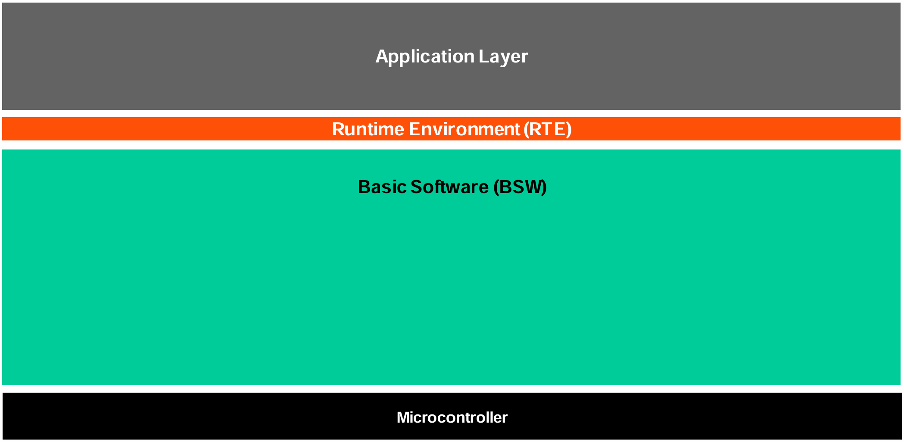
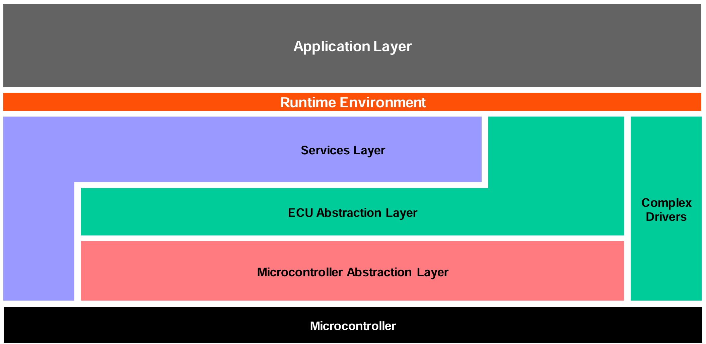

# 2.1 AUTOSAR Architecture — Classic vs Adaptive

[← Home](0.0-Introduction.md)

## Concept Introduction

- **AUTOSAR** (AUTomotive Open System ARchitecture) is a worldwide partnership standardizing automotive E/E (electrical/electronic) software architecture so OEMs and suppliers can exchange and reuse software components across ECUs and vendors.
- AUTOSAR publishes **two platforms** with different target hardware and use cases:
  - **Classic Platform (CP)** — for resource-constrained microcontrollers (MCUs), statically configured, no dynamic memory, runs without an OS-level process model beyond a minimal RTOS (OSEK/VDX-derived AUTOSAR OS). Distinguishes, on the highest abstraction level, three software layers running on the microcontroller: **Application, RTE, and Basic Software (BSW)** — source [1][3].
  - **Adaptive Platform (AP)** — for high-performance microprocessors (MPUs) running a POSIX-compliant OS (typically Linux), implementing **ARA (AUTOSAR Runtime for Adaptive Applications)**, with service-oriented communication (`ara::com`, SOME/IP), used for ADAS, HPC (high-performance compute), infotainment domain controllers — source [2].

## Scope — Design Philosophy & Goals: Classic vs Adaptive

Both platforms standardize automotive E/E software, but optimize for opposite engineering tradeoffs:

- **Classic Platform — determinism and hardware independence.** A layered architecture decouples hardware-independent application software from hardware-oriented Basic Software (BSW) via the RTE, so SW-Cs can be developed and relocated across ECUs without touching application code. Static, build-time configuration and a minimal RTOS (no dynamic memory) keep worst-case timing analyzable — the property safety-relevant control loops need. Standardized methodology and exchange formats let OEMs/suppliers integrate modules from different sources and scale the same software across car lines and variants [1].
- **Adaptive Platform — service-oriented flexibility and agile development.** Services and clients bind **dynamically at runtime** (instead of Classic's build-time RTE generation) through a service-oriented architecture (ARA) organized into functional clusters that don't constrain the underlying implementation. This trades away Classic's static analyzability for distributed, independent, and agile development — services can be deployed and updated across the in-vehicle network [2].
- **The tradeoff in one line**: Classic optimizes for *predictability and certifiability* on resource-constrained MCUs; Adaptive optimizes for *flexibility and reuse of compute-heavy services* on high-performance MPUs.

## Scope — Classic Platform Layers

Per the official Classic Platform layer breakdown [3], two views of the stack — enough to see where Adaptive's MCAL-less, service-oriented stack diverges (see [2.2 AUTOSAR Classic Platform](2.2-AUTOSAR-Classic-Platform.md) for the full per-component breakdown, the Virtual Functional Bus, and a worked MCAL call-chain):

**Top view** — the three highest-level layers:



- **Application Layer** — Software Components (SW-Cs) implementing customer/OEM application logic; mostly hardware-independent, communicate only via **ports** (no direct hardware access).
- **RTE (Runtime Environment)** — generated, ECU- and application-specific glue code providing communication services to SW-Cs; above the RTE the architecture style changes from "layered" to "component style." Task: make SW-Cs independent of their mapping to a specific ECU.
- **Basic Software (BSW)** — everything below the RTE, itself layered (see next view).

**Coarse view** — BSW split into its sub-layers:



- **Services Layer** — the highest BSW sub-layer.
- **ECU Abstraction Layer** — interfaces the Microcontroller Abstraction Layer's drivers plus drivers for *external* devices; offers a peripheral/device API independent of µC-internal-vs-external location.
- **Microcontroller Abstraction Layer (MCAL)** — the lowest BSW layer; *internal* drivers with direct register-level access to the µC and its on-chip peripherals, fully chip-specific — this is the layer Adaptive Platform has none of (see below).
- **Complex Drivers** — a layer that spans from the hardware directly to the RTE, bypassing the standard layering, for: devices not specified within AUTOSAR, very high timing constraints, or migration of legacy/pre-AUTOSAR code (a.k.a. Complex Device Drivers, CDD).
- **Microcontroller** — the physical MCU (e.g., NXP S32K).

## Scope — Adaptive Platform Architecture

Per the official Adaptive Platform overview [2]:

- AP implements **ARA**; applications interact through two interface types — **services** and **APIs**.
- The platform is built from **functional clusters**, grouped into **Adaptive Services** and the **AUTOSAR Adaptive Platform Basis** (Communication, Storage, Security, Safety, Configuration, Diagnostics, Cryptography, Runtime), all sitting on a **POSIX OS** / **(virtual) machine**, with one or more **Adaptive Applications** above. Functional clusters in the Platform Basis need ≥1 instance per (virtual) machine; services may be distributed across the in-car network.
- **MCAL is Classic-only** — MCAL (Microcontroller Abstraction Layer) is a Classic Platform concept; the Adaptive Platform has no MCAL at all, since AP runs on an MPU under a POSIX OS and never accesses microcontroller peripheral registers directly — that register-level access is exactly what MCAL exists for in Classic. AP's nearest equivalents are the OS/hypervisor's own device drivers, sitting below the POSIX OS layer, outside the AUTOSAR-standardized stack.


### Classic vs Adaptive — Key Contrasts (see [1][2] for full detail)

|                   | Classic Platform                              | Adaptive Platform                                                 |
| ----------------- | --------------------------------------------- | ----------------------------------------------------------------- |
| Target HW         | Resource-constrained MCU                      | High-performance MPU                                              |
| OS                | Minimal RTOS (OSEK/VDX-derived)               | POSIX-compliant (typically Linux)                                 |
| Configuration     | Static, build-time                            | Supports dynamic deployment/update                                |
| Comm. style       | Signal-based, statically scheduled (Com/PduR) | Service-oriented (`ara::com`, SOME/IP), dynamic service discovery |
| App-to-infra link | RTE generated/bound at build time             | RTE binds services/clients dynamically at runtime                 |

## Sample — Adaptive Platform: `ara::com` Event Subscription

Unlike Classic's static RTE binding, an AP client discovers a service instance at runtime and subscribes to one of its events. Reduced from the official worked example (`AUTOSAR_AP_EXP_ARAComAPI`, R25-11, Listings 5.5 and 5.13) [4]:

```cpp
/* --- Server side (provider), per Listing 5.13 --- */
RadarServiceImpl myRadarService(InstanceIdentifier(instanceIdStr));
myRadarService.init();
myRadarService.OfferService();          /* makes the instance discoverable */

/* --- Client side (consumer), per Listing 5.5 --- */
auto handles = proxy::RadarServiceProxy::FindService(instspec);
myRadarProxy = std::make_unique<proxy::RadarServiceProxy>(handles[0]);

myRadarProxy->BrakeEvent.Subscribe(10);  /* keep up to 10 buffered samples */
myRadarProxy->BrakeEvent.GetNewSamples(
    [](SamplePtr<proxy::events::BrakeEvent::SampleType> samplePtr) {
        if (samplePtr->active) { /* ... handle the sample ... */ }
    });
```

`RadarServiceProxy`, `OfferService`, `FindService`, `Subscribe`, and `GetNewSamples` are the actual `ara::com` Proxy/Skeleton API names defined in the spec — not invented for this knowledge base. 

## Sample — V2X Domain Controller: Splitting Classic and Adaptive Across Two Chips

A V2X (vehicle-to-everything) unit is a good concrete case for the "mix Classic and Adaptive" answer in the Q&A below, because the split isn't arbitrary — it follows directly from which side of the chip needs determinism and which side needs a rich communication stack.



**The two chips and what runs where:**

- **Cortex-A MPU — Adaptive Platform + GUI.** Runs Linux, hosts AP functional clusters and any HMI/GUI process. This is the chip with a full network stack, a filesystem, and the horsepower to do TLS/security processing and protocol handling for off-board communication.
- **Cortex-M MCU — Classic AUTOSAR.** Runs the AUTOSAR OS (OSEK/VDX-derived) with statically configured tasks, BSW, and MCAL drivers talking directly to on-chip peripherals (SPI, CAN-FD controllers, GNSS UART/timer inputs).
- **Inter-chip link — Automotive Ethernet, with SOME/IP as the IPC payload.** This is the same VFB realization principle detailed in [2.2 AUTOSAR Classic Platform](2.2-AUTOSAR-Classic-Platform.md): from the Adaptive side, a port is just a `SOME/IP` service call; from the Classic side, the same connection arrives through Com/PduR like any other inter-ECU signal. Neither side needs to know the other runs a different AUTOSAR platform — Ethernet + SOME/IP is the shared wire format.
- **Other devices in the diagram:**
  - **Quectel 5G NR / C-V2X PC5 modem** — attached to the **Cortex-A** side over USB3/PCIe, control-plane via QMI. Carries both `5G-Uu` (network/cloud V2X) and `PC5` (direct device-to-device V2X) radio paths.
  - **Sensor (radar/lidar)** — attached to the **Cortex-M** side over CAN-FD/SPI.
  - **GPS receiver (GNSS)** — attached to the **Cortex-M** side, one-way, including a **1PPS** timing pulse alongside the GNSS data.

**Why the Quectel modem sits on Cortex-A, not Cortex-M:**

- It needs a heavyweight, constantly-evolving protocol stack (5G NR modem firmware, C-V2X PC5 stack, IP/TLS, QMI control-plane signaling) — the kind of stack that lives in Linux drivers and userspace daemons, not in a statically-configured MCAL/BSW build. Adaptive Platform (or plain Linux underneath it) is where USB3/PCIe host controllers, QMI, and a full IP stack already exist.
- Its *timing is not deterministic by nature*: 5G/PC5 link establishment, congestion, retransmission, and channel access all vary. That variability is exactly what must **not** leak into the safety/real-time domain — see below.
- It is naturally a high-throughput, high-level data path (V2X messages destined for cloud services, GUI, or path-planning algorithms that already run on the AP side), not a register-level peripheral.

**Why the radar/lidar sensor and the GPS receiver must sit on Cortex-M, not Cortex-A:**

- They feed a **hard real-time control loop** (collision avoidance, positioning for V2X message generation) where the consuming software needs a bounded, guaranteed-latency path from physical input to application logic — exactly what MCAL drivers (`Spi`, `Can`) plus a statically scheduled AUTOSAR OS task provide, and exactly what a general-purpose Linux scheduler on Cortex-A cannot promise.
- The GNSS **1PPS** signal is a hardware timing reference, not just data — it's typically wired to an MCU timer/capture peripheral to get a hardware timestamp with microsecond-level accuracy. That only works with direct, low-jitter register access (MCAL), which Cortex-A's OS-mediated I/O path does not offer.
- Keeping sensor ingestion on the same chip that runs the deterministic OS avoids an extra inter-chip hop (and its jitter) on the critical sensing→decision path; only the *result* of that processing needs to cross to Cortex-A (e.g., for display or cloud upload), not the raw, time-critical sensor stream.

**How this split preserves Classic AUTOSAR's deterministic nature:**

- **Isolation of jitter sources.** Everything inherently non-deterministic — radio link timing, Linux scheduling, GUI rendering, QMI/modem driver latency — stays entirely on the Cortex-A/Adaptive side. The Cortex-M/Classic side never blocks on, or is timed by, anything happening on Cortex-A; it only consumes whatever arrives over the Ethernet/SOME-IP link on its own schedule.
- **Static scheduling, no dynamic memory.** Because Classic's OS tasks, BSW module configuration, and memory layout are all fixed at build time (see Classic Platform row in the Contrasts table above), the worst-case execution time of the sensor→decision path on Cortex-M is analyzable up front — a property Adaptive deliberately trades away for runtime service discovery and dynamic deployment.
- **Direct, single-owner hardware access.** MCAL drivers give the Classic stack exclusive, register-level access to the CAN/SPI sensor bus and the GNSS/1PPS timer capture, with no OS-mediated abstraction layer (no Linux kernel driver, no virtual filesystem) sitting in the latency path the way it would on Cortex-A.
- **The Ethernet/SOME-IP boundary is also a determinism boundary.** Whatever load or congestion exists on the Cortex-A side (modem traffic, GUI updates) cannot starve the Cortex-M task scheduler — the two chips' OS instances and clocks are independent. This is the same VFB principle covered in [2.2 AUTOSAR Classic Platform](2.2-AUTOSAR-Classic-Platform.md) — a port connection's *realization* (here: inter-chip Ethernet) is decoupled from the application logic on either side — applied at the chip-pair level instead of the ECU-pair level.

## Q&A

- **Q: Why does AUTOSAR insist SW-Cs never touch hardware directly?**
  A: Portability — the same application SW-C can be reused on a different MCU/vendor by only re-generating RTE and re-configuring MCAL/ECU Abstraction, without touching application logic.
- **Q: Could a project mix Classic and Adaptive?**
  A: Yes — common in domain-controller architectures where a Classic-Platform "safety MCU" handles real-time I/O and a co-located Adaptive-Platform MPU handles compute-heavy services, communicating over an internal bus. See the V2X domain-controller Sample above for a worked, two-chip example of exactly this split.

## References

1. [AUTOSAR Classic Platform](https://www.autosar.org/standards/classic-platform) — autosar.org standards page; "About"/"Description" sections are the source for the three-layer (Application/RTE/BSW) breakdown and the Classic Platform design-philosophy summary (hardware/application decoupling, determinism, reuse/interoperability, scalability) above.
2. [AUTOSAR Adaptive Platform](https://www.autosar.org/standards/adaptive-platform/) — autosar.org standards page; source for the ARA, functional-cluster, dynamic-linking description, and the Adaptive Platform design-philosophy summary (service-oriented, distributed/agile development) above.
3. *Layered Software Architecture*, AUTOSAR Classic Platform R22-11, Document ID 53 — [PDF](https://www.autosar.org/fileadmin/standards/R22-11/CP/AUTOSAR_EXP_LayeredSoftwareArchitecture.pdf) — source for the Top/Coarse view layer breakdown above; see [2.2 AUTOSAR Classic Platform](2.2-AUTOSAR-Classic-Platform.md) for the full per-component detail, the Virtual Functional Bus, and a worked MCAL call-chain, all sourced from this same document.
4. *Explanation of `ara::com` API*, AUTOSAR Adaptive Platform R25-11, Document ID 846 — [PDF](https://www.autosar.org/fileadmin/standards/R25-11/AP/AUTOSAR_AP_EXP_ARAComAPI.pdf) — source for the Proxy/Skeleton sample above (Listings 5.5, 5.13); see also the sibling specs in the same release: *Specification of Communication Management* (`AUTOSAR_AP_SWS_CommunicationManagement.pdf`) and *Requirements on Communication Management* (`AUTOSAR_AP_RS_CommunicationManagement.pdf`).
5. Related: [2.2 AUTOSAR Classic Platform](2.2-AUTOSAR-Classic-Platform.md), [4.1 MCAL Application Design](4.1-MCAL-Application-Design.md), [6.1 ECU Development Lifecycle](6.1-ECU-Development-Lifecycle.md).
