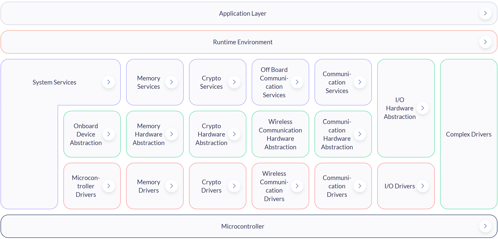
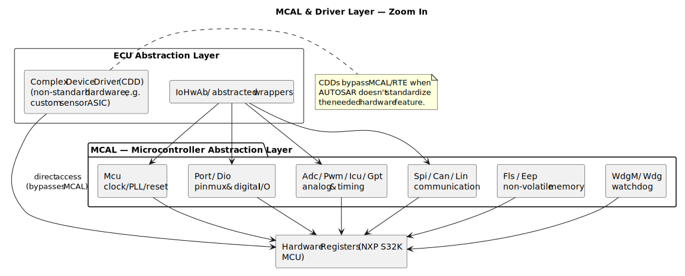

# 2.2 AUTOSAR Classic Platform

[← Home](0.0-Introduction.md) · See also: [2.1 AUTOSAR Architecture](2.1-AUTOSAR-Architecture.md)

## Concept Introduction

- **AUTOSAR Classic Platform (CP)**'s design philosophy is to **decouple application software from hardware**: a layered architecture separates hardware-independent application software from hardware-oriented Basic Software (BSW) via the RTE, so SW-Cs can be developed without specific knowledge of the hardware used and relocated across ECUs without touching application code [2].
- That decoupling is what makes CP's other goals possible: **determinism** (static, build-time configuration, no dynamic memory, a minimal RTOS — predictable timing for safety-relevant control loops) and **reuse/interoperability** — standardized methodology and exchange formats let OEMs and suppliers integrate software modules from different sources, and scale the same software across car lines and variants [2].
- See [2.1 AUTOSAR Architecture](2.1-AUTOSAR-Architecture.md) for the Classic-vs-Adaptive Platform contrast; this document zooms into Classic Platform's internal layering, scope, and a concrete MCAL-level call chain.

## Scope — AUTOSAR Classic Platform Overview

The full Classic Platform stack, layer by layer [1]:



- **Application Layer** — Software Components (SW-Cs) implementing customer/OEM application logic; mostly hardware-independent, communicate only via **ports** (no direct hardware access).
- **RTE (Runtime Environment)** — generated, ECU- and application-specific glue code providing communication services to SW-Cs.
- **Services Layer** — highest BSW sub-layer: **System Services** (OS, timers, ECU state/mode management — EcuM, BswM — watchdog manager), **Memory Services** (NvM), **Crypto Services**, **Off-Board Communication Services** (V2X, off-board diagnostics), **Communication Services** (Com, PduR, diagnostic stacks Dcm/Dem).
- **ECU Abstraction Layer** — interfaces the Microcontroller Abstraction Layer's drivers plus drivers for *external* devices; offers a peripheral/device API independent of µC-internal-vs-external location. Components: Onboard Device Abstraction, Memory/Crypto/Wireless-Communication/Communication HW Abstraction, and **I/O Hardware Abstraction** — placed here per [1], not in the Services Layer, because it abstracts I/O *location* (on-chip vs. on-board) and ECU hardware layout, not the sensors/actuators themselves.
- **Microcontroller Abstraction Layer (MCAL)** — the lowest BSW layer; see the Module Map below for NXP's concrete module set.
- **Complex Drivers (CDD)** — a driver for hardware AUTOSAR doesn't standardize (e.g., a custom sensor ASIC over SPI), spanning from the hardware directly up to the RTE; see the extensibility rule below.
- **Microcontroller** — the physical MCU (e.g., NXP S32K).

### Hardware Independence — the Task of Each Layer

Each layer's defining **Task** (the term used by the source spec [1] itself) is to make everything *above* it independent of whatever sits *below* it — this is the mechanism by which AUTOSAR achieves hardware independence, not an incidental side effect of layering:

| Layer | Task [1] | Implementation | Upper interface |
| --- | --- | --- | --- |
| **MCAL** | Make higher software layers independent of **µC** | µC-dependent | Standardized, µC-independent |
| **ECU Abstraction** | Make higher software layers independent of **ECU hardware layout** | µC-independent, ECU-hardware-dependent | µC- and ECU-hardware-independent |
| **RTE** | Make AUTOSAR Software Components independent of their **mapping to a specific ECU** | ECU- and application-specific (generated per ECU) | Completely ECU-independent |

Practical effect: the same Application SW-C source code is reusable across different microcontrollers (NXP, Infineon, Renesas, ...) and different ECU hardware layouts — only the MCAL implementation/configuration and the ECU Abstraction drivers change, plus a re-generation of RTE/BSW configuration. MCAL's entire reason for existing is to absorb µC-specific register access so nothing above it ever has to touch a register directly.

### Virtual Functional Bus (VFB) and Signal Realization

- The VFB is the design-time concept that makes the RTE possible: "this virtual bus decouples the applications from the infrastructure. It communicates via dedicated ports... The VFB handles communication both within the individual ECU and between ECUs. From an application point of view, no detailed knowledge of lower-level technologies or dependencies is required" [2].
- Concretely: SW-Cs are designed and connected via ports **before** any ECU mapping exists. The VFB is what lets that design stay valid regardless of how SW-Cs are later distributed across ECUs.
- **Realization** — once the AUTOSAR Methodology partitions SW-Cs onto concrete ECUs (see [6.1 ECU Development Lifecycle](6.1-ECU-Development-Lifecycle.md)), each VFB port connection is realized one of two ways:
  - **Both endpoints on the same ECU** → collapses to a direct, generated **RTE** call — no network involved.
  - **Endpoints on different ECUs** → realized as a full signal path down through Com → PduR → a Communication HW Abstraction module (e.g. CanIf) → an MCAL driver → the bus, and back up the mirrored path on the receiving ECU. See the Sample below for that exact path, with real API names.
- This is precisely why SW-C application code never has to change when a signal's routing is re-mapped from intra-ECU to inter-ECU (or vice versa) — the VFB/port abstraction is what AUTOSAR is protecting the application from.

## Scope — MCAL Module Map



- **Common MCAL modules** (names are AUTOSAR-standardized; behavior is chip-specific):
  - `Mcu` — clock/PLL setup, reset, low-power mode entry.
  - `Port` / `Dio` — pin muxing (Port) and digital I/O (Dio).
  - `Adc` / `Pwm` / `Icu` (Input Capture Unit) / `Gpt` (General Purpose Timer) — analog & timing peripherals.
  - `Spi` / `Can` / `Lin` / `Fls` (Flash) / `Eep` (EEPROM emulation) — communication & non-volatile memory.
  - `WdgM`/`Wdg` — watchdog.
- **Each MCAL module** typically exposes: `<Module>_Init()`, `<Module>_DeInit()`, read/write or notification functions, and a `<Module>_GetVersionInfo()` — a consistent pattern across all modules.
- **Configuration-driven**: MCAL behavior is fixed mostly at **build/generation time** via a config tool (NXP S32 Configuration Tool, or EB tresos) producing `<Module>_Cfg.h/.c` — runtime flexibility is intentionally limited for determinism and certifiability.

## Scope — AUTOSAR API Naming, Submodules and Standardized Services

AUTOSAR's "scope" extends beyond just naming the MCAL modules above — it is a defined set of standardized module APIs, named submodules per layer, and standardized service categories [1][2]:

- **Three kinds of interface, by name** [1]:
  - **AUTOSAR Interface** — language-, ECU- and network-technology-independent; defines the ports through which SW-Cs and/or BSW modules send/receive information or invoke services. Can be realized either locally (intra-ECU) or over a network.
  - **Standardized AUTOSAR Interface** — an AUTOSAR Interface whose syntax *and* semantics are themselves standardized within AUTOSAR; used to expose **AUTOSAR Services** (Services Layer functionality) to application SW-Cs.
  - **Standardized Interface** — a plain, language-specific (typically C) API standardized by AUTOSAR without using the AUTOSAR Interface technique. Because it isn't an AUTOSAR Interface, it is always intra-ECU — communication through it can never be re-routed over a network. **This is exactly what every MCAL API above is**: `Can_Write`, `Adc_ReadGroup`, `Spi_WriteIB`, `Dio_WriteChannel` are all Standardized Interfaces, not AUTOSAR Interfaces — which is why a call into MCAL can never silently become a network call.
- **Named submodules per layer** — every module in the Module Map above is a standardized, named module, not a generic placeholder. The same naming discipline continues one layer up: **Services Layer** → `Com`, `PduR`, `NvM`, `Dem`, `Det`, `Dlt`, `EcuM`, `BswM`, `ComM`, `WdgM`; **ECU Abstraction Layer** → `CanIf`, `IoHwAb`, `WdgIf`, `MemIf` (full ICC3 module map in [1]).
- **Six standardized service types** [1] — the Services Layer (and the HW Abstraction/Driver groups beneath it, MCAL included) is organized around these categories regardless of silicon vendor: **I/O** (sensors, actuators, ECU onboard peripherals), **Memory** (internal/external non-volatile memory), **Crypto** (cryptographic primitives, HW- or SW-based), **Communication** (vehicle network systems, ECU onboard communication, ECU-internal SW), **Off-board Communication** (V2X, in-vehicle wireless, off-board diagnostics), **System** (OS, timers, error memory, ECU state/mode management). Every MCAL module above belongs to exactly one of these.
- **Complex Drivers extend — but don't break — the scope.** AUTOSAR's own extensibility rule is explicit [1]: standard MCAL/BSW modules may be *extended* in functionality while remaining compliant; non-standard functionality is instead integrated as a **Complex Driver (CDD)** (see the Complex Drivers bullet above), and **no further layers may be added** to the architecture. A CDD spans from the hardware directly up to the RTE, bypassing MCAL/ECU-Abstraction/Services entirely, specifically to add functionality AUTOSAR has not standardized — devices outside AUTOSAR's scope, very high timing constraints (e.g. injection control, electric valve control, incremental position detection via TPU/PCP/CCU peripherals), or legacy/migration code — while still exposing a normal AUTOSAR Interface upward to SW-Cs [1]. A CDD's access back into the rest of the BSW is restricted: it may use named exclusive access points such as the PDU Router, NVRAM Manager, Watchdog Manager, or the SPI/GPT drivers, but only where those modules' functions are documented as re-entrant [1].

## Sample — Classic Platform: SW-C to MCAL Call Chain for an Inter-ECU Signal

Use case: an Application SW-C writes a signal (e.g., vehicle speed) that must reach another ECU over CAN. Walking the call chain down from the SW-C to the MCAL driver, and back up on the receiving ECU, makes the VFB realization principle above concrete, with the real API names used by AUTOSAR-compliant BSW stacks.

**Transmit path (sending ECU):**

```c
/* Application SW-C, via RTE-generated accessor */
Rte_Write_PPort_VehicleSpeed(speedValue);

/* RTE forwards the write into the Services Layer */
Com_SendSignal(VehicleSpeed_SignalId, &speedValue);

/* Com packs the signal into an I-PDU and hands it to PduR */
PduR_ComTransmit(VehicleSpeed_PduId, &pduInfo);

/* PduR routes the I-PDU to the Communication HW Abstraction module for this PDU */
CanIf_Transmit(VehicleSpeed_PduId, &pduInfo);

/* CanIf hands the L-PDU to the MCAL CAN driver for the configured controller/HTH */
Can_Write(VehicleSpeed_Hth, &canPdu);
```

**Receive path (receiving ECU):**

```c
/* Can driver (MCAL) — interrupt-driven; notifies CanIf of a newly received L-PDU */
CanIf_RxIndication(&mailbox, &pduInfoPtr);

/* CanIf dispatches the PDU to whichever upper-layer module is configured for it */
PduR_CanIfRxIndication(VehicleSpeed_PduId, &pduInfoPtr);

/* Com unpacks the I-PDU back into the signal it carries */
Com_RxIndication(VehicleSpeed_PduId, &pduInfoPtr);

/* RTE propagates the unpacked signal to the data element behind the receiver SW-C's port */
```

Each call above is a real, standardized AUTOSAR function name [3][4][5] — nothing in this chain is project-specific except the PDU/signal IDs and the SW-C's own port/data-element names. The CAN-FD Sample below walks the receive path again for a specific sensor use case, diagrammed step by step.

## Sample — Classic Platform: Cortex-M MCU Receiving Sensor Data over CAN-FD

Use case: a Cortex-M-based ECU running Classic AUTOSAR receives data from a radar/lidar sensor over a CAN-FD bus — the call chain from the bus, through the `Can` MCAL driver, up to the application. CAN-FD is a documented extension of the AUTOSAR CAN Communication Stack: "the CAN Communication Stack supports ... CAN FD communication, if supported by hardware" [1].



What AUTOSAR has defined at each step (function names and signatures taken from the R25-11 specs [3][4][5]):

1. **Radar/lidar → CAN-FD bus (Microcontroller / HW)** — the sensor transmits its measurement as a CAN-FD frame; the CAN controller hardware checks DLC/CRC on the raw bytes before handing them to the driver.
2. **`Can` driver — MCAL, Rx HW buffer** — chip-specific, interrupt-driven; copies the received L-PDU out of the CAN-FD controller's hardware receive buffer, then calls the configured upper-layer notification:
   ```c
   /* Can driver (MCAL) ISR — interrupt-driven; copies the L-PDU out of the HW mailbox, then notifies CanIf */
   void Can_Isr_RxMailbox(void) {
       /* ... read CAN-FD frame out of the controller's HW receive buffer into mailbox/pduInfo ... */
       CanIf_RxIndication(&mailbox, &pduInfo);
   }
   ```
3. **`CanIf` — ECU Abstraction Layer (Communication HW Abstraction), PDU dispatch** — validates/filters the L-PDU and dispatches it (`PduId`, `SDU`) to whichever upper-layer module is configured for this PDU, independent of which CAN controller (on-chip or external ASIC) actually received it:
   ```c
   void CanIf_RxIndication(const Can_HwType* Mailbox, const PduInfoType* PduInfoPtr) {
       /* validates/filters, then calls the upper layer configured for this PDU */
   }
   ```
4. **`PduR` — Services Layer, routes the PDU** — for a direct 1:1 route the spec permits compiling this straight through to `Com_RxIndication` (a real, documented PduR optimization, not a simplification made for this sample):
   ```c
   /* #define PduR_CanIfRxIndication Com_RxIndication */
   void PduR_CanIfRxIndication(PduIdType RxPduId, const PduInfoType* PduInfoPtr) {
       Com_RxIndication(RxPduId, PduInfoPtr);
   }
   ```
5. **`Com` — Services Layer, unpacks signals** — deserializes the I-PDU back into the signal(s) it carries:
   ```c
   void Com_RxIndication(PduIdType RxPduId, const PduInfoType* PduInfoPtr) {
       /* deserializes the I-PDU; updates the signal-update (unpacked) data element it carries */
   }
   ```
6. **RTE** — propagates the unpacked signal update to the data element behind the Sensor Processing SW-C's receiver port.
7. **Sensor Processing SWC — Application Layer, plausibility check** — reads the new value via the RTE-generated accessor. `Rte_Read_<port>_<dataElement>` is the one conceptual name in this chain — the real symbol is generated per-project from the SW-C's actual port and data-element names, so no single standardized spelling exists.

Note that only step 2 is MCAL proper — everything from `CanIf` upward is ECU Abstraction/Services/RTE, included here because the question "what happens to a sensor frame after the `Can` driver hands it off" is exactly where MCAL's responsibility ends and the rest of the stack picks up; see the generic transmit/receive Sample above for the transmit-side mirror of this chain.

## Q&A

- **Q: Who normally supplies MCAL — the OEM, the Tier-1, or the silicon vendor?**
  A: Usually the **silicon vendor** (NXP, via the RTD package) or a dedicated BSW vendor (Elektrobit tresos, Vector MICROSAR). The Tier-1's team **configures and integrates** it rather than writing it from scratch — though CDDs and bugfixes/patches are commonly authored in-house.
- **Q: What does DET stand for and why does it matter at this layer?**
  A: **Development Error Tracing** — a debug-build-only mechanism where MCAL functions validate parameters and report violations via `Det_ReportError`, disabled in production builds for performance. Code reviewers check that DET checks don't leak into release-build timing-critical paths.
- **Q: Can MCAL modules call each other directly?**
  A: Generally no — MCAL modules are largely independent/parallel; cross-module coordination happens at the ECU Abstraction or Services layer, preserving the layer's modularity.
- **Q: What's the practical difference between "ECU Abstraction" and "MCAL" when both seem to wrap hardware?**
  A: MCAL = one specific chip's register interface, standardized API. ECU Abstraction = hides *which* MCU is underneath, so the same ECU Abstraction call works whether MCAL is implemented for an NXP S32K or another vendor's MCU.

## References

1. *Layered Software Architecture*, AUTOSAR Classic Platform R22-11, Document ID 53 — [PDF](https://www.autosar.org/fileadmin/standards/R22-11/CP/AUTOSAR_EXP_LayeredSoftwareArchitecture.pdf) — authoritative source for the per-layer Task/Properties table, the I/O Hardware Abstraction layer placement, the interface-type definitions, the six service types, and the Complex Driver extensibility rule above.
2. [AUTOSAR Classic Platform](https://www.autosar.org/standards/classic-platform) — autosar.org standards page; source for the design-philosophy summary in Concept Introduction above (hardware/application decoupling, determinism, reuse/interoperability, scalability), the VFB quote above, and per-module SWS documents (e.g., SWS_Dio, SWS_Can).
3. *Specification of CAN Interface*, AUTOSAR Classic Platform R25-11, Document ID 12 — [PDF](https://www.autosar.org/fileadmin/standards/R25-11/CP/AUTOSAR_CP_SWS_CANInterface.pdf) — source for `CanIf_Transmit` and `CanIf_RxIndication` in the Samples above.
4. *Specification of Communication*, AUTOSAR Classic Platform R25-11, Document ID 15 — [PDF](https://www.autosar.org/fileadmin/standards/R25-11/CP/AUTOSAR_CP_SWS_COM.pdf) — source for `Com_SendSignal` and `Com_RxIndication` in the Samples above.
5. *Specification of PDU Router*, AUTOSAR Classic Platform R25-11, Document ID 35 — [PDF](https://www.autosar.org/fileadmin/standards/R25-11/CP/AUTOSAR_CP_SWS_PDURouter.pdf) — source for `PduR_ComTransmit`, `PduR_CanIfRxIndication` (and the `#define`-to-`Com_RxIndication` routing optimization) in the Samples above.
6. NXP, *S32K1xx / S32K3 RTD (Real-Time Drivers) Reference Manual* — vendor portal (login required), describes the concrete MCAL module set shipped for S32K.
7. Related: [2.1 AUTOSAR Architecture](2.1-AUTOSAR-Architecture.md), [4.1 MCAL Application Design](4.1-MCAL-Application-Design.md) for a full worked example built on these modules.
