# 3.1 Embedded Systems Fundamentals — Basic Communication Protocols

[← Home](0.0-Introduction.md)

## Concept Introduction

This document summarizes the three serial communication protocols every embedded engineer touches daily — **SPI**, **I2C**, and **UART** — after first defining the vocabulary used to describe and compare them:

- **Serial vs. parallel**: serial sends one bit at a time over a single signal wire (or a small fixed set of wires); parallel sends many bits at once over many wires, one per bit. All three protocols covered here are **serial** — far fewer pins, and unlike parallel buses, signal timing doesn't have to stay matched ("skew") across many wires as cable length grows, which is why serial dominates at the chip-to-chip and board-to-board level.
- **Synchronous vs. asynchronous**: synchronous protocols share a dedicated **clock line** that tells both sides exactly when to sample each bit (SPI, I2C). Asynchronous protocols have **no shared clock**; both ends must independently agree on a fixed bit rate ahead of time and re-synchronize at the start of every frame (UART).
- **Simplex / half-duplex / full-duplex**: simplex = data flows one direction only; half-duplex = both directions are possible but not at the same time, usually because they share one wire (I2C's `SDA`); full-duplex = both directions happen simultaneously on separate wires (SPI's `MOSI`/`MISO`, UART's `TX`/`RX`).
- **Master and slave**: the **master** drives the transfer — in synchronous protocols it generates the clock and initiates every transaction; the **slave** only responds. SPI is normally one master with one or more slaves; I2C supports multiple masters arbitrating for the bus; UART has no master/slave concept at all, since it's a direct point-to-point link between two peers.
- **Baud rate vs. data rate**: **baud rate** is the symbol (signal-transition) rate per second; **data rate** is the actual bit throughput. For the simple binary signaling these protocols use, baud rate and bit rate are numerically the same — but the term "baud rate" specifically shows up in **asynchronous** protocols like UART, where there is no clock line, so both ends rely on a pre-agreed baud rate to know how long each bit lasts.
- **Clock polarity and phase (CPOL/CPHA)**: properties of a synchronous clock — **polarity** is which logic level the clock idles at when no data is moving (idle-low vs. idle-high), and **phase** is which clock edge (leading or trailing) data is sampled on. These combine into SPI's four "modes" (see SPI below).
- **Clock stretching**: a slave device's ability to hold the shared clock line low to pause an in-progress synchronous transfer when it needs more time before it can respond — an I2C-specific mechanism (see I2C below).

## SPI (Serial Peripheral Interface)

SPI is a **serial, synchronous, full-duplex** protocol with no formally defined maximum data rate — it runs as fast as the master's clock and both devices' electrical characteristics allow, commonly tens of MHz.

### Series/Parallel, Sync, Duplex, Data Rate

- **Serial**, one bit per clock edge per data line.
- **Synchronous**: the master drives a dedicated clock (`SCLK`/`SCK`); there is no baud-rate negotiation — the slave simply samples on whichever edge the configured clock phase specifies.
- **Full-duplex**: data shifts out on `MOSI` and in on `MISO` **simultaneously**, on the same clock edges — every SPI transfer is really a bidirectional shift-register exchange, even if one side's data is unused.
- **Data rate**: no protocol-imposed ceiling; bounded only by the clock frequency the master, slave, and PCB/wiring can support.

### Ports, Connections, Master/Multi-Master

- Four signals: **`MOSI`** (Master Out Slave In), **`MISO`** (Master In Slave Out), **`SCLK`** (clock, master-driven), and **`SS`/`CS`** (Slave/Chip Select, active-low, one per slave).
- SPI is normally **single-master**: one master drives the clock and selects exactly one slave at a time by pulling that slave's `CS` line low. Multiple slaves share `MOSI`/`MISO`/`SCLK` but each gets its own dedicated `CS` line (a "star" wiring around the master) — a slave with `CS` high ignores the bus and tri-states `MISO`.
- There is no built-in addressing scheme — `CS` selection *is* the addressing mechanism, which is also why SPI doesn't scale well to large numbers of devices (one GPIO per slave).

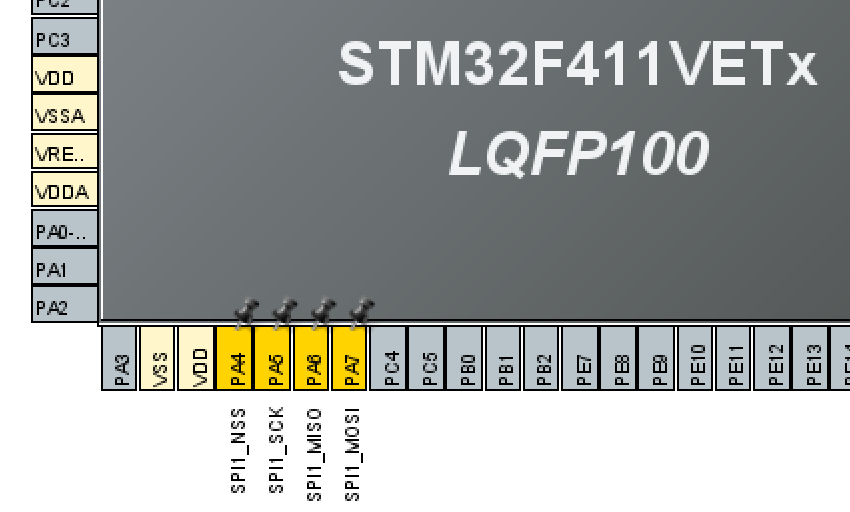

### Operation — Config / Write / Read / Send / Receive

- **Config**: set the clock prescaler (derives `SCLK` frequency from the peripheral clock), **CPOL**/**CPHA** (must match the slave's expectations — picking the wrong one of the 4 modes is a classic "SPI doesn't work" bug), data frame size (8/16-bit), and master/slave role in the SPI control register (e.g. `SPI_CR1` on STM32).
- **Send/Write**: writing a byte to the data register begins shifting it out on `MOSI`, MSB-first by default, synchronized to the clock the master generates.
- **Receive/Read**: every bit shifted out on `MOSI` is matched by a bit shifted in on `MISO` on the same clock edge — reading the data register after a transfer completes returns whatever the slave shifted back, even on a "write-only" operation (the dummy byte sent to clock in a read is a common SPI idiom).
- Because TX and RX happen on the same clock, "send" and "receive" are really one operation — there's no way to clock data in one direction without simultaneously clocking the other direction's shift register.

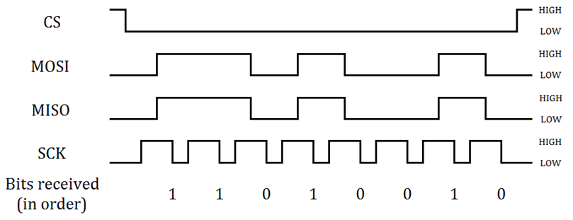

### Special Properties

- **No flow control, no ACK**: a slave can't signal "not ready" mid-byte (no clock stretching), and there is no acknowledgement bit — error detection/correction is left entirely to the application protocol layered on top.
- **Four clock modes** from CPOL × CPHA, and a mismatch between master and slave configuration is the most common SPI bring-up bug.
- Scales poorly in slave count (one `CS` GPIO per device) but scales very well in speed compared to I2C.

## I2C (Inter-Integrated Circuit)

I2C is a **serial, synchronous, half-duplex** protocol, standardized at **100 kbps (Standard mode)**, **400 kbps (Fast mode)**, **1 Mbps (Fast mode+)**, and **3.4 Mbps (High-speed mode)**.

### Series/Parallel, Sync, Duplex, Data Rate

- **Serial**, one bit per clock pulse.
- **Synchronous**: shares a clock line (`SCL`), generated by whichever device is currently the bus master.
- **Half-duplex**: data (`SDA`) is a single, shared, bidirectional wire — only one device drives it at a time, so the two directions cannot overlap.
- **Data rate**: standardized speed grades rather than an arbitrary clock, from 100 kbps up to 3.4 Mbps.

### Ports, Connections, Master/Multi-Master

- Two signals only: **`SDA`** (Serial Data) and **`SCL`** (Serial Clock), both **open-drain** and requiring external pull-up resistors — this is what lets multiple devices share the same two wires without contention damage (a device can only pull the line low, never drive it high).
- I2C is a true **multi-drop bus**: every device (master or slave) connects to the same `SDA`/`SCL` pair, distinguished by a **7-bit (or extended 10-bit) address**.
- **Multi-master capable**: more than one device can initiate a transfer; if two masters start at once, **bus arbitration** (continuous comparison of the driven `SDA` level against what's actually on the wire, bit by bit) lets one master win non-destructively while the other backs off.

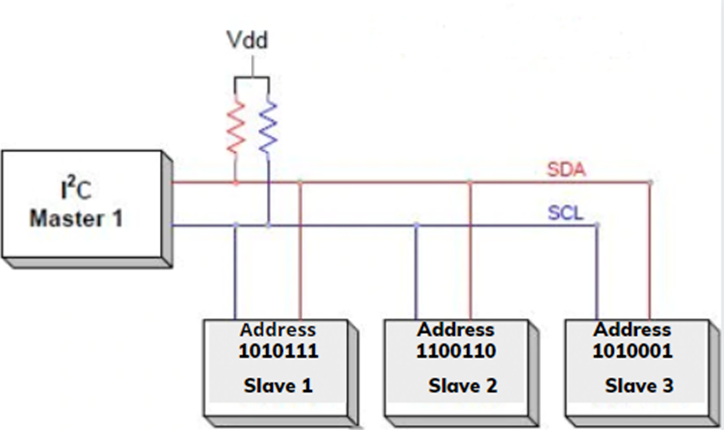

### Operation — Config / Write / Read / Send / Receive

- **Config**: set the bus speed (clock prescaler for the target mode), and the device's own address if it can act as a slave.
- **Send/Write**: the master issues a **START condition** (`SDA` falls while `SCL` is high), then clocks out the target's 7-bit address plus a R/W bit (0 = write); the addressed slave pulls `SDA` low for one clock as an **ACK**. The master then clocks out each data byte, with the **receiver** (slave, in a write) ACKing after every byte, ending with a **STOP condition** (`SDA` rises while `SCL` is high).
- **Receive/Read**: same addressing phase but with the R/W bit set to 1; the **slave** then drives `SDA` to shift data back to the master, and the **master** ACKs each received byte except the last, which it **NACK**s to tell the slave to release the bus before the STOP condition.
- A **repeated START** (instead of STOP between the address-write and a following read) is the standard idiom for "write a register pointer, then read its value" without releasing the bus to another master in between.

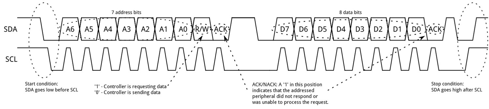

A concrete master-to-slave write and master-to-slave read, with the actual SDA/SCL bit streams lined up against real hardware:

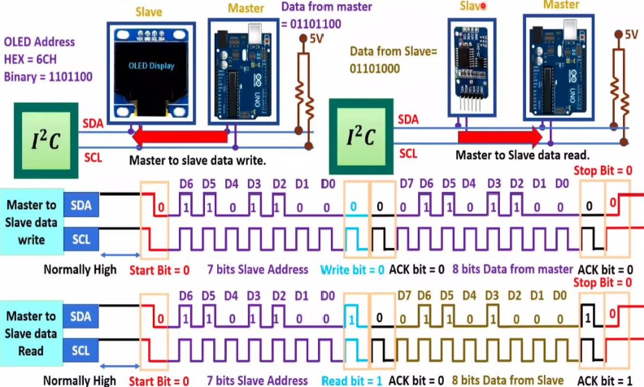

### Special Properties

- **Clock stretching**: a slave can hold `SCL` low after a clock pulse to pause the master mid-transaction when it needs more time (e.g. to prepare requested data) — the master must check that `SCL` has actually been released before driving the next clock edge.

  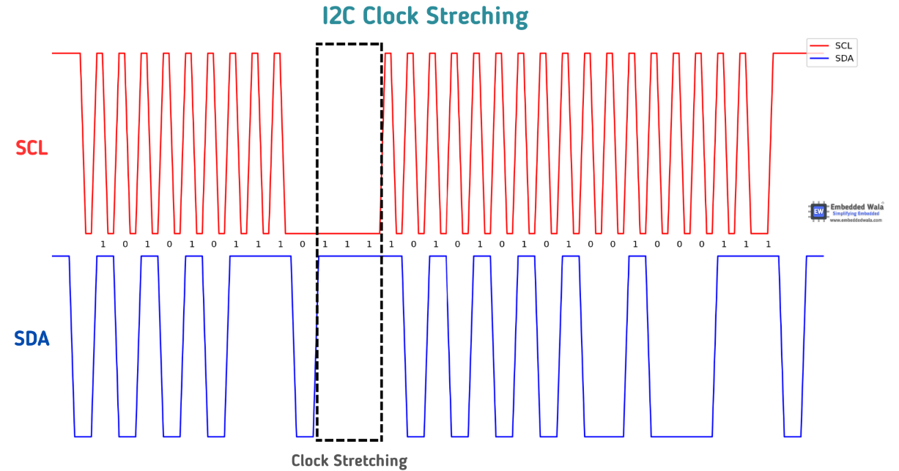

- **Built-in addressing and ACK/NACK** make it straightforward to put many devices on two wires with basic error signaling, at the cost of being much slower than SPI.
- **Bus arbitration** is what makes multi-master operation safe without a separate arbiter — each master compares what it drove on `SDA` against what's actually on the wire, bit by bit, and backs off the instant it sees a mismatch:

  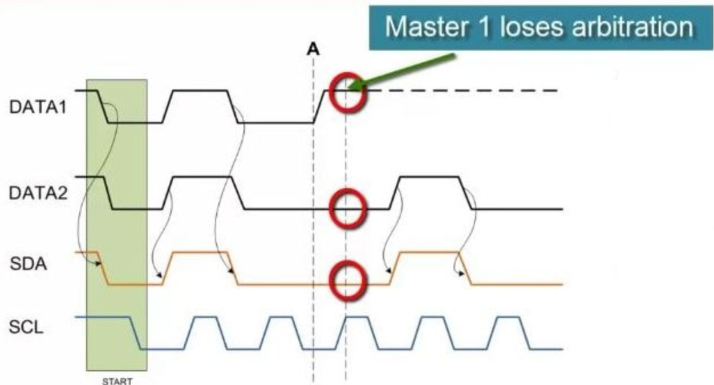

## UART (Universal Asynchronous Receiver/Transmitter)

UART is a **serial, asynchronous, full-duplex** point-to-point link with an arbitrary, configurable **baud rate** (common values: 9600, 19200, 115200 bps) that both ends must agree on in advance.

### Series/Parallel, Sync, Duplex, Data Rate

- **Serial**, one bit per bit-period.
- **Asynchronous**: there is no clock line at all — both devices free-run their own clocks at the agreed **baud rate**, and the **start bit** of every frame is what lets the receiver re-synchronize its sampling for that frame.
- **Full-duplex**: `TX` and `RX` are independent wires, so both directions can transmit simultaneously.
- **Data rate**: whatever baud rate both sides are configured for; no protocol-defined ceiling, but practical limits come from the UART peripheral's clock divider and the line's electrical quality.

### Ports, Connections, Master/Multi-Master

- Two data signals: **`TX`** (transmit) and **`RX`** (receive), **cross-connected** between the two devices (device A's `TX` → device B's `RX`, and vice versa), plus a common ground reference. Optional hardware flow-control signals **`RTS`/`CTS`** let a receiver pause a sender when its buffer is full.
- **Point-to-point only** — plain UART connects exactly two devices; there is no master/slave concept and no addressing, because there's no shared bus to arbitrate. (Multi-drop variants exist — e.g. RS-485 — but those add their own electrical layer and addressing scheme on top of the same basic framing described here.)

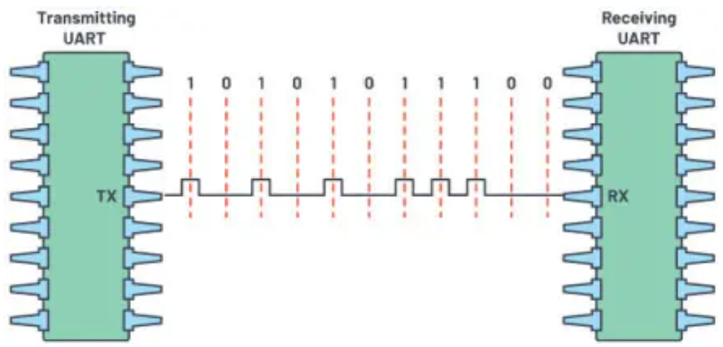

### Operation — Config / Write / Read / Send / Receive

- **Config**: set the **baud rate** (must match on both ends), **word length** (commonly 8 data bits), **parity** (none/even/odd), and **number of stop bits** (1 or 2) — together this is often shorthand-written as e.g. "115200 8N1".

  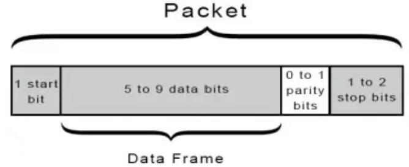

- **Send/Write**: writing a byte to the data register starts shifting it out on `TX` as a frame: an idle-high line drops to a **start bit** (logic low), then the data bits (LSB-first), an optional parity bit, then one or more **stop bits** (logic high) before returning to idle. This is a **parallel-to-serial** conversion — the byte sitting in parallel on the internal data bus is shifted out one bit at a time:

  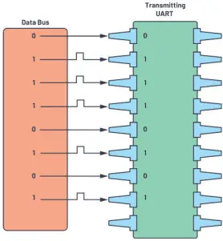

- **Receive/Read**: the receiver continuously watches `RX` for the falling edge of a start bit, then samples the middle of each subsequent bit period (typically using an internal clock oversampling at 8x or 16x the baud rate for noise immunity), checks parity if enabled, and signals "data available" (e.g. an `RXNE` flag/interrupt) once a full frame has arrived for the application to read from the data register. This is the mirror-image **serial-to-parallel** conversion:

  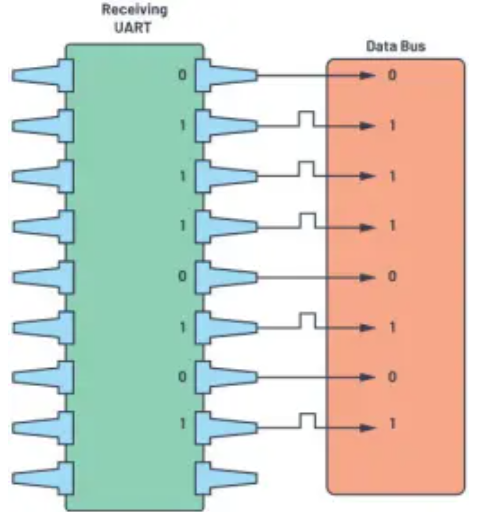

- Send and receive are fully independent operations on separate wires — unlike SPI/I2C, there's no shared clock forcing TX and RX to happen together.

### Special Properties

- **No addressing, no ACK** in the base protocol — UART by itself can't detect a dropped frame or tell devices apart; higher-level protocols (e.g. Modbus, NMEA, vendor bootloader protocols) add framing/checksums/addressing on top when needed.
- **Baud-rate mismatch** between the two ends is the single most common UART bug — even a few percent of clock error compounds across a byte's bit periods and corrupts the frame, since there's no clock line to keep both sides in lock-step.
- Simplicity (2 wires, no bus contention, no arbitration) makes it the default choice for short point-to-point debug/console links.

## Q&A

- **Q: Why does SPI need one chip-select line per slave, while I2C doesn't?**
  A: SPI has no addressing in the protocol itself — `CS` *is* the addressing mechanism, so each slave needs its own line to be individually selectable. I2C carries a 7-bit address inside every transaction over the same shared `SDA`/`SCL` pair, so no per-device select line is needed.
- **Q: Why is UART called asynchronous when it clearly has a notion of timing (the baud rate)?**
  A: "Asynchronous" refers to the absence of a shared clock *signal*, not the absence of timing — both sides still must agree on a bit rate, but they free-run independent clocks and resynchronize at every frame's start bit rather than being driven by one shared clock edge.
- **Q: When would I reach for I2C instead of SPI, given SPI is faster and simpler per-transfer?**
  A: When pin count matters more than speed — I2C's 2-wire multi-drop bus scales to many devices without extra GPIOs, which is why most low/medium-speed sensors (temperature, IMU, EEPROM) default to I2C while high-throughput peripherals (flash, displays, ADCs) favor SPI.
- **Q: If I just care about maximizing overall throughput, how do SPI, I2C, and UART rank?**
  A: **SPI wins by a wide margin**: it has no protocol-mandated speed ceiling (often tens of MHz), shifts data **full-duplex** on every clock edge, and carries almost no per-byte overhead beyond the clock itself. **UART** comes next: throughput is capped by the configured baud rate (commonly up to a few Mbps), and every byte pays a fixed framing tax — a typical 8N1 frame spends 10 bit-times to carry 8 data bits, ~80% efficiency at best, before even accounting for the two ends needing to agree on that baud rate. **I2C is the slowest** of the three: it's capped at standardized speed grades (100 kbps–3.4 Mbps), is **half-duplex** so reads and writes can't overlap, and spends extra clock cycles on the address phase plus an ACK bit after every single byte. In short: pick SPI when raw bandwidth matters most (flash, displays, ADCs), and treat I2C's low throughput as the price paid for its 2-wire, multi-device addressing — which is exactly the tradeoff in the question above.
- **Q: Why does I2C need external pull-up resistors on SDA and SCL — what would happen without them?**
  A: Every I2C device drives `SDA`/`SCL` with an **open-drain** (open-collector) output — it can only actively pull a line **low**, never drive it **high**. That's deliberate: with several masters and slaves sharing the same two wires, letting any device actively drive a logic-high would risk two devices fighting to drive opposite levels at once (bus contention that can damage a driver). The pull-up resistors are what passively restore the line to logic-high once every device on the bus releases it — without them, `SDA`/`SCL` would simply float (or sit stuck low, since nothing would ever pull them back up) and no transaction could complete. This same open-drain-plus-pull-up arrangement is also what makes **clock stretching** and **bus arbitration** possible: any device can unilaterally hold a line low and be sure it'll win, since "low" always overrides "released" on a shared, pulled-up wire (a "wired-AND").

## References

- NXP, *S32K3 Reference Manual* (SPI/I2C/UART peripheral chapters) — vendor portal.
- STMicroelectronics, *STM32F411 Datasheet* (pinout / alternate-function tables) — source for the SPI1 pinout diagram above.
- Embedded Wala (embeddedwala.com) — source for the I2C clock-stretching waveform above.
- Related: [3.3 Embedded Fundamentals — Bootloader](3.3-Embedded-Fundamentals-Boothloader.md), [5.1 NXP Platform Overview](5.1-NXP-Platform-Overview.md).
