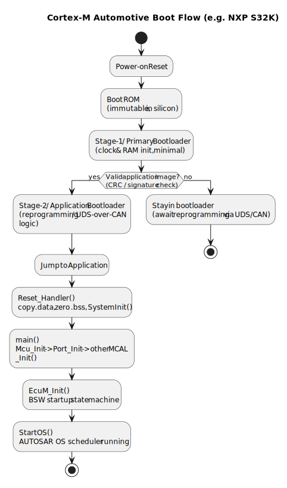

# 3.1 Embedded Systems Fundamentals — MCAL, Driver, Bootloader, Automotive Cortex Chips

[← Home](0.0-Introduction.md)

## Concept Introduction

- An automotive ECU's software stack rests on three foundational concepts that this role touches daily: the **microcontroller abstraction (MCAL)**, **drivers** in the general embedded sense (not only AUTOSAR's), and the **bootloader** that gets code running on real silicon.
- Automotive-grade chips overwhelmingly use **Arm Cortex** cores, split into two families with very different software stacks:
  - **Cortex-M** (microcontroller profile, e.g. M4/M7) — bare-metal or RTOS, no MMU (or limited MPU only), runs AUTOSAR Classic / MCAL-style code directly on hardware. Example: **NXP S32K1xx/S32K3** family.
  - **Cortex-A** (applications profile, e.g. A53/A55) — has an MMU, runs a full OS (Linux, QNX), used where Adaptive AUTOSAR or general-purpose compute is needed. Example: **NXP S32G2/S32G3**, **NXP i.MX 8/9**.
- This JD's "MCAL (legacy)" requirement sits squarely on the **Cortex-M side**; the embedded-Linux/daemon material in [3.2](3.2-Linux-Services-Daemons.md) is relevant for Cortex-A companion processors or gateway-class ECUs the same team may integrate with.

## Scope — MCAL vs Driver vs Bootloader

- **MCAL** (recap from [2.2](2.2-AUTOSAR-Classic-Platform.md)): AUTOSAR-standardized, chip-specific peripheral access layer — the term is specific to the AUTOSAR Classic world.
- **Driver** (general embedded sense): any software that manages a hardware peripheral end-to-end, whether or not it follows AUTOSAR conventions — e.g. a Linux kernel driver, a bare-metal UART driver, an RTOS BSP driver. MCAL modules *are* drivers, but not every driver is MCAL-shaped.
- **Bootloader**: the first software that runs out of reset, responsible for minimal hardware init, choosing/validating an application image, and jumping to it. In automotive it usually also implements **flashing/reprogramming** (e.g., UDS-over-CAN bootloader for field updates).
  - **Boot ROM** (immutable, in silicon) → **Stage-1/Primary bootloader** (minimal, e.g. sets up clocks/RAM, may live in flash) → **Stage-2/Application bootloader** (handles update logic, signature/CRC checks, jumps to app) → **Application** (AUTOSAR stack or RTOS app).
  - On Cortex-A automotive SoCs the chain is longer: Boot ROM → SPL/secondary program loader (e.g. U-Boot SPL) → U-Boot proper → Linux kernel → init system (see [3.2](3.2-Linux-Services-Daemons.md)).

## Use Cases

- **Bring-up debugging**: when a new board doesn't boot, a Tech Lead needs to reason about *which stage* failed — clock config in stage-1, image CRC failure in stage-2, or an MCAL `Mcu_Init` misconfiguration once the app starts — to direct the team efficiently (JD 3.1).
- **Reprogramming/flashing strategy**: estimating effort for adding a new ECU variant's bootloader support (different flash geometry, different CAN bootloader timing) is a recurring feasibility/estimation task (JD 3.3).
- **Mixed Cortex-M/Cortex-A systems**: many modern domain controllers pair an S32K-class safety MCU (running AUTOSAR Classic/MCAL) with an S32G-class Cortex-A SoC (running Linux) communicating over SPI/Ethernet — a Tech Lead must understand both sides well enough to debug the boundary.

## Sample — Cortex-M Boot Flow (Typical S32K)



```c
/* Simplified startup_S32K.c (vendor startup code, illustrative) */
void Reset_Handler(void) {
    __disable_irq();
    /* 1. Copy .data from flash to RAM, zero .bss */
    CopyDataSection();
    ZeroBssSection();
    /* 2. Optional: call SystemInit() for early clock/PLL bring-up */
    SystemInit();
    /* 3. Call main() -> typically Mcal/BSW Init sequence, then OS StartOS() */
    main();
    while (1) { /* should never return */ }
}
```

- Typical application `main()` then runs: `Mcu_Init()` → `Port_Init()` → other MCAL `_Init()` calls → `EcuM_Init()` (BSW startup state machine) → `StartOS()` (hand off to AUTOSAR OS scheduler).

## Q&A

- **Q: Why don't Cortex-M chips run Linux?**
  A: No MMU (or MPU-only, no virtual memory) and far less RAM/flash than Cortex-A parts — Linux's memory model and footprint don't fit; Cortex-M instead runs bare-metal, a small RTOS, or AUTOSAR OS.
- **Q: What's the difference between an MPU and an MMU?**
  A: An MPU (Memory Protection Unit, found on Cortex-M) defines a small number of fixed-size protected regions without address translation. An MMU (on Cortex-A) does full virtual-to-physical address translation, enabling separate process address spaces — required for a general-purpose OS.
- **Q: Why is a separate "stage-1" bootloader needed if Boot ROM can already load code?**
  A: Boot ROM is fixed in silicon and minimal (load-and-jump from a known location, maybe basic signature check). Field-updatable bootloader logic (UDS reprogramming, A/B image selection, rollback) must live in **mutable flash**, hence a second stage.
- **Q: How does a bootloader validate an application image before jumping to it?**
  A: Typically CRC32/checksum at minimum; safety/security-relevant designs add a cryptographic signature check (e.g., ECDSA) against a key stored in protected/OTP memory — relevant to secure boot discussions with security-conscious OEM customers.

## References

- Arm, *Cortex-M for Beginners* and *Cortex-A Series Programmer's Guide* — [https://developer.arm.com/documentation](https://developer.arm.com/documentation).
- NXP, *S32K3 Reference Manual* (boot flow / startup chapter) — vendor portal.
- Joseph Yiu, *The Definitive Guide to Arm Cortex-M3 and Cortex-M4 Processors* (book) — deep dive on the Cortex-M boot/exception model.
- Related: [3.2 Linux Services & Daemons](3.2-Linux-Services-Daemons.md), [5.1 NXP Platform Overview](5.1-NXP-Platform-Overview.md).
