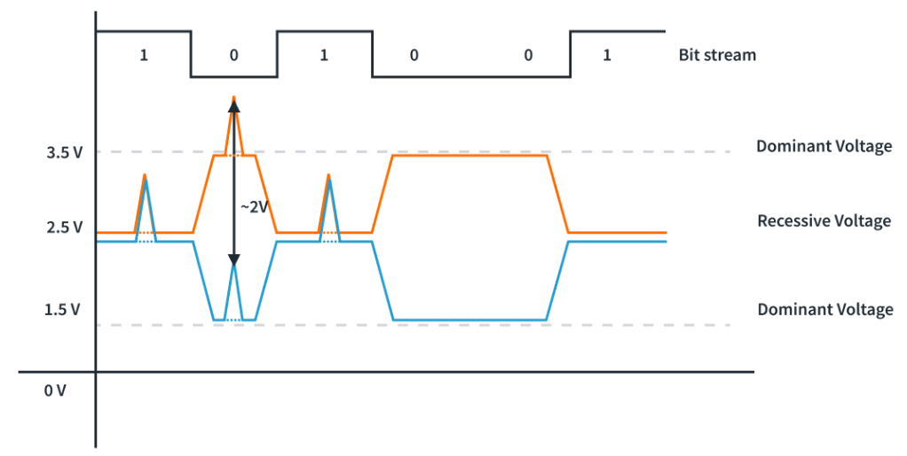
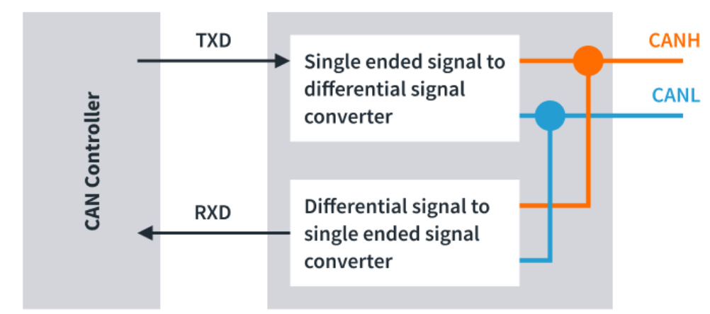
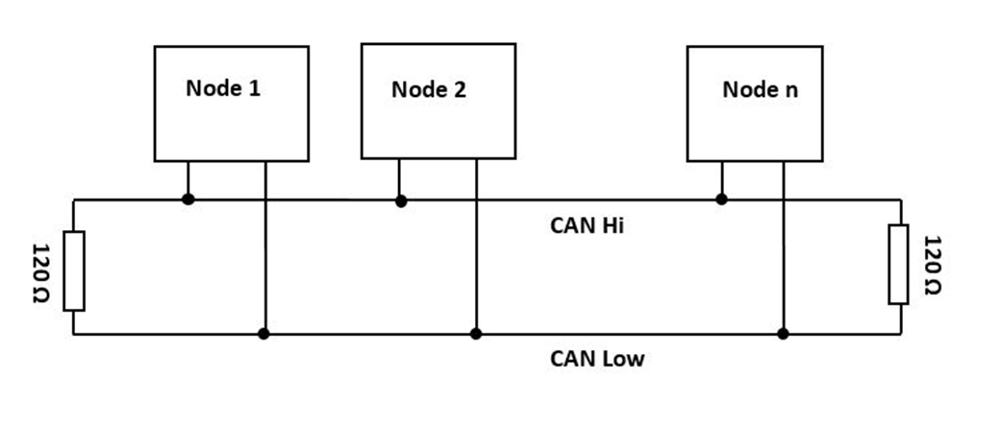
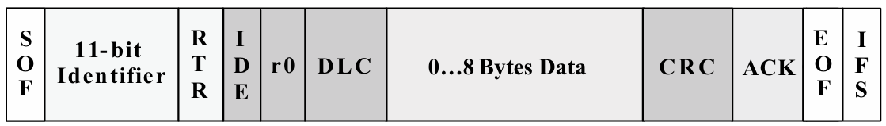
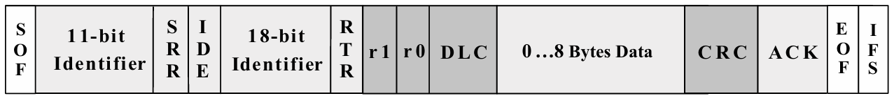
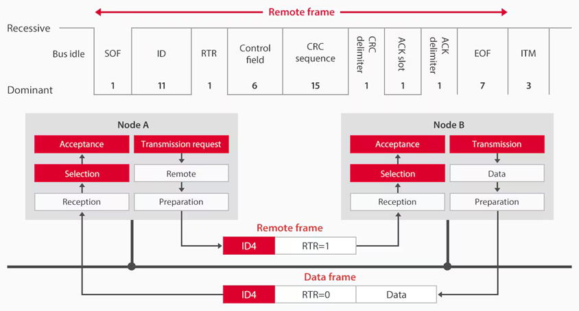
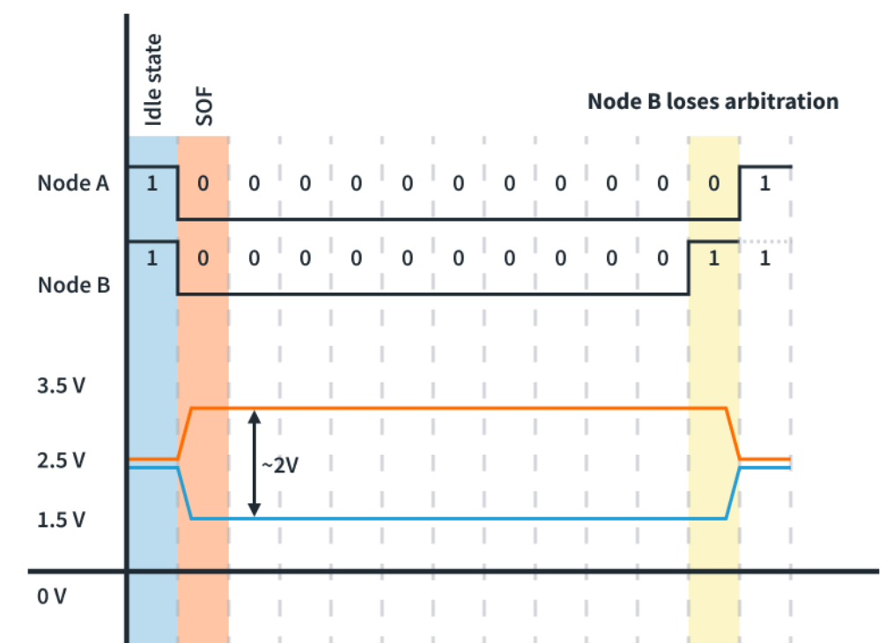
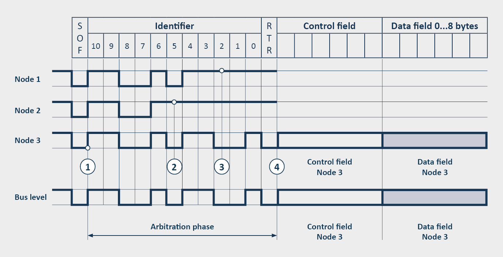
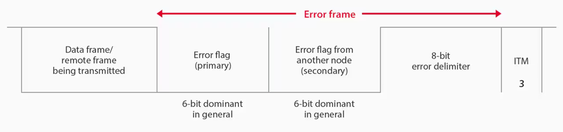

# 3.2 Embedded Systems Fundamentals — CAN Bus

[← Home](0.0-Introduction.md)

## Concept Introduction

Controller Area Network (CAN) is a **serial, multi-master, message-broadcast** bus developed by Bosch and standardized as **ISO 11898**, originally to replace point-to-point wiring harnesses in vehicles [1][2]. It differs from the point-to-point protocols in [3.1 Basic Communication Protocols](3.1-Embedded-Fundamentals-Basic%20Communication.md) in one fundamental way: there is no addressed "device" on the bus at all. Every node broadcasts short messages tagged with a **message identifier**, every other node receives every message, and each node's CAN controller decides locally — via **acceptance filtering** — whether a given message is relevant to it [1][2]. This makes CAN a natural fit for automotive networks, where many ECUs need the same sensor value (e.g. vehicle speed) at the same time.

- **Serial, asynchronous-framed, half-duplex**: one bit at a time over a shared two-wire bus; nodes take turns, never transmitting and receiving their own data simultaneously the way SPI does.
- **Multi-master**: any node can initiate a transmission when the bus is idle — there is no central bus master polling devices, unlike a typical I2C/SPI topology.
- **Message-based, not address-based**: frames carry a **message identifier** (what the data *is*), never a destination address (*who* should get it). This is the single biggest conceptual difference from UART/I2C/SPI.
- **Priority-based, non-destructive arbitration**: when two nodes transmit at once, the message with the numerically lower identifier wins the bus without either message being corrupted or retransmission needed by the winner — see [Bus Arbitration](#bus-arbitration) below.
- **Differential signaling**: two wires, `CAN_H` and `CAN_L`, are driven to opposite voltage offsets from a common-mode level; the receiver reads the *difference* between them, which is what gives CAN its strong noise immunity over standard twisted-pair cable [1].
- **Maximum signaling rate of 1 Mbps** under the classical CAN 2.0 / ISO 11898-2 high-speed standard used throughout this document [1][2].

## Physical Layer — Bus, Signaling, Topology

### Dominant and Recessive Bus States

CAN's bus arbitration and error signaling both rest on one electrical idea: the bus has exactly two logical states, and they are **not symmetric**.

- **Recessive** (logic 1): the bus's idle/default state. Every node's transceiver passively pulls its output toward recessive when not actively driving, so an idle bus — or a bus where every node is releasing it — reads recessive [1].
- **Dominant** (logic 0): actively driven by a transceiver. **Dominant always overwrites recessive** on the shared bus — if even one node drives dominant while every other node drives/releases recessive, the bus reads dominant [1][2].

This dominant-overwrites-recessive behavior is a **wired-AND**: the same physical idea I2C uses for clock stretching and bus arbitration in [3.1](3.1-Embedded-Fundamentals-Basic%20Communication.md#special-properties), but here it is the basis of the entire protocol rather than an edge case.

On the two-wire differential bus, dominant and recessive are encoded as a voltage difference rather than an absolute level:

```
Vdiff = V(CAN_H) − V(CAN_L)
```

- **Recessive**: both lines sit at the common-mode bias (~2.5 V), so `Vdiff ≈ 0 V`.
- **Dominant**: `CAN_H` is driven ~1 V higher (~3.5 V) and `CAN_L` ~1 V lower (~1.5 V), producing a typical `Vdiff ≈ 2 V` [1][3].



Because only the *difference* between the two wires is read, common-mode noise picked up equally by both wires (e.g. from a nearby motor controller, shown as the small spikes on both lines above) cancels out at the receiver and never crosses the recessive/dominant threshold — the same noise-immunity principle behind any balanced differential pair.

A **CAN transceiver** is what does this single-ended-to-differential conversion: it sits between the CAN controller's logic-level `TXD`/`RXD` pins and the physical `CAN_H`/`CAN_L` bus wires.



### Bus Topology and Termination

ISO 11898-2 (high-speed CAN, the variant covered throughout this document) specifies a **single linear bus** of twisted-pair cable, with every node tapping into the same `CAN_H`/`CAN_L` pair and a **120 Ω termination resistor at each physical end of the bus** (not at every node — a mid-bus node with its own termination would de-terminate the line the moment it's unplugged) [1]. The standard's headline numbers: up to **1 Mbps over 40 m**, up to **30 nodes**, with stub (drop) lengths off the main trunk kept under ~0.3 m to avoid reflections [1].



Each node is a stack of three layers, mirroring the ISO/OSI split shown in [3.1](3.1-Embedded-Fundamentals-Basic%20Communication.md):

| Layer | Component | Responsibility |
| --- | --- | --- |
| Application | MCU / DSP firmware | Builds and consumes message payloads |
| Data-link | **CAN controller** (often built into the MCU, e.g. RX63N's on-chip CAN module) | Bit timing, arbitration, stuffing, CRC, error handling — entirely transparent to firmware |
| Physical | **CAN transceiver** (e.g. NXP PCA82C250, TI SN65HVD230) | Converts the controller's logic-level TX/RX pins to/from the differential `CAN_H`/`CAN_L` bus voltages |

Because hot-plugging is explicitly supported by the standard, nodes can be added or removed while the bus is live without disrupting traffic already in flight — and a faulty node is designed to remove *itself* from the bus rather than take the network down (see [Fault Confinement](#error-detection-and-fault-confinement) below) [1][2].

## Frame Format — Standard and Extended CAN

Nodes exchange data using one of four frame types, only the first two of which are ever generated directly by application code (the other two are emitted automatically by the CAN controller hardware) [2]:

| Frame type | Generated by | Purpose |
| --- | --- | --- |
| **Data frame** | User / API | Carries up to 8 bytes of payload |
| **Remote frame** | User / API | Requests another node to send a data frame with a matching ID |
| **Error frame** | CAN controller | Signals a detected error to the whole bus |
| **Overload frame** | CAN controller | Requests extra delay before the next frame |

### Standard CAN (11-bit identifier)

```
| SOF | Identifier (11) | RTR | IDE | r0 | DLC (4) | Data (0-8 bytes) | CRC (15+1) | ACK (2) | EOF (7) |
```

- **SOF** (1 bit, dominant) — marks the start of a frame and re-synchronizes every node on the bus.
- **Identifier** (11 bits) — the message ID. **Lower numeric value = higher priority**; an all-zero identifier is the highest-priority message possible on the network [1][2].
- **RTR** (1 bit) — dominant for a data frame, recessive for a remote frame; this is the field that distinguishes the two.
- **IDE** (1 bit) — dominant in a Standard-CAN frame, signaling "no extended identifier follows."
- **r0** — reserved for future protocol use.
- **DLC** (4 bits) — number of data bytes (0–8) in this frame; in a remote frame, the number of bytes being *requested*.
- **Data** (0–8 bytes) — the payload; absent in a remote frame.
- **CRC** (15-bit sequence + 1-bit delimiter) — checksum of everything from SOF through the data field, used by every receiver for error detection.
- **ACK** (2 bits) — the transmitter sends this recessive; **any** receiver that got an error-free frame overwrites it dominant. This is a broadcast acknowledgment, not a per-receiver one — the transmitter only learns "at least one node ACKed," never which nodes received it.
- **EOF** (7 recessive bits) — marks the end of the frame; a dominant bit here is itself a stuffing-rule violation and is treated as an error.



### Extended CAN (29-bit identifier)

Extended CAN keeps the same overall shape but splits the identifier into an **11-bit base ID** and an **18-bit extension**, separated by an extra **SRR** bit (a placeholder where Standard CAN's RTR sits) and a recessive **IDE** bit signaling "18 more identifier bits follow," plus one additional reserved bit (**r1**) ahead of the DLC field [1][2]:

```
| SOF | Base ID (11) | SRR | IDE(1) | Extended ID (18) | RTR | r1 | r0 | DLC | Data | CRC | ACK | EOF |
```



11 bits give **2,048** distinct standard identifiers; 29 bits give **~537 million** extended identifiers [1]. Both formats can coexist on the same physical bus — the `IDE` bit tells every receiver which framing to expect mid-message.

A **remote frame** uses the same field layout as a data frame but with `RTR` recessive and no data field — it is how one node asks another to *send* a data frame with a matching ID, rather than carrying data itself:



### Bit Stuffing and Synchronization

CAN uses Non-Return-to-Zero (NRZ) encoding, where the bit level is held constant for the whole bit period — efficient, but it gives a receiver nothing to re-synchronize against during a long run of identical bits, and individual node oscillators (~0.5% accuracy) drift relative to each other over time [4]. CAN solves both problems with one mechanism:

- After **five consecutive bits of the same polarity**, the transmitter inserts one complementary "stuff bit"; the receiver strips it back out. This guarantees a bus transition at least every 5 bits — never with the field, no transmitted edges every node can use to keep its own bit timing aligned [1][4].
- Bit stuffing applies from **SOF through the CRC field** — it does *not* apply to the fixed-pattern ACK, EOF, and interframe-space fields, which rely on their fixed recessive runs being recognizable precisely because they are exempt from stuffing [1][4].
- Five-in-a-row of the **same** polarity outside a stuffed context is itself the trigger pattern for an **error frame** (which opens with six dominant bits) — stuffing violations are how the protocol detects a large class of transmission errors "for free" [1][4].

## Bus Arbitration

CAN's bus-access scheme is formally **CSMA/CD+AMP**: Carrier-Sense Multiple Access, with Collision Detection and Arbitration on Message Priority [1]. In practice:

1. **Carrier-sense**: a node only starts transmitting when the bus has been idle for a minimum period.
2. If two or more nodes start at the same instant, every node compares, bit by bit, what it is driving against what it actually reads back from the bus.
3. The moment a node drives **recessive** but reads back **dominant**, it knows another node's identifier bit beat it — it **immediately stops transmitting** and silently waits to retry once the bus is idle again [1][2].
4. The node whose identifier is **all dominant for longer** — i.e. the lower numeric ID — wins outright and continues its message uninterrupted, with **no time lost and no corruption** to the winning message [1][2].

| Node 1 | Node 2 | Resulting bus level |
| --- | --- | --- |
| Dominant | Dominant | Dominant |
| Dominant | Recessive | Dominant |
| Recessive | Dominant | Dominant |
| Recessive | Recessive | Recessive |

This AND-like truth table is exactly why arbitration is **non-destructive**: a losing node detects the mismatch within that same bit and simply yields, rather than the two messages colliding and both being garbled the way they would on a classic Ethernet collision domain [2]. This is also why a low-value identifier is described as "high priority" — it has more dominant (0) bits up front, so it survives arbitration against any identifier with a recessive bit in the same position.



The same process scales to any number of contending nodes — each one drops out the moment its own identifier bit loses, until only the highest-priority message is left transmitting:



## Error Detection and Fault Confinement

CAN is unusually aggressive about catching errors, combining five independent detection mechanisms, three at the message level and two at the bit level [1]:

1. **Bit monitoring** — every transmitter reads back every bit it sends and compares it to what it meant to send (outside the identifier/ACK fields, where a mismatch is expected by design during arbitration/acknowledgment).
2. **CRC check** — the 15-bit CRC at the end of the frame is recomputed by every receiver.
3. **Frame check** — fixed-format fields (SOF, EOF, ACK delimiter, CRC delimiter) must always read recessive; a dominant bit there is a form error.
4. **ACK check** — a transmitter that gets no dominant ACK bit back from any receiver knows nobody accepted the frame.
5. **Bit-stuffing check** — six consecutive identical bits where stuffing should have prevented it is itself flagged as an error.

Any one of these failing causes the detecting node to broadcast an **error frame** (six dominant bits, which by construction is high enough priority to interrupt everything else on the bus), and the original transmitter automatically retries — the retried frame still has to win arbitration again like any other transmission [1][2].



Because every other node that also observes the same violation pitches in with its own dominant error flag, the error frame above shows both the original detecting node's **primary** flag and **secondary** flags from other nodes layering on top before the bus settles back to the recessive delimiter.

### Fault Confinement States

So that one electrically faulty node can't monopolize the bus with endless error frames, every node tracks a **transmit error counter (TEC)** and **receive error counter (REC)** — incremented on failures, decremented on successful transmissions/receptions — and moves through three states based on those counts [4]:

| State | Trigger | Behavior |
| --- | --- | --- |
| **Error active** | Default state after reset | Signals errors with a 6-dominant-bit error flag, same as any other transmission |
| **Error passive** | TEC or REC ≥ 127 | Still participates, but signals errors with a *passive* (6-recessive-bit) flag so it can no longer dominate the bus with errors |
| **Bus off** | TEC > 255 | Detaches itself from the bus entirely — stops transmitting and receiving until explicitly reinitialized |

This is the mechanism referenced in the bootloader-adjacent design guidance from [3.3](3.3-Embedded-Fundamentals-Boothloader.md): an application should poll the CAN status register (or use the CAN error interrupt) once per main loop, treat Error Passive as a "something's wrong, tell the user" signal, and treat Bus Off as "stop trying to communicate until the peripheral reports Error Active again — then reinitialize CAN from scratch" [4].

## CAN Standards (ISO 11898 family)

CAN as described above is the **data-link layer** (ISO 11898-1); the *physical* layer is standardized separately, which is why "CAN" alone doesn't fully specify a bus — the variant matters [4]:

| Standard | Scope |
| --- | --- |
| **ISO 11898-1** | CAN data-link layer and physical signaling (protocol logic itself) |
| **ISO 11898-2** | High-speed medium access unit — the two-wire balanced bus described throughout this document; dominant in automotive powertrain and industrial control |
| **ISO 11898-3** | Low-speed, fault-tolerant physical layer (can keep communicating with one wire shorted/open) |
| **ISO 11898-4** | Time-Triggered CAN (TTCAN) — adds a system-wide schedule on top of standard CAN arbitration |
| **ISO 11898-5/-6** | High-speed CAN with low-power and selective-wake-up modes |
| **ISO 11992-1** | Fault-tolerant CAN for truck/trailer interconnects |
| **ISO 11783-2** | 250 kbps agricultural-equipment CAN variant (four-wire, adds a separate power/ground pair) |

## MCU CAN Peripheral — Registers and Operating Modes

The register-level details below follow the Renesas RX63N's on-chip CAN module as a concrete worked example [4]; an NXP S32K MCAL `Can` driver (see [5.1 NXP Platform Overview](5.1-NXP-Platform-Overview.md)) exposes the same concepts — mailboxes, acceptance filters, bit-timing registers — through AUTOSAR-standardized APIs instead of direct register pokes, but the underlying CAN-controller hardware model is the same across vendors.

### Mailboxes

A CAN controller doesn't have "TX/RX registers" the way a UART does — it has an array of **mailboxes** (32 on the RX63N), each independently configurable as a transmit or receive slot, holding one full message's ID, DLC, 8 data bytes, and a hardware timestamp [4]:

- **Normal mailbox mode**: all 32 mailboxes can be transmit or receive, freely mixed — the recommended starting point while learning the peripheral.
- **FIFO mailbox mode**: 24 mailboxes stay general-purpose; the remaining 8 split into a 4-deep TX FIFO and a 4-deep RX FIFO for higher-throughput streaming use cases.

When more than one mailbox is configured to receive the same message, **the lowest-numbered matching mailbox wins** — the same "lower number = higher priority" idea as the bus identifier, applied locally to mailbox selection [4].

### Key Registers

| Register | Purpose |
| --- | --- |
| **CTLR** (Control Register) | Selects operating mode (reset/halt/operate/sleep), mailbox mode, ID format, message-lost behavior |
| **BCR** (Bit Configuration Register) | Baud-rate prescaler (`BRP`) and bit-timing segments (`TSEG1`, `TSEG2`, `SJW`) — see Bit Timing below |
| **MKRk** (Mask Register, k=0..7) | Acceptance-filter mask, shared across a block of mailboxes |
| **MKIVLR** (Mask Invalid Register) | Per-mailbox bit to bypass masking and require an exact ID match |
| **MBj** (Mailbox j, j=0..31) | The message itself: ID, IDE, RTR, DLC, 8 data bytes |
| **MCTLj** (Message Control Register j) | Per-mailbox request/status bits: `TRMREQ`/`RECREQ` (request), `SENTDATA`/`NEWDATA` (completion), `MSGLOST` (overrun) |
| **STR** (Status Register) | Bus-wide status: reset/halt/sleep state, transmit/receive-in-progress, error status |

Acceptance filtering compares an incoming message's ID against a mailbox's configured ID **after applying the corresponding `MKRk` mask** — bits set in the mask are "don't care" positions, letting one mailbox accept a *range* of IDs rather than just one exact match; setting a mailbox's bit in `MKIVLR` instead forces an exact-ID-only match for that one mailbox [4].

### Operating Modes

The CAN module moves through four mutually exclusive modes, set via `CTLR.CANM[1:0]`:

```
CPU reset → CAN sleep mode → CAN reset mode → CAN halt mode → CAN operation mode
```

- **CAN reset mode** — entered first after a CPU reset; this is where `BCR` (bit timing) must be configured, since it cannot be changed once communication starts.
- **CAN halt mode** — used to configure mailboxes (`MBj`, `MCTLj`, `MKRk`, `MKIVLR`) and self-test settings; all other registers retain their values.
- **CAN operation mode** — normal communication; the module becomes an active bus node once it observes 11 consecutive recessive bits (confirming the bus is genuinely idle, not just momentarily quiet).
- **CAN sleep mode** — clock gated off to the CAN module for low power; entered/exited only from reset or halt mode, and only the `SLPM` bit itself may be touched while asleep.

A node that hits the **Bus Off** fault-confinement state (see above) automatically falls back out of operation mode and must be walked back through reset/halt/operate again by software once the underlying fault clears [4].

### Bit Timing and Baud Rate

Every bit period is divided into time quanta (**Tq**) derived from the peripheral clock, split into three segments plus the fixed 1-Tq sync segment:

```
Bit time = SS (1 Tq) + TSEG1 (4-16 Tq) + TSEG2 (2-8 Tq)
Bit rate = fCANCLK / (segments expressed in Tq per bit)
SJW (1-4 Tq) ≤ min(TSEG1, TSEG2)   — resynchronization jump width
```

- `TSEG1` sets where, within the bit, the controller samples the bus level (the "sample point") — placing it later in the bit (a larger `TSEG1`) gives noise more time to settle before the sample is taken.
- `SJW` (Synchronization Jump Width) bounds how far the controller may shift its next sample point, per edge, to correct for the ~0.5% oscillator drift between nodes mentioned under [Bit Stuffing](#bit-stuffing-and-synchronization) — this is what keeps independently clocked nodes synchronized without a shared clock line.
- **All nodes on one bus must agree on the resulting bit rate** (commonly 125 kbps / 250 kbps / 500 kbps / 1 Mbps), even though each derives it from its own `BRP`/`TSEG1`/`TSEG2` register values and its own peripheral clock — a baud-rate mismatch here is the CAN equivalent of the UART baud-mismatch bug from [3.1](3.1-Embedded-Fundamentals-Basic%20Communication.md#special-properties), except CAN's bit-stuffing-driven resynchronization makes it considerably more tolerant of small drift than UART is.

## Sample — Initialization, Transmit, and Receive

Direct register-level CAN bring-up on the RX63N (illustrative, condensed from [4]) — note that production firmware would normally use a vendor-supplied CAN driver/API layer (or an AUTOSAR `Can` MCAL module) instead of poking these registers directly, the same way [3.3](3.3-Embedded-Fundamentals-Boothloader.md) layers a bootloader beneath the application rather than having every application touch flash registers itself:

```c
/* 1. Enter CAN reset mode and configure bit timing (100 kbps example) */
CAN0.CTLR.BIT.CANM = 1;            /* CAN reset mode */
CAN0.BCR.BIT.BRP   = 19;           /* prescaler: fCANCLK = fCAN / (BRP+1) */
CAN0.BCR.BIT.TSEG1 = 14;           /* sample-point segment */
CAN0.BCR.BIT.TSEG2 = 7;            /* TSEG2 < TSEG1 */
CAN0.BCR.BIT.SJW   = 1;            /* resync jump width */
CAN0.MKIVLR.LONG   = 0xFFFFFFFF;   /* mask invalid for all mailboxes (exact match) */

/* 2. Enter CAN halt mode and configure mailboxes */
CAN0.CTLR.BIT.CANM = 2;            /* CAN halt mode */

/* Receive mailbox: standard ID 0x001, data frame */
CAN0.MCTL[rxmbx].BYTE = 0;
CAN0.MB[rxmbx].ID.BIT.SID = 0x001;
CAN0.MB[rxmbx].ID.BIT.RTR = 0;
CAN0.MB[rxmbx].ID.BIT.IDE = 0;
CAN0.MCTL[rxmbx].BYTE |= 0x40;     /* RECREQ = 1: configure as receive mailbox */

/* Transmit mailbox: standard ID 0x001, 8 data bytes */
CAN0.MCTL[txmbx].BYTE = 0;
CAN0.MB[txmbx].ID.BIT.SID = 1;
CAN0.MB[txmbx].ID.BIT.IDE = 0;
CAN0.MB[txmbx].ID.BIT.RTR = 0;
CAN0.MB[txmbx].DLC = 0x8;

/* 3. Enter CAN operation mode */
CAN0.CTLR.BIT.CANM = 0;
```

```c
/* Polling receive: wait for a fully-written, unread message in rxmbx */
int rxpoll(int mailboxno) {
    int polling = 0x80;
    while (CAN0.MCTL[mailboxno].BIT.RX.INVALDATA && polling) polling--;
    if (polling == 0) return 0;                 /* still mid-update, retry later */
    return CAN0.MCTL[mailboxno].BIT.RX.NEWDATA;  /* 1 once a full message is ready */
}

void rxread(int mailboxno) {
    for (int i = 0; i < CAN0.MB[mailboxno].DLC; i++)
        rxframe.data[i] = CAN0.MB[mailboxno].DATA[i];
    if (CAN0.MCTL[mailboxno].BIT.RX.MSGLOST)
        CAN0.MCTL[mailboxno].BIT.RX.MSGLOST = 0; /* a newer frame overwrote one we hadn't read */
    CAN0.MCTL[mailboxno].BIT.RX.NEWDATA = 0;     /* re-arm for the next message */
}

/* Transmit: load data into the mailbox, then request transmission */
void cantx(int txbx, uint8_t *data, int len) {
    CAN0.MCTL[txbx].BIT.TX.TRMREQ   = 0;         /* clear any prior request first */
    CAN0.MCTL[txbx].BIT.TX.SENTDATA = 0;
    for (int i = 0; i < len; i++) CAN0.MB[txbx].DATA[i] = data[i];
    CAN0.MCTL[txbx].BIT.TX.TRMREQ   = 1;         /* hardware now contends for the bus */
}
```

The polling pattern above (`INVALDATA` → `NEWDATA` → clear `NEWDATA`) is the manual equivalent of the **CANi reception complete interrupt**, and `SENTDATA` going high is the equivalent of the **CANi transmission complete interrupt** — an interrupt-driven design just moves these same flag checks into ISRs instead of a polling loop, exactly as the UART `RXNE` flag/interrupt pairing works in [3.1](3.1-Embedded-Fundamentals-Basic%20Communication.md#uart-universal-asynchronous-receivertransmitter) [4].

## Q&A

- **Q: Why doesn't CAN need device addresses the way I2C does?**
  A: I2C's master needs to pick a specific slave for a transfer, so it needs an address. CAN broadcasts every message to every node and lets each node's acceptance filter decide locally whether the *content* (the message ID) is relevant — there is no concept of "this message is for node X" in the protocol at all, only "this message is data type Y."
- **Q: If two nodes transmit at exactly the same time, doesn't that corrupt both messages, like an Ethernet collision?**
  A: No — this is CAN's signature feature. Because every transmitter reads back the bus while it sends, a node loses arbitration the instant it sends recessive but reads dominant, and it simply stops without ever having corrupted the bus — the winning node's frame is completely intact. Compare this to classical (non-switched) Ethernet's CSMA/CD, where a collision corrupts *both* frames and both senders must back off and retry.
- **Q: Why is a low-numbered CAN identifier "high priority"?**
  A: Dominant = logic 0, and dominant always wins arbitration. A lower binary identifier value has dominant bits earlier/more often in the ID field, so it keeps winning the bit-by-bit comparison against any identifier that has a recessive (1) bit in the same position — which is exactly why "all zeros" is the highest possible priority.
- **Q: What's the practical difference between Error Passive and Bus Off, and why does it matter for application design?**
  A: Error Passive means the node is having trouble but is still a participating bus member — it's a "raise a warning" signal. Bus Off means the node has electrically detached itself and is no longer transmitting *or* receiving until software explicitly reinitializes the CAN peripheral — application code has to actively poll for this state and treat it as "stop assuming any CAN message will arrive" until recovery, since the hardware won't silently resume on its own.
- **Q: Standard (11-bit) vs. Extended (29-bit) identifiers — when would a system need the larger ID space?**
  A: 2,048 IDs (Standard) is more than enough for most single-vehicle networks, which is why automotive powertrain/body networks predominantly use Standard CAN. Extended IDs show up where the ID space needs to encode more structure directly into the identifier itself (e.g. SAE J1939's PGN-based addressing used in commercial trucks/agriculture), or where many independent subsystems' ID ranges need to coexist without collision.

## References

1. Corrigan, S. (2002, rev. 2016). *Introduction to the Controller Area Network (CAN)*, SLOA101B, Texas Instruments — primary source for the physical layer, dominant/recessive signaling, bus topology/termination, transceiver features, and ISO 11898 layering throughout this document.
2. Corrigan, S. (2002, rev. 2016), *ibid.* — primary source for the CSMA/CD+AMP arbitration mechanism, Standard/Extended frame field definitions, message types, and error-checking methods.
3. Corrigan, S. (2002, rev. 2016), *ibid.*, Figure 7 — source for the dominant/recessive bus voltage levels (`Vdiff`, ~2.5 V common-mode bias).
4. Conrad, J. M., & Mitra, A. (2014). *Embedded Systems Using the Renesas RX63N Microcontroller: Advanced Topics*, Chapter 10 "CAN Bus" — primary source for bit stuffing, fault confinement states (error active/passive/bus off), the RX63N CAN module's register set (CTLR/BCR/MKR/MB/MCTL/STR), operating-mode state machine, bit-timing/baud-rate formulas, and the mailbox initialization/transmit/receive code samples.
5. Supplementary diagrams (bus topology/termination, differential signaling waveform, transceiver block diagram, bit-wise arbitration, standard/extended/remote/error frame layouts) — reference illustrations collected alongside the PDFs above; original web source not captured.
6. Related: [3.1 Embedded Fundamentals — Basic Communication Protocols](3.1-Embedded-Fundamentals-Basic%20Communication.md), [3.3 Embedded Fundamentals — Bootloader](3.3-Embedded-Fundamentals-Boothloader.md), [5.1 NXP Platform Overview](5.1-NXP-Platform-Overview.md).
