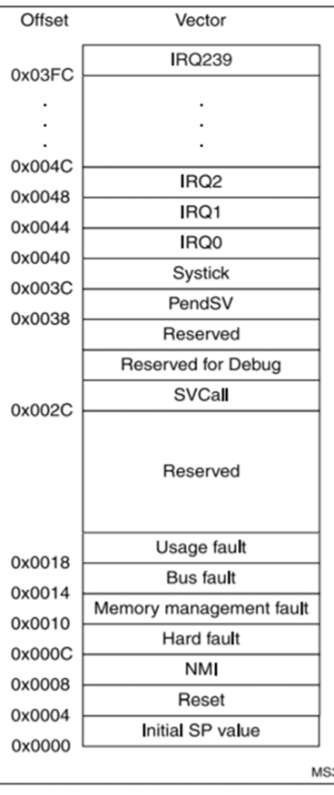
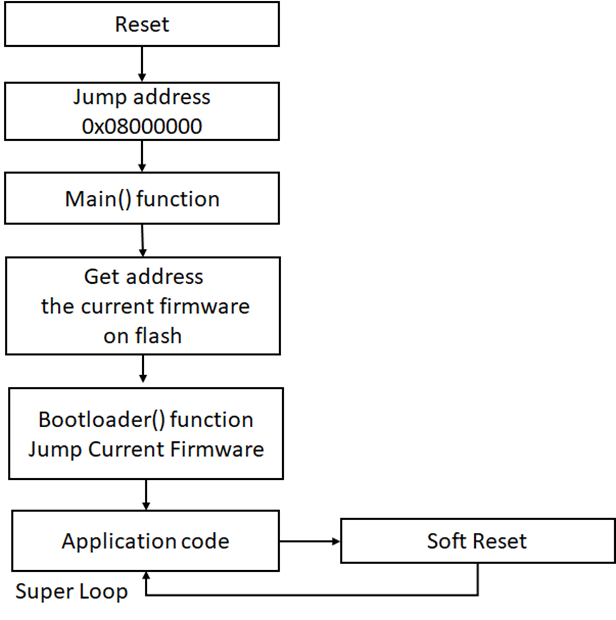
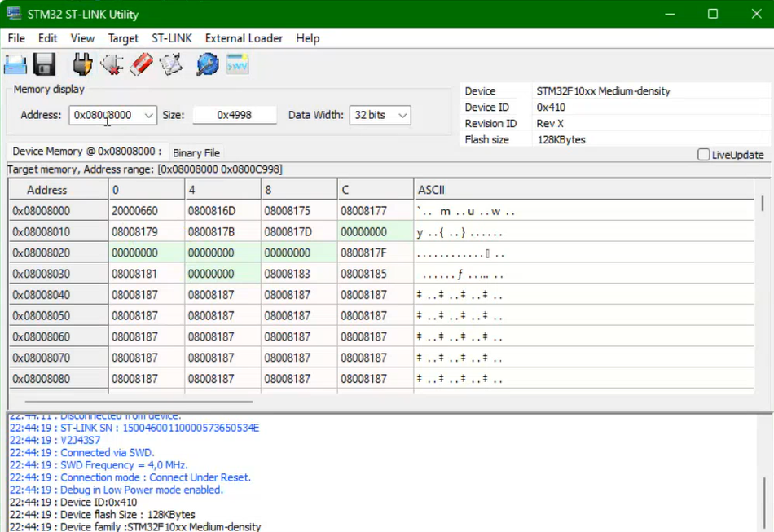

# 3.3 Embedded Fundamentals — Bootloader

[← Home](0.0-Introduction.md)

## Concept Introduction

- A **bootloader** is the first software that runs when an MCU comes out of reset. Two distinct things get called "bootloader" and it's worth keeping them separate:
  - **OS-loading bootloader** (PC BIOS/UEFI, or U-Boot on a Cortex-A/Linux SoC): its job is to find and start an operating system.
  - **Firmware field-update bootloader** (the subject of this document): there is no separate OS to load. Its job is to decide, on every reset, whether to (a) accept a new application image over some communication link (UART/CAN/I2C/USB/...) and reprogram flash with it, or (b) jump straight into the already-flashed application — so that a product's firmware can be updated in the field without a JTAG programmer or a factory return [1].
- A system with this kind of bootloader always has **at least two program images coexisting in the same flash**: the bootloader itself, and the application. The bootloader owns the decision of which one runs on a given reset [1].

## Scope — Memory Layout, Vector Table, and Stack Pointers

### Memory Layout and Where the Bootloader Must Live

- Flash is organized hierarchically: **pages** (smallest writable unit) → **sectors** (smallest erasable unit, often a few kB) → **blocks** [1].
- On every Cortex-M reset, the CPU hardware fetches from one fixed, hardwired address — it cannot be told in software to start anywhere else. On STM32 parts that fixed address is `0x0000_0000`, and the **BOOT0** pin (and **BOOT1** on older families) selects, in hardware, *which physical memory is aliased there*: Main Flash (normally based at `0x0800_0000`), ST's built‑in **System memory** bootloader (a different bootloader than the one this document builds — ST's factory UART/USB/I²C loader), or embedded SRAM.
- Because that very first fetch is fixed by hardware, the field-update bootloader described here has no choice but to *be* the image stored at the boot address (`0x0800_0000` throughout this document, confirmed by the flash dump in Troubleshooting below) — nothing else can occupy it.
- Reasons the bootloader is placed, and sized, the way it is (per the PDF's "Memory Partitioning" guidance [1]):
  1. **Hardware-fixed boot address** — not a choice; the reset sequence below always starts there.
  2. **Erase-sector alignment** — both the bootloader and the application must start on a flash-sector boundary, so erasing/reprogramming one image can never erase the other's sectors.
  3. **Write/read protection** — many MCUs can lock specific sectors against accidental erasure; keeping the bootloader inside a protected region stops it from bricking itself.
  4. **Size budget** — keep the bootloader as small as the chip's erase granularity allows (the PDF's rule of thumb is to start around 4 kB [1]) so the application keeps the most flash. This project's STM32F10xx configuration allocates `0x0800_0000`–`0x0800_8000` (32 kB) to the bootloader, with the application starting at `0x0800_8000`.

### Reset Vector, Interrupt Vectors, and the Vector Table

The **vector table** is a fixed array of 32-bit words at the base of an image (the bootloader's table at `0x0800_0000`, the application's at `0x0800_8000`). Every entry is either the one special *Initial SP value*, or the address of a handler function:



| Offset | Entry | What it holds |
| --- | --- | --- |
| `0x0000` | Initial SP value | not an address to jump to — the literal value loaded into the Main Stack Pointer (see below) |
| `0x0004` | **Reset vector** | address of `Reset_Handler` — the first instruction the CPU executes |
| `0x0008`–`0x0018` | NMI, Hard fault, Memory management fault, Bus fault, Usage fault | fixed system exception handlers |
| `0x002C` | SVCall | supervisor call exception (RTOS syscalls) |
| `0x0038`, `0x003C` | PendSV, SysTick | RTOS context-switch and system-tick exceptions |
| `0x0040`–`0x03FC` | **Interrupt vectors** IRQ0…IRQ239 | one address per external/peripheral interrupt; the NVIC supports up to 240 of these on Cortex-M4 [2] |

- The **reset vector** is specifically the word at offset `0x0004`: the address of `Reset_Handler`. The **interrupt vectors** are every other handler-address entry in the same table — looked up by the NVIC whenever that exception or peripheral interrupt fires.
- Because the bootloader and the application are independent, complete programs, **each needs its own full vector table**. Cortex-M solves this with the **VTOR** (Vector Table Offset Register, part of the SCB): whichever image is running points VTOR at its own table base, so the NVIC always reads the *currently running* image's handlers — this is exactly what `SCB->VTOR = ...` does in the Sample below.

### MSP, PSP, and the Initial SP Value

- Cortex-M banks two stack pointers behind register R13 [2]: the **Main Stack Pointer (MSP)** and the **Process Stack Pointer (PSP)**. Only one is active at a time (selected by `CONTROL.SPSEL`); after reset `SPSEL = 0`, so **MSP is always the active stack pointer out of reset** — PSP only matters once an RTOS explicitly switches to it for task stacks, which this bootloader does not do.
- The **Initial SP value** (vector-table offset `0x0000`) is the one entry the hardware loads *directly* into MSP instead of treating as a code address — normally the top of SRAM (e.g. the linker's `_estack`/`__StackTop` symbol), not a flash address.
- **Correcting a common mix-up**: `0x0800_0000` is the **flash base address where the bootloader's vector table is stored** — it is *not itself* the Initial SP value. The Initial SP value is the word read *from* that address (offset `0x0000` inside the table), and it points into SRAM, not flash [2].

## Operations — Power-Up to Application, and the Reset Procedure



**Hardware reset sequence (runs before any software, identical on power-up and on a reset button press):**

1. The **BOOT0** pin state, sampled at reset, selects which physical memory is aliased at `0x0000_0000` — Main Flash, System memory, or SRAM (see Memory Layout above). This decides *where the vector table below is read from*; it does not by itself select bootloader vs. application.
2. The CPU reads the word at vector-table offset `0x0000` and loads it **directly into MSP** — no software has executed yet.
3. The CPU reads the word at offset `0x0004` (the reset vector) into the Program Counter and begins executing `Reset_Handler`.

**This project's bootloader (software, runs after step 3 above):**

4. `Reset_Handler` performs the standard C-runtime start-up — the "copy down" step [1]: copy `.data` from flash to RAM, zero `.bss` — then calls `main()`.
5. `main()` calls `Boot()`, which performs a *warm jump* into the application: load MSP from the application's vector table, relocate `VTOR` to the application's table, then branch to the address stored at the application's reset vector (`0x0800_8000 + 0x04`).
6. Execution is now inside the **application's own** `Reset_Handler`, which repeats step 4 — its own copy-down — before calling the application's `main()`.

**Reset procedure (reset button / watchdog reset while running):** a reset re-runs the *entire* hardware sequence above from step 1 — it does not resume where execution left off. Two corrections to keep in mind here:

- **BOOT0/BOOT1 only run once, at the hardware reset itself**, and they only ever choose between Main Flash / System memory / SRAM. They are *not* re-consulted to jump from the bootloader into the application after a firmware update — that hand-off is done entirely in software (step 5, the `Boot()` function below).
- This project's current `Boot()` jumps **unconditionally** — it does not yet check that the application's reset vector is valid before jumping. See Troubleshooting #1 below for why that matters and how to add the check.

## Sample — Bootloader `Reset_Handler` and Application Hand-off

```c
/* startup.c — bootloader's own Reset_Handler (CMSIS-style startup, illustrative) */
extern uint32_t _sidata, _sdata, _edata, _sbss, _ebss; /* linker-provided symbols */
extern int main(void);

void Reset_Handler(void) {
    /* 1. Copy .data section from flash to RAM ("copy down") */
    uint32_t *src = &_sidata, *dst = &_sdata;
    while (dst < &_edata) {
        *dst++ = *src++;
    }

    /* 2. Zero-initialize .bss section */
    dst = &_sbss;
    while (dst < &_ebss) {
        *dst++ = 0;
    }

    /* 3. Optional: early clock/PLL bring-up */
    SystemInit();

    /* 4. Call main() -- never expected to return */
    main();
    while (1) { /* should never reach here */ }
}
```

```c
/* boot.c -- decides whether to stay resident or hand off to the application */
#define APP_VECTOR_TABLE_ADDR 0x08008000U  /* application's flash base -- see Memory Layout above */

void Boot(void) {
    /* Reset the clock system before handing off to the application */
    RCC_DeInit();

    /* Disable fault interrupts during the handoff so a fault can't fire
       mid-transition, before the application's own vector table is live */
    SCB->SHCSR &= ~(SCB_SHCSR_USGFAULTENA_Msk | SCB_SHCSR_BUSFAULTENA_Msk | SCB_SHCSR_MEMFAULTENA_Msk);

    /* Load the Main Stack Pointer (MSP) from the application's vector table,
       offset 0x00 -- the Initial SP value, not a code address (see
       "MSP, PSP, and the Initial SP Value" above) */
    __set_MSP(*(__IO uint32_t*)(APP_VECTOR_TABLE_ADDR));

    /* Relocate VTOR so the NVIC now reads exception/interrupt handlers from
       the application's vector table instead of the bootloader's */
    SCB->VTOR = APP_VECTOR_TABLE_ADDR;

    /* Read the reset vector -- offset 0x04 -- the address of the
       application's own Reset_Handler */
    uint32_t appResetAddr = *(__IO uint32_t*)(APP_VECTOR_TABLE_ADDR + 4U);

    /* Branch into the application's Reset_Handler. It runs the
       application's own copy-down and then its own main(); the bootloader
       never returns from here. */
    void (*appResetHandler)(void) = (void (*)(void)) appResetAddr;
    appResetHandler();
}

int main(void) {
    Boot();
}
```

## Troubleshooting

### 1. Bootloader jumps to a non-existent application ("jumps into the weeds")

- **Symptom**: nothing happens, or the MCU hangs/behaves erratically, right after `Boot()` runs.
- **Root cause**: erased flash reads back as `0xFFFFFFFF`. If no application has been flashed yet, `APP_VECTOR_TABLE_ADDR + 4` holds `0xFFFFFFFF`, and `Boot()` above jumps to it unconditionally — straight into garbage [1].
- **Fix**: validate the application's reset vector *before* jumping, and fall back to staying in the bootloader (idle/listen for a new image) if it's invalid:
  ```c
  uint32_t appResetAddr = *(__IO uint32_t*)(APP_VECTOR_TABLE_ADDR + 4U);
  if (appResetAddr != 0xFFFFFFFFU) {
      /* ...proceed with the MSP/VTOR/jump sequence above... */
  } else {
      /* stay resident: no valid application, wait for a firmware update */
  }
  ```

### 2. Application runs standalone but not when loaded through the bootloader

- **Symptom**: flashing the application directly with a debugger works fine; flashing it through the bootloader's update path produces no visible behavior.
- **Root cause**: a debugger silently does extra work (loading symbols, sometimes re-running C-runtime init) that the bootloader's bare warm jump does not.
- **Fix**: while halted in the bootloader, use the IDE's **Add Symbols** feature to load the application's symbol file [1]. Single-stepping through `Boot()` then lands in readable application C code instead of a disassembly view, making it possible to actually debug the hand-off.

### 3. Verifying the flashed application image is correct

- **Symptom**: suspect the application image is partially or incorrectly written to flash.
- **Root cause**: a buffer or write bug in the bootloader's flashing routine.
- **Fix**: dump the application's flash region with a memory/debug tool — e.g. the address range shown here in ST-LINK Utility:

  

  Take one dump with the application flashed directly, and a second dump with it flashed through the bootloader, then diff the two binaries (the PDF recommends WinMerge [1]). Identical dumps confirm the bootloader wrote the image correctly; differences point to the flashing routine.

### 4. Application misbehaves only when entered via the bootloader's jump (copy-down issue)

- **Symptom**: application works when flashed and run standalone, but exhibits strange behavior (uninitialized variables, etc.) only when entered through `Boot()`.
- **Root cause**: the application's own `.data`/`.bss` copy-down (its own `Reset_Handler`, shown in Sample above) must run again after the warm jump — it is not automatic. Some IDEs silently insert this call when debugging standalone, masking the bug [1].
- **Fix**: confirm the application's own startup file actually performs the copy-down before calling its `main()`; don't rely on the debugger having done it.

### 5. System misbehaves after the jump even though the vector, image, and copy-down are all correct

- **Symptom**: everything above checks out, but the application still behaves incorrectly after a bootloader-mediated jump (works fine on a cold flash + reset).
- **Root cause**: some peripheral/mode registers are **write-once after reset** on certain MCUs. If the bootloader configures one of these and the application's startup tries to reconfigure it differently, the result is undefined [1].
- **Fix**: audit registers the bootloader touches before jumping — the PDF flags **watchdog timers**, **processor mode**, and **memory remap registers** specifically [1] — and ensure the application's startup either reuses the bootloader's configuration for these or confirms the register is still writable.

## Q&A

1. **What do we actually erase when we "erase full chip" on the STM32 ST-LINK Utility?**

   A: Only the flash. SRAM contents and any non-volatile config outside the flash array (e.g. option bytes) are untouched unless separately addressed.

2. **What's the difference between the Initial SP value and the reset vector in the vector table?**

   A: Offset `0x0000` (Initial SP value) is loaded *directly* into MSP — it's a stack address, not code. Offset `0x0004` (reset vector) is loaded into the Program Counter — it's the address the CPU starts executing at. Confusing the two is the single most common vector-table mistake (see the correction in "MSP, PSP, and the Initial SP Value" above).

3. **Why does the bootloader have to rewrite `SCB->VTOR` before jumping to the application?**

   A: Because the bootloader and the application each ship their own complete vector table. If VTOR still pointed at the bootloader's table, every exception/interrupt taken inside the application (including SysTick, faults, and peripheral IRQs) would dispatch to the *bootloader's* handlers instead of the application's.

## References

1. Beningo, J. (2015). *Bootloader Design for Microcontrollers in Embedded Systems*, Rev A2 — primary source for the boot-loader requirements, behavior, start-up branching, memory partitioning, reset/interrupt vector explanation, and troubleshooting guidance throughout this document.
2. [ARM Cortex-M4 Architecture](https://microcontrollerslab.com/arm-cortex-m4-architecture/) — microcontrollerslab.com — source for the core register set (R13/SP, R14/LR, R15/PC), the MSP/PSP banked stack pointers, the NVIC's up-to-240-external-interrupt count, and the vector-table-offset-0x0000-is-Initial-SP-not-an-address distinction, all cited above.
3. Related: [2.1 AUTOSAR Architecture](2.1-AUTOSAR-Architecture.md), [2.2 AUTOSAR Classic Platform](2.2-AUTOSAR-Classic-Platform.md) for where MCAL/driver code sits relative to the bootloader and application images described here.
