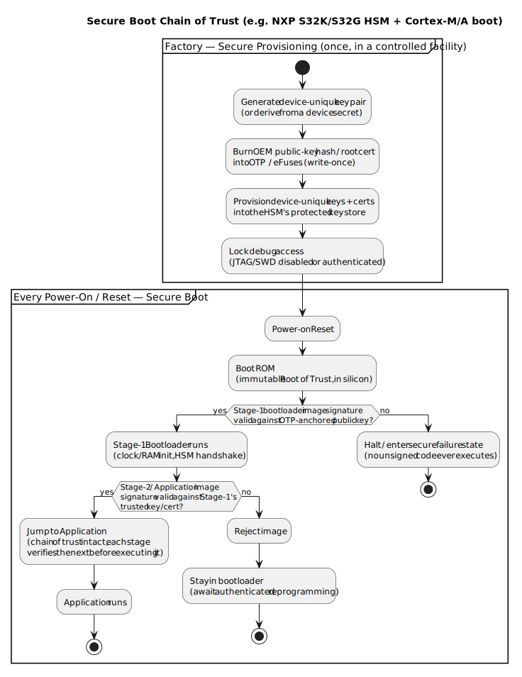

# 3.3.1 Embedded Fundamentals — Secure Boot, Firmware Authentication & Root of Trust

[← Home](0.0-Introduction.md)

This document extends [3.3 Bootloader](3.3-Embedded-Fundamentals-Boothloader.md): that document covers *how* a bootloader decides whether to reprogram flash or jump to the application, but treats every image it finds as trustworthy. This document adds the security layer on top — how the system knows the image it is about to run was actually put there by the OEM/Tier-1, and hasn't been tampered with — which is what turns a plain field-update bootloader into a **secure boot** implementation.

## Concept Introduction

- **Secure boot** is the practice of cryptographically verifying every piece of code before it is allowed to execute, starting from an immutable anchor in silicon and extending link-by-link up to the application — so that no unsigned or tampered firmware can ever run on the device [1][2].
- **Root of Trust (RoT)**: the one component in the chain that is *not* itself verified by anything else — it is trusted by construction. In an automotive MCU this is normally a combination of:
  - **Boot ROM** — code masked into silicon at manufacture; cannot be modified after the die is made.
  - **OTP / eFuses** — one-time-programmable memory holding the hash of the OEM's public key (or the root certificate itself), burned once during manufacturing/provisioning and unreadable/unwritable afterward.
  - A **hardware security enclave** alongside the main core — e.g. NXP's **CSEc** (Cryptographic Service Engine, S32K1xx) or **HSE** (Hardware Security Engine, S32K3xx/S32G) — a separate core that owns key storage and performs the actual signature/crypto operations so the main application core never has direct access to key material [3].
- **Firmware authentication** is *not* the same as the integrity check [3.3](3.3-Embedded-Fundamentals-Boothloader.md) already performs before jumping to an application. A CRC/checksum only detects accidental corruption; it uses no secret and anyone can recompute it, so it cannot stop a deliberately modified image. Authentication instead verifies a **digital signature** (commonly RSA-2048 or ECDSA P-256 over a SHA-256 hash of the image) using a public key the device already trusts — only someone holding the corresponding *private* key (the OEM's build/signing infrastructure) could have produced a signature that verifies [1][2].
- **Secure provisioning** is the one-time factory step — happening once per device, on the production line, *before* the vehicle ever leaves the plant — that plants the Root of Trust: burning the OEM public-key hash into OTP, injecting device-unique keys into the HSM's protected key store, and locking debug access. Secure boot then runs on *every* power-on/reset for the rest of the device's life, checking against what provisioning planted once.

## Scope — Root of Trust, Chain of Trust, and the Provisioning Lifecycle



- **Chain of trust**: Boot ROM (the RoT) verifies Stage-1 bootloader's signature against the OTP-anchored public key hash before executing a single instruction of it; Stage-1, now trusted, verifies Stage-2/application before jumping to it; each link only runs once the previous link has authenticated it [1][2]. This is the same reset-time hand-off sequence as [3.3](3.3-Embedded-Fundamentals-Boothloader.md#operations--power-up-to-application-and-the-reset-procedure), with a signature check gating each jump instead of an unconditional one.
- **Asymmetric keys, not shared secrets**: the private signing key lives only in the OEM/Tier-1's build/release infrastructure (ideally itself HSM-protected) and never touches the vehicle. The device only ever holds a public key (or its hash) — so extracting keys from a fielded ECU does not compromise the ability to *forge* new signed firmware, only at most disclose what is already public.
- **Anti-rollback protection**: a monotonic version counter, itself stored in OTP or HSM-protected non-volatile memory, is checked alongside the signature so a validly-signed *but older, previously-patched-vulnerable* image cannot be replayed to downgrade the device — the signature alone only proves authenticity, not currency.
- **Debug port lock**: JTAG/SWD access is disabled or gated behind its own authentication as part of provisioning — an unlocked debug port lets an attacker single-step past a secure boot check entirely, so it is treated as part of the same RoT, not a separate concern.
- **Secure provisioning as a production-line process**: unlike secure boot (runs every reset, identical logic on every unit), provisioning runs once per device and typically involves a per-device unique key or derived secret (not one shared key across the whole fleet), so that compromising one device's key material doesn't compromise the fleet.
- **Where this sits relative to AUTOSAR**: AUTOSAR Classic does not itself standardize "secure boot" as a BSW module — it is a platform/silicon-vendor feature that runs *before* the AUTOSAR OS or any BSW module starts. What AUTOSAR does standardize and build on top of a trusted platform is the **Crypto Service Manager (CSM/CryIf/Crypto Driver)** stack for in-application crypto operations, and **SecOC** (Secure Onboard Communication) for authenticating individual CAN/Ethernet messages at runtime — a different problem (message-level authenticity, checked continuously) from secure boot's image-level authenticity (checked once per reset) [4].

## Sample — Boot-Time Signature Verification (Illustrative)

```c
/* secure_boot.c -- Stage-1 bootloader verifying the application image
   before jumping to it (illustrative; extends boot.c from 3.3 Sample) */

#define APP_IMAGE_ADDR      0x08008000U   /* application flash base, see 3.3 */
#define APP_SIGNATURE_ADDR  0x0801FC00U   /* signature appended after the image */
#define APP_IMAGE_SIZE      0x00017C00U

/* HSE_/CSE_-prefixed calls represent the on-chip security core's API --
   the signing/verification key material never leaves that core. */
extern HSE_Status_t HSE_VerifySignature(
    const uint8_t *image, uint32_t image_len,
    const uint8_t *signature, KeyHandle_t trusted_pubkey_handle);

bool SecureBoot_VerifyApplication(void) {
    const uint8_t *image     = (const uint8_t *)APP_IMAGE_ADDR;
    const uint8_t *signature = (const uint8_t *)APP_SIGNATURE_ADDR;

    /* trusted_pubkey_handle refers to a key that was provisioned into the
       HSE's protected key store at the factory -- see Secure Provisioning
       above -- and is never exposed to application code. */
    HSE_Status_t result = HSE_VerifySignature(
        image, APP_IMAGE_SIZE, signature, OEM_ROOT_PUBKEY_HANDLE);

    return (result == HSE_STATUS_OK);
}

int main(void) {
    if (SecureBoot_VerifyApplication()) {
        Boot();   /* Boot() from 3.3 Sample -- MSP/VTOR/jump sequence */
    } else {
        /* Do not jump. Stay resident, log the failure, await an
           authenticated reprogramming attempt over the field-update path. */
        EnterSecureFailureState();
    }
}
```

- The only change to the reset-time flow from [3.3](3.3-Embedded-Fundamentals-Boothloader.md#operations--power-up-to-application-and-the-reset-procedure) is this gate: `Boot()` itself (MSP load, VTOR relocation, jump) is unchanged — it simply must not be *reached* unless `HSE_VerifySignature` succeeds.
- Because the verification key handle, not raw key bytes, is passed to the HSE, application code can request a verification but can never read out the key it verified against — the same separation-of-privilege principle that keeps the private signing key off the device entirely.

## Q&A

1. **What's the difference between the integrity check ([3.3](3.3-Embedded-Fundamentals-Boothloader.md)'s CRC) and firmware authentication?**

   A: Integrity (CRC/checksum) only proves the image wasn't *accidentally* corrupted in transit or storage — it uses no secret, so anyone can recompute a matching CRC for a maliciously modified image. Authentication verifies a digital signature that only someone holding the OEM's private key could have produced, so it also proves the image's *origin*, not just its bit-for-bit consistency.

2. **What exactly is the "Root of Trust" in a secure boot chain — is it a chip, a key, or a piece of code?**

   A: All three, working together: the Boot ROM (immutable code in silicon), the OTP/eFuse-held public-key hash (a value that can be written once and never changed), and often a dedicated security core like NXP's CSEc/HSE that holds keys the main core cannot directly read. It's called the *root* because it is the one link in the chain trusted by construction rather than verified by a predecessor.

3. **Why does the private signing key never touch the vehicle, even inside the HSM?**

   A: The HSM/HSE on the device only ever needs the *public* key (or its hash) to verify signatures — verification is a public-key operation. Keeping the private key exclusively in the OEM's build/release infrastructure means a compromised or physically extracted ECU can at most leak public information, not grant the attacker the ability to sign new, accepted firmware.

4. **Why is a monotonic version counter needed if the signature check already passed?**

   A: A signature only proves an image is authentic and unmodified — it says nothing about whether it's the *current* one. Without an anti-rollback counter, an attacker could re-flash a validly-signed older image that contains a since-patched vulnerability, and the signature check alone would accept it.

5. **If secure boot already checks a signature, why also disable the JTAG/SWD debug port?**

   A: A live, unauthenticated debug port lets an attacker halt the core, single-step past the verification call, or force the "verified" branch directly — bypassing the entire chain of trust in software terms while the hardware checks are still technically "in place but not reached." Locking debug access is therefore part of the same Root of Trust, not an independent hardening step.

6. **Is secure boot part of the AUTOSAR Classic Platform specification?**

   A: Not as a standalone BSW module — it runs before the AUTOSAR OS or any BSW module starts, and is really a silicon/platform feature (e.g. NXP's HSE firmware). AUTOSAR Classic does standardize adjacent, higher-layer building blocks — the Crypto Service Manager stack for in-application crypto and SecOC for authenticating individual runtime messages — but the boot-time chain of trust itself sits below and outside those specifications.

7. **What's the practical difference between secure boot and secure provisioning?**

   A: Provisioning is a one-time, factory-floor event per device: generating/injecting device-unique keys, burning the OEM public-key hash into OTP, and locking debug access. Secure boot is what runs on *every* subsequent power-on/reset for the rest of the device's life, checking signatures against what provisioning planted once. Provisioning creates the Root of Trust; secure boot exercises it.

8. **Why use asymmetric (public/private key) signatures instead of a simpler shared-secret MAC for firmware authentication?**

   A: A shared-secret MAC would require the same secret to exist both in the OEM's signing infrastructure *and* on every vehicle — and any single extracted device would then hand an attacker the ability to forge accepted firmware for the entire fleet. Asymmetric signing means the device only ever holds a public key; extracting it discloses nothing that helps forge a new valid signature.

9. **What happens on a real ECU if Stage-1's signature check on the application fails?**

   A: The bootloader must not jump — it stays resident (the same "stay in bootloader" branch as the unconditional-jump bug fixed in [3.3 Troubleshooting #1](3.3-Embedded-Fundamentals-Boothloader.md#1-bootloader-jumps-to-a-non-existent-application-jumps-into-the-weeds)), typically logs the failure for diagnostics, and waits for a new image over the authenticated field-update path rather than ever executing unverified code.

10. **Does secure boot make the CRC-based integrity check in [3.3](3.3-Embedded-Fundamentals-Boothloader.md) unnecessary?**

    A: No — they catch different failure modes and are typically kept together. A CRC is cheap and catches ordinary flash corruption or an incomplete/interrupted write before spending time on a comparatively expensive signature verification; the signature check is what specifically defends against deliberate tampering. Production designs commonly run both, CRC first as a fast filter.

## References

1. NIST — *SP 800-193: Platform Firmware Resiliency Guidelines* — [https://csrc.nist.gov/pubs/sp/800/193/final](https://csrc.nist.gov/pubs/sp/800/193/final) — primary source for the Root of Trust for Update/Detection/Recovery model and the general chain-of-trust terminology used throughout this document.
2. Arm — *Platform Security Architecture (PSA) Certified* resources — [https://www.psacertified.org/development-resources/](https://www.psacertified.org/development-resources/) — reference for the Root of Trust concept, asymmetric-signature-based secure boot, and anti-rollback counters as applied to embedded/IoT-class MCUs, directly analogous to the automotive case described here.
3. NXP — S32K3/S32G product family pages — [https://www.nxp.com/applications/automotive](https://www.nxp.com/applications/automotive) — vendor source for the CSEc/HSE hardware security core naming used in this document; detailed HSE firmware/API behavior is covered in NXP's S32K3 Reference Manual and HSE firmware documentation (NXP customer/vendor portal, registration required per part number), consistent with how vendor-specific docs are referenced in [5.1](5.1-NXP-Platform-Overview.md#references).
4. AUTOSAR — [https://www.autosar.org/](https://www.autosar.org/), *Specification of Crypto Service Manager* and *Specification of Secure Onboard Communication (SecOC)*, AUTOSAR Classic Platform — source for how in-application crypto services and runtime message authentication relate to, and are distinct from, the boot-time chain of trust described here.
5. Related: [3.3 Bootloader](3.3-Embedded-Fundamentals-Boothloader.md) for the underlying reset-to-application hand-off this document adds authentication to; [2.2 AUTOSAR Classic Platform](2.2-AUTOSAR-Classic-Platform.md) for where the Crypto Service Manager and SecOC sit in the BSW stack; [5.1 NXP Platform Overview](5.1-NXP-Platform-Overview.md) for the HSE/CSEc hardware security core in NXP's S32K/S32G product context.
