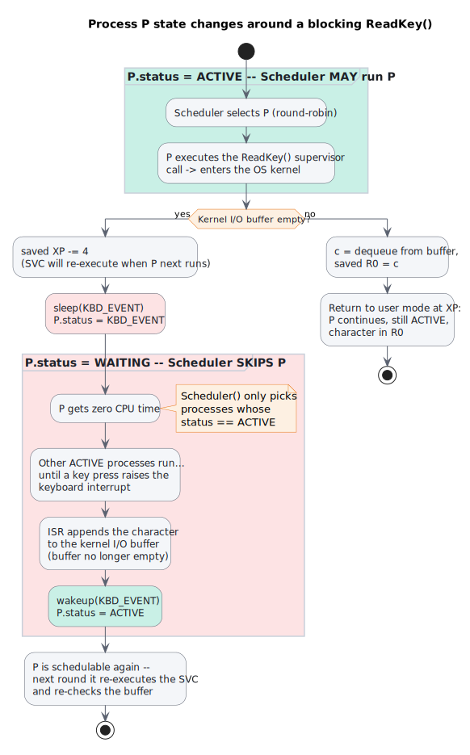

# I/O with Interrupts — the Blocking ReadKey() Example

How an operating system turns an asynchronous hardware event (a keystroke) into a synchronous, blocking read for a user program — interrupts, kernel buffers, and a supervisor call (SVC) handler that is refined step by step. The material follows MIT 6.004 *Computation Structures*, "Devices & Interrupts" [1], which uses the Beta teaching CPU; the mechanics map directly onto the Cortex-M model from [3.4 Exceptions & Interrupts](3.4-Embedded-Fundamentals-Interrupt.md) (SVC ≈ the `SVCall` exception, the saved `XP` ≈ the stacked return `PC`, the supervisor-mode bit `PC[31]` ≈ Handler mode).

---

## 1. Concept Introduction

I/O devices are **asynchronous**: a key press happens at a time the CPU cannot predict, and at a rate wildly slower than the CPU executes instructions. The event-driven answer has three parts [1]:

- **Interrupts move data from the device into the kernel.** The user program never polls the hardware itself. When a key is pressed, the keyboard raises an interrupt request; the OS's interrupt service routine (ISR) reads the character from the device and stores it away. This is *event handling* — device-to-kernel data movement.
- **A kernel buffer decouples the device from the program.** The ISR appends each character to a FIFO buffer owned by the OS (one per process holding keyboard focus). The buffer absorbs the rate mismatch: keys can arrive while the program is busy, and the program can read faster than keys arrive. The buffer is finite — characters arriving when it is full are discarded, typically with a beep to the user [1].
- **The read operation is a blocking supervisor call.** The program calls `ReadKey()` and simply assumes that when it returns, the character is in `R0`. If no character is available yet, the OS *blocks* (suspends) the process until one arrives. This is *event processing* — kernel-to-program data movement — and keeping it separate from event handling is the core design idea.

---

## 2. The Basic Flow — From Keystroke to R0

Two independent code paths meet at the kernel buffer: the interrupt side (driven by hardware, at unpredictable times) and the SVC side (driven by the program, whenever it wants input).

**Interrupt side — filling the buffer:**

1. A key is pressed; the keyboard controller raises an interrupt request to the CPU.
2. The CPU finishes the current instruction, switches to supervisor mode, and vectors to the keyboard ISR.
3. The ISR reads the character through memory-mapped I/O — the device's status and data registers appear at fixed memory addresses:

   ```c
   struct kbd {
       int  status;
       char data;
   } *keyboard = (struct kbd *) KEYBOARD_ADDR;

   /* in the keyboard ISR: */
   if (keyboard->status & READY) {
       char c = keyboard->data;
       /* append c to the kernel buffer of the
          process that has keyboard focus */
   }
   ```

4. The ISR appends the character to the kernel buffer and returns; the interrupted program resumes, unaware anything happened.

**SVC side — draining the buffer:**

1. A user-mode program executes a `ReadKey()` **supervisor call (SVC)** to fetch the next character from the kernel buffer. Where an interrupt is hardware asking the OS for service, an SVC is *software* asking: it is the system-call mechanism.
2. The SVC transfers control into the **OS kernel**: the CPU switches to supervisor mode (interrupts disabled) and the process's registers are saved — including `XP`, the return address pointing at the instruction *following* the SVC.
3. In the OS kernel, the **ReadKey SVC handler** grabs the next character from the buffer and places it in the user's `R0` (i.e. the *saved* copy of `R0`, restored on return).
4. The handler returns and the program resumes execution at the instruction following the SVC, with the character in `R0` — from the program's point of view, `ReadKey()` was an ordinary function call.

The interesting problems all come from one question the flow above ignores: **what if the buffer is empty when the SVC runs?**

---

## 3. Improving ReadKey_SVC — Issues & Solutions

The naive handler just loops waiting for the buffer to fill:

```c
ReadKey_SVC() {                      /* naive version — broken */
    while (buffer_empty()) ;          /* spin in the kernel...  */
    saved_regs[R0] = get_next_char_from_buffer();
}
```

Each solution below fixes the worst remaining problem left by the previous version [1]:

| #   | Issue with the previous version                                                                                                                                                                                                                       | Solution                                                                                                                                                                                                                                                                                                                                  
| --- | ----------------------------------------------------------------------------------------------------------------------------------------------------------------------------------------------------------------------------------------------------- | ----------------------------------------------------------------------------------------------------------------------------------------------------------------------------------------------------------------------------------------------------------------------------------------------------------------------------------------- 
| 1   | **System hangs — the keyboard interrupt can never fire.** The SVC handler runs in supervisor mode with interrupts disabled, so while it spins on the empty buffer, the ISR that would fill the buffer can never run. Deadlock.                        | Don't wait in the kernel at all. If the buffer is empty, **subtract 4 from the saved `XP`** (return address) and return immediately. The process resumes *at the SVC instruction itself* and re-executes it; between re-executions it runs in user mode with interrupts enabled, so the ISR can fill the buffer.                          
| 2   | **Busy-waiting wastes the CPU.** The process now re-executes the SVC in a tight enter-kernel / check-buffer / return loop, burning cycles that other processes could use — the machine is 100% busy doing nothing.                                    | After rewinding `XP`, call **`Scheduler()`**: suspend this process and switch to the next one in a **round-robin time-sharing scheme**. The waiting process only retries once per scheduling round instead of continuously.                                                                                                               
| 3   | **The scheduler still wastes time on processes that cannot run.** Every round, the scheduler dutifully resumes the waiting process just so it can re-execute the SVC, find the buffer still empty, and go back to sleep — pointless context switches. | Give each process a **status flag** and treat processes as a small **state machine**: `ACTIVE` (0) vs `WAITING` (a nonzero event ID). `sleep(event)` marks the process WAITING; the **scheduler skips any process that is not ACTIVE**; the keyboard ISR calls `wakeup(event)` to flip waiters back to ACTIVE when data actually arrives. 

The code for the final version:

```c
ReadKey_SVC() {                       /* final version */
    if (buffer_empty()) {
        saved_XP -= 4;                /* re-arm the SVC          */
        sleep(KBD_EVENT);             /* status = KBD_EVENT, then */
        return;                       /*   calls Scheduler()      */
    }
    saved_regs[R0] = get_next_char_from_buffer();
}

Scheduler() {
    /* round-robin, but skip processes that are WAITING */
    do { current = next_process(current); }
    while (current->status != ACTIVE);
    run(current);
}

keyboard_ISR() {
    char c = keyboard->data;
    append_to_buffer(c);
    wakeup(KBD_EVENT);                /* every process whose status  */
}                                     /* == KBD_EVENT -> ACTIVE      */
```

### Process-state view — when can the scheduler run the process?

The activity diagram below shows the final design from the perspective of one process `P` blocked on an empty buffer: `P` is only schedulable while its status is `ACTIVE`; the whole time the buffer is empty it sits in `WAITING`, invisible to the scheduler, until the keyboard interrupt's `wakeup()` flips it back.



---

## 4. Why the Final Design Works — sleep / wakeup Details

- **`sleep(event_id)`** sets the caller's status to a unique identifier for the awaited event (e.g. `KBD_EVENT`) and invokes the scheduler. A nonzero status *is* the WAITING state — no separate queue is needed in this simple scheme [1].
- **`wakeup(event_id)`** — called from the ISR — scans the process table and sets every process whose status equals that event ID back to `ACTIVE` (0):

  ```c
  void wakeup(int event_id) {
      for (each process p)
          if (p->status == event_id)
              p->status = ACTIVE;
  }
  ```

- **The re-check on wake is not optional.** `wakeup()` marks the process runnable, it does not hand it the character. Because `XP` was rewound, the woken process re-executes the whole SVC and re-tests the buffer. If two processes were sleeping on `KBD_EVENT`, both wake, the first to be scheduled consumes the character, and the second finds the buffer empty again and simply goes back to sleep — correct behavior falls out of the loop for free.
- **Division of labor**, restated: the ISR does *event handling* (get the byte off the hardware fast, buffer it, wake waiters); the SVC handler does *event processing* (deliver buffered data to the program at the program's pace). Keeping ISRs short and pushing the rest to schedulable context is exactly the pattern automotive firmware uses (compare the interrupt-side rules in [3.4 Exceptions & Interrupts](3.4-Embedded-Fundamentals-Interrupt.md)).

How *quickly* the ISR side gets to run when the hardware asks — and what bounds that delay — is the subject of the next document: [3.4.3 Interrupt Latency](3.4.3-Embedded-Fundamentals-InterruptLatency.md).

---

## 5. Q&A

1. **Why does the naive spin-loop handler hang the whole system rather than just the calling process?**

   A: The spin loop runs inside the SVC handler, in supervisor mode with interrupts disabled. The only thing that could ever make `buffer_empty()` false is the keyboard ISR — and interrupts being disabled means it can never run. Nothing else can execute either, so the machine is dead, not just the process.

2. **Why subtract 4 from the saved `XP` instead of jumping back into the handler later?**

   A: On SVC entry the hardware saved `XP` pointing at the instruction *after* the SVC (PC + 4). Subtracting 4 makes the return from the handler land on the SVC instruction itself, so the process transparently re-issues the request. It is the cheapest possible "retry later": no extra kernel state, no callback — the retry *is* the original instruction.

3. **The `Scheduler()` fix already stops the busy-wait. What does the status-flag state machine actually buy?**

   A: With only the scheduler fix, the scheduler still gives the waiting process a full turn every round, only for it to re-enter the kernel, test an empty buffer, and yield — a wasted context switch per waiting process per round. The status flag makes the wait cost *zero* CPU: the scheduler's `status != ACTIVE` check skips the process entirely until the ISR's `wakeup()` re-arms it.

4. **Is `ReadKey()` blocking or non-blocking I/O, and where is the blocking implemented?**

   A: Blocking — the caller cannot proceed past `ReadKey()` without a character in `R0`. But note *where* the blocking lives: not in a loop inside the kernel handler (that was the naive handler's bug), but in the process state machine — the process is simply not scheduled while WAITING. "Blocked" is a scheduling state, not code that runs.

5. **What is the Cortex-M equivalent of this SVC mechanism?**

   A: The `SVC` instruction raises the `SVCall` exception: the core stacks R0–R3, R12, LR, PC, xPSR and enters the handler in Handler mode — the stacked PC plays the role of the Beta's saved `XP`, and an RTOS system call modifies the *stacked* R0 to deliver its return value, exactly like `saved_regs[R0]` here. See the entry/return mechanics in [3.4 Exceptions & Interrupts](3.4-Embedded-Fundamentals-Interrupt.md).

---

### References

1. **MIT OpenCourseWare** — *6.004 Computation Structures* (Spring 2017), Chapter 18 "Devices & Interrupts", section 1 — [https://ocw.mit.edu/courses/6-004-computation-structures-spring-2017/pages/c18/c18s1/](https://ocw.mit.edu/courses/6-004-computation-structures-spring-2017/pages/c18/c18s1/): authoritative source for the keyboard/ReadKey example, the successive `ReadKey_SVC` refinements, the sleep/wakeup scheme, and the event-handling vs event-processing distinction. (Beta ISA; register/mode names follow the course.)
2. Related: [3.4 Exceptions & Interrupts](3.4-Embedded-Fundamentals-Interrupt.md) for the Cortex-M exception mechanics this maps onto, and [3.4.3 Interrupt Latency](3.4.3-Embedded-Fundamentals-InterruptLatency.md) for the topic this document stops at.
