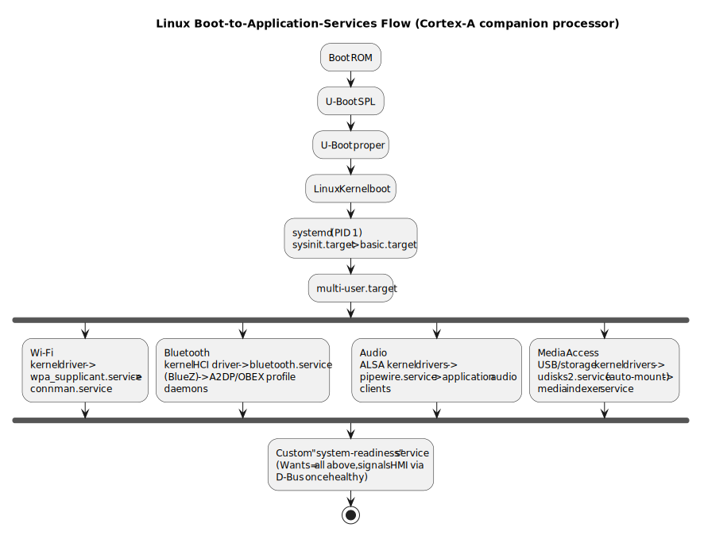

# 3.6 Linux Services, Daemons, and Boot-Time Application Startup

[← Home](0.0-Introduction.md) · See also: [3.1 Basic Communication Protocols](3.1-Embedded-Fundamentals-Basic%20Communication.md), [3.2 CAN Bus](3.2-Embedded-Fundamentals-CAN.md), [3.3 Bootloader](3.3-Embedded-Fundamentals-Boothloader.md)

## Concept Introduction

- On Cortex-A automotive SoCs (gateway, infotainment, ADAS domain controllers) the OS is typically **embedded Linux**, built with **Yocto** (see [7.2](7.2-Yocto-Build-System.md)). Functionality like audio, Wi-Fi, Bluetooth, and media access is implemented as **services/daemons** managed by an init system — almost always **systemd** on modern automotive Linux builds.
- **Daemon**: a background process with no controlling terminal, started at boot or on-demand, running for the system's lifetime (e.g. `wpa_supplicant` for Wi-Fi, `bluetoothd` for Bluetooth, `pulseaudio`/`pipewire` for audio).
- **Service** (systemd terminology): a managed unit describing how to start/stop/restart a daemon, its dependencies, and its resource constraints — systemd's `.service` unit file is the contract.

## Scope — systemd Concepts a Tech Lead Should Know

- **Unit types**: `.service` (a process), `.socket` (socket activation), `.target` (grouping/milestone, like a runlevel), `.mount`, `.timer`.
- **Dependency directives** inside a unit: `Wants=`, `Requires=`, `After=`, `Before=` — control ordering and whether failures cascade.
- **Boot targets**: `sysinit.target` → `basic.target` → `multi-user.target` (or `graphical.target` on systems with a display) — application services typically attach to `multi-user.target`.
- **Socket/D-Bus activation**: many automotive services (e.g. ConnMan/NetworkManager, BlueZ) are started **on first D-Bus request** rather than unconditionally at boot, saving startup time and resources.
- **journald**: systemd's logging — `journalctl -u <service>` is the first debugging step for a failed service, directly relevant to JD 3.1 (technical issue ownership).

## Use Cases — Bring-Up Sequencing for Audio / Wi-Fi / Bluetooth / Media



- **Wi-Fi**: kernel driver (built into the Yocto kernel recipe) → `wpa_supplicant.service` (handles WPA association) → `connman.service` or `NetworkManager.service` (higher-level connection management) → application-level Wi-Fi UI/API.
- **Bluetooth**: kernel HCI driver → `bluetooth.service` (BlueZ `bluetoothd`) → profile-specific daemons (e.g. `obexd` for file transfer, A2DP for audio streaming) — A2DP audio sink/source ties Bluetooth into the audio stack.
- **Audio**: ALSA kernel drivers (per-codec) → user-space sound server (`pulseaudio.service` or increasingly `pipewire.service`) → application audio clients (media player, voice assistant, Bluetooth A2DP bridge) — ordering matters: the sound server must be up before any client tries to connect.
- **Media access** (e.g. USB stick, SD card for media playback): kernel USB/storage drivers → `udisks2.service` (or a custom udev rule + automount unit) for auto-mount → media indexing/player service consuming the mounted path.
- Common pattern: a **custom Yocto-built service** (the "necessary service" the JD-adjacent question references) is layered on top to **orchestrate** these — e.g. a "system-readiness" service that `Wants=` all the above and only declares the system ready for the HMI once they've all reported healthy, often via D-Bus signals.

## Sample — A Minimal systemd Service Unit

```ini
# /etc/systemd/system/media-indexer.service
[Unit]
Description=Media Library Indexer
After=network-online.target sound.target
Wants=network-online.target
# Don't start until the audio stack is actually up
Requires=pipewire.service

[Service]
Type=simple
ExecStart=/usr/bin/media-indexer --watch /media
Restart=on-failure
RestartSec=2
User=media

[Install]
WantedBy=multi-user.target
```

```bash
# Enable + start, and tail logs for debugging — typical Tech Lead bring-up commands
systemctl enable media-indexer.service
systemctl start media-indexer.service
systemctl status media-indexer.service
journalctl -u media-indexer.service -f
```

- Authoring this unit and wiring it into a Yocto image means adding a recipe that installs both the binary and the `.service` file, and enabling it via `systemd_system_unitdir` packaging (see [7.2](7.2-Yocto-Build-System.md)) — usually via a `.bbappend` or a dedicated recipe with `inherit systemd` and `SYSTEMD_SERVICE:${PN} = "media-indexer.service"`.

## Q&A

- **Q: Why use D-Bus instead of just sequencing services with `After=`?**
  A: Many startup dependencies are about **runtime readiness**, not just "process started" — a daemon can be running but not yet ready to serve requests. D-Bus signals/method calls let dependents wait for actual readiness rather than guessing with a fixed startup order.
- **Q: What's the difference between `Wants=` and `Requires=`?**
  A: `Wants=` is a soft dependency — the dependency is started if possible, but failure doesn't stop the dependent unit. `Requires=` is a hard dependency — if the required unit fails or stops, the dependent unit is stopped too.
- **Q: How would you debug a Bluetooth audio service that isn't starting on boot?**
  A: `systemctl status bluetooth.service` → check `journalctl -u bluetooth -b` for the current boot → verify kernel module loaded (`lsmod | grep bluetooth`, `dmesg | grep -i bluetooth`) → check D-Bus policy files if it's a permissions issue → check the profile-specific daemon (A2DP) separately, since `bluetoothd` running doesn't guarantee every profile is enabled.
- **Q: Why might an automotive system avoid `graphical.target` even if it has a display?**
  A: `graphical.target` pulls in a full desktop display-manager stack designed for general-purpose Linux; automotive HMI compositors are usually launched as a dedicated `multi-user.target`-attached service instead, for tighter boot-time control and a smaller footprint.

## References

- freedesktop.org, *systemd System and Service Manager* documentation — [https://www.freedesktop.org/wiki/Software/systemd/](https://www.freedesktop.org/wiki/Software/systemd/), and `man systemd.service` / `man systemd.target`.
- BlueZ project documentation — [http://www.bluez.org/](http://www.bluez.org/).
- PipeWire documentation — [https://docs.pipewire.org/](https://docs.pipewire.org/).
- Yocto Project, *Mega-Manual* — systemd packaging section — [https://docs.yoctoproject.org/](https://docs.yoctoproject.org/).
- Related: [7.2 Yocto Build System](7.2-Yocto-Build-System.md) for packaging these services into an image.
