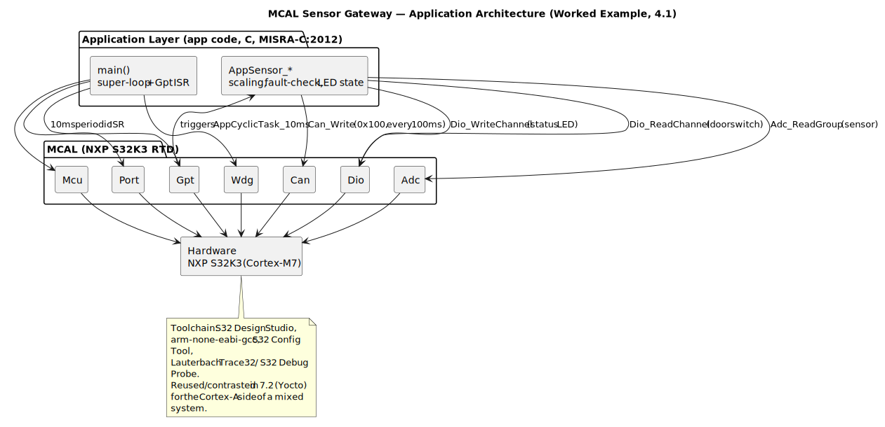

# 4.1 Worked Example — A Proposed MCAL Application

[← Home](0.0-Introduction.md)

## Concept Introduction

- This is a concrete, buildable example tying together everything in [2.2 AUTOSAR Classic Platform](2.2-AUTOSAR-Classic-Platform.md), [3.2 CAN Bus](3.2-Embedded-Fundamentals-CAN.md), and [3.3 Bootloader](3.3-Embedded-Fundamentals-Boothloader.md): a small **AUTOSAR-Classic, MCAL-based application** for an NXP S32K3-class MCU.
- Chosen application: **"CAN Sensor Gateway"** — reads an analog sensor (e.g. a battery-current shunt) and a digital input (e.g. a door-switch), publishes the values periodically on CAN, and exposes a watchdog-supervised health LED. Deliberately small enough to be a complete, traceable example, but touching every architectural concern a real MCAL feature would.

## Scope

- **In scope**: `Mcu`, `Port`, `Adc`, `Dio`, `Can`, `Gpt` (periodic trigger), `Wdg` MCAL modules; a thin application layer calling them directly (no RTE/SW-C — representative of a pre-RTE bring-up app or a CDD-style direct-MCAL component); build via S32 Design Studio / GCC toolchain.
- **Out of scope**: full RTE-generated SW-C structure, Com/Dcm/Dem BSW services, multi-core, functional-safety qualification — omitted for clarity; in a real project these would wrap around this same MCAL usage.

## Requirements / Main Functionality

- **FR-1**: Sample the analog sensor on `Adc` channel 0 every 10 ms via a `Gpt`-driven periodic interrupt.
- **FR-2**: Read the digital door-switch on a `Dio` channel on every cycle.
- **FR-3**: Transmit a CAN frame (ID `0x100`) every 100 ms containing the latest ADC value (scaled) and door-switch state.
- **FR-4**: Service the hardware watchdog (`Wdg`) every cycle; on missed service, the MCU resets — basic fail-safe behavior.
- **FR-5**: Drive a status LED (`Dio` output) — solid on = healthy, blinking = a self-detected fault (e.g. ADC out-of-range).
- **NFR-1**: Worst-case cycle execution time must fit within the 10 ms period with margin (timing budget — typically validated with a logic analyzer / trace tool, see [5.1](5.1-NXP-Platform-Overview.md)).
- **NFR-2**: MISRA-C:2012 mandatory/required rule compliance for all application code (consistent with [2.2](2.2-AUTOSAR-Classic-Platform.md) review expectations).

## Architecture Diagram



- This same diagram's toolchain/layering is referenced again in [7.2 Yocto Build System](7.2-Yocto-Build-System.md) when contrasting a bare-metal MCAL build with a Linux/Yocto-based build for the Cortex-A side of a mixed system.

## Programming Language & Dependencies

- **Language**: C (C99 subset honoring MISRA-C:2012), with a small amount of Arm assembly only in vendor-supplied startup code — standard for AUTOSAR Classic / MCAL-level code; C++ is essentially never used at this layer due to determinism and certification concerns.
- **Dependencies**:
  - **NXP S32K3 RTD (Real-Time Drivers)** — provides the MCAL module implementations (`Adc.c/h`, `Dio.c/h`, `Can.c/h`, `Gpt.c/h`, `Wdg.c/h`, `Mcu.c/h`, `Port.c/h`).
  - **CMSIS-Core(M)** — Arm's hardware abstraction header set (NVIC access, intrinsics), pulled in by the RTD.
  - **Vendor startup/linker files** (`startup_S32K3xx.c`, `.ld` linker script) generated by S32 Design Studio project templates.
  - No RTOS in this minimal example (super-loop + ISR design); a real project would typically add **AUTOSAR OS** or **FreeRTOS** for task scheduling once complexity grows.

## Build Configuration / Tech Stack / Toolchain

- **IDE / Config tool**: **NXP S32 Design Studio for S32 Platform** (Eclipse-based), with the **S32 Configuration Tool** plugin to generate MCAL config (`*_Cfg.c/h`) from a GUI peripheral configuration.
- **Compiler/toolchain**: **GNU Arm Embedded Toolchain (`arm-none-eabi-gcc`)**, bundled with S32DS; alternative: IAR EWARM or Green Hills MULTI on some customer projects.
- **Build system**: S32DS generates an **Eclipse CDT-managed makefile project**; for CI/headless builds, the same sources are typically built with a hand-written or generated **GNU `make`** invocation calling `arm-none-eabi-gcc`/`arm-none-eabi-ld` directly — this is the integration point a Tech Lead must understand to set up Jenkins/CI (see [7.1](7.1-TechLead-TechStack.md)).
- **Debug/flash tooling**: **P&E Micro Multilink** or **Lauterbach Trace32**, via SWD/JTAG; **S32 Debug Probe** for low-cost bring-up.
- **Representative `make` build invocation** (headless CI equivalent of the IDE build):

```makefile
# Makefile (simplified, illustrative)
TOOLCHAIN  = arm-none-eabi
CC         = $(TOOLCHAIN)-gcc
OBJCOPY    = $(TOOLCHAIN)-objcopy
MCU        = -mcpu=cortex-m7 -mfloat-abi=hard -mfpu=fpv5-d16

CFLAGS     = $(MCU) -std=c99 -Wall -Os -ffunction-sections -fdata-sections \
             -Iinc -IRTD/include -DCPU_S32K344

LDFLAGS    = $(MCU) -Tlinker/S32K344_flash.ld -Wl,--gc-sections -nostartfiles

SRCS       = src/main.c src/app_sensor.c \
             RTD/src/Adc.c RTD/src/Dio.c RTD/src/Can.c RTD/src/Gpt.c \
             RTD/src/Wdg.c RTD/src/Mcu.c RTD/src/Port.c \
             startup/startup_S32K344.c

OBJS       = $(SRCS:.c=.o)

all: app.elf app.bin

app.elf: $(OBJS)
	$(CC) $(LDFLAGS) -o $@ $^

app.bin: app.elf
	$(OBJCOPY) -O binary $< $@

clean:
	rm -f $(OBJS) app.elf app.bin
```

## Sample — Application Main Loop

```c
int main(void) {
    Mcu_Init(&Mcu_Config_0);
    Mcu_InitClock(McuClockSettingConfig_0);
    Port_Init(&Port_Config_0);
    Adc_Init(&Adc_Config_0);
    Dio writes go through generated config implicitly via Port_Init
    Can_Init(&Can_Config_0);
    Can_SetControllerMode(0, CAN_CS_STARTED);
    Wdg_Init(&Wdg_Config_0);
    Gpt_Init(&Gpt_Config_0);
    Gpt_EnableNotification(GptChannel_10ms);
    Gpt_StartTimer(GptChannel_10ms, GPT_10MS_TICKS);

    while (1) {
        Wdg_SetTriggerCondition(WDG_TRIGGER_OK);
        /* cyclic work driven by Gpt ISR setting a flag; CAN Tx every 10th cycle */
    }
}

/* Gpt ISR notification (10 ms tick) */
void AppCyclicTask_10ms(void) {
    Adc_ValueGroupType adc_val;
    Adc_ReadGroup(AdcConf_AdcGroup_SensorGroup, &adc_val);
    Dio_LevelType door = Dio_ReadChannel(DioConf_DioChannel_DoorSwitch);
    AppSensor_Update(adc_val, door);   /* app logic: scale, fault-check, LED state */
    if (AppSensor_TxDue()) {
        Can_Write(CanConf_CanHth_Tx100ms, AppSensor_GetCanPdu());
    }
}
```

## Q&A

- **Q: Why no RTE in this example if it's "AUTOSAR Classic"?**
  A: To keep the worked example minimal and focused purely on MCAL usage. A production AUTOSAR Classic project would wrap `AppSensor_*` logic in an RTE-generated SW-C and route ADC/Dio/Can access through ECU Abstraction — but the MCAL calls at the bottom look exactly like this.
- **Q: How would you estimate effort to add a second CAN channel?**
  A: If the second channel uses already-supported hardware peripherals and the existing `Can` MCAL module instance model, it's mostly **configuration effort** (new `Can_Config` controller/HOH entries, regenerate) plus app-layer wiring — typically low effort. If it requires a peripheral not covered by the RTD module (e.g. a CAN-FD feature absent from the installed RTD version), it becomes a **feasibility risk** needing a vendor RTD upgrade or a CDD — this distinction is exactly the kind of feasibility analysis in JD 3.3.
- **Q: Where would unit tests live for this kind of code?**
  A: Application logic (`AppSensor_Update`, scaling/fault-check) is unit-testable on a host PC with a mocked MCAL (stub `Adc_ReadGroup`/`Dio_ReadChannel`), often using **Unity/CMock** or **Google Test with C wrappers** — MCAL/RTD code itself is usually vendor-validated and tested via hardware-in-the-loop instead.

## References

- NXP, *S32K3 Real-Time Drivers (RTD) User Guide* — vendor portal (registration required).
- NXP, *S32 Design Studio for S32 Platform* documentation — [https://www.nxp.com/design/software/development-software/s32-design-studio-ide](https://www.nxp.com/design/software/development-software/s32-design-studio-ide).
- MISRA Consortium, *MISRA C:2012* (with Amendment 2/3) — [https://www.misra.org.uk/](https://www.misra.org.uk/).
- Related: [2.2 AUTOSAR Classic Platform](2.2-AUTOSAR-Classic-Platform.md), [7.2 Yocto Build System](7.2-Yocto-Build-System.md), [7.1 Tech Lead Tech Stack](7.1-TechLead-TechStack.md).
