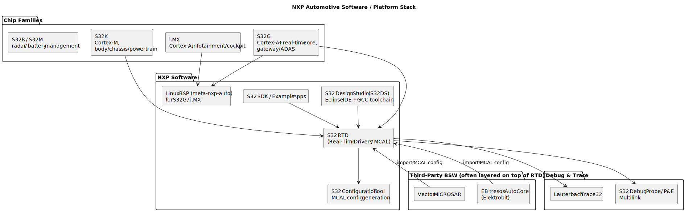

# 5.1 NXP Automotive Software & Platform Overview

[← Home](0.0-Introduction.md)

## Concept Introduction

- **NXP Semiconductors** is one of the largest automotive silicon vendors; the JD's "NXP automotive software products" requirement means knowing both the **chip families** and the **software/tooling ecosystem** NXP ships around them — an experienced developer is expected to navigate this without hand-holding.
- Two product lines matter most for this role:
  - **S32K** — Cortex-M MCUs for body/chassis/powertrain control (the home of "MCAL legacy" work).
  - **S32G** — Cortex-A + real-time core "vehicle network processors" for gateway/service-oriented gateway and ADAS, often paired with S32K-class MCUs in a system.
- Related families worth recognizing by name even without deep expertise: **i.MX** (Cortex-A applications processors for infotainment/cockpit, runs Linux/Android/QNX), **S32R** (radar), **S32M** (battery management).

## Scope — NXP Software Stack



- **S32 RTD (Real-Time Drivers)**: NXP's AUTOSAR-flavored MCAL/driver package for S32K/S32G — the direct subject of [2.2](2.2-AUTOSAR-Classic-Platform.md)/[4.1](4.1-MCAL-Application-Design.md). Versioned per release (e.g. RTD 4.0.x, 5.0.x), with its own release notes and known-issues list a Tech Lead must track per customer-locked version.
- **S32 Design Studio (S32DS)**: Eclipse-based IDE bundling the GCC Arm toolchain, debugger integration, and project templates.
- **S32 Configuration Tool**: GUI tool generating MCAL/BSW configuration headers from a peripheral configuration model (alternative/complement to EB tresos for full BSW stacks).
- **Third-party BSW**: many programs run a **full AUTOSAR BSW stack** from **Elektrobit (EB tresos)** or **Vector (MICROSAR)** *on top of* NXP's RTD MCAL — the Tech Lead must understand both vendor boundaries and how integration issues get triaged between them.
- **S32 SDK / Example Applications**: reference application code demonstrating RTD usage, useful as a known-good baseline when debugging integration regressions.

## Use Cases — Platform Knowledge in Daily Work

- **Version/compatibility tracking**: a given customer project locks to a specific RTD version + S32DS version + compiler version combination; "it works on my machine" issues are very often a **toolchain version mismatch** — a Tech Lead's first triage question.
- **Errata awareness**: NXP publishes **chip errata** (silicon bugs with workarounds) per part number/revision — a senior developer recognizes when a weird symptom matches a known errata rather than assuming an application bug, directly feeding JD 3.1 (technical ownership) and 3.3 (risk assessment, since errata-driven workarounds affect schedule).
- **Cross-platform debugging**: in a mixed S32K (AUTOSAR Classic) + S32G (Linux) system, integration bugs at the boundary (e.g. a SPI link between the two) require knowing both platforms' debugging tools — `Trace32`/S32 Debug Probe on the MCU side, `dmesg`/`gdb`/`strace` on the Linux side.
- **Customer-facing technical discussion** (JD 1.2/1.3): explaining *why* a feature needs a specific RTD version upgrade, or why a chip errata workaround costs extra cycles, is a routine customer call topic.

## Sample — Typical Debug/Trace Setup

```text
Host PC (Trace32 PowerView / S32 Debug software)
   │  USB
   ▼
Lauterbach Debug Cable  /  S32 Debug Probe
   │  JTAG / SWD
   ▼
NXP S32K344 target board
   │  CAN / SPI / Ethernet (system bus)
   ▼
Companion NXP S32G (Linux) — debugged separately via SSH + gdbserver, or a second Trace32 unit
```

- A common Tech Lead activity: setting up a **multi-core/multi-chip trace session** to correlate a timing issue spanning both the S32K MCAL cycle and an S32G-side service — requires fluency with both debug ecosystems.

## Q&A

- **Q: What's the practical difference between using NXP's own S32 Configuration Tool vs. a third-party BSW vendor's tool (EB tresos)?**
  A: NXP's tool configures **RTD/MCAL only**, generating chip-level driver config. EB tresos (or Vector DaVinci) configures the **full BSW stack** including RTE, Com, Dcm, OS — and typically *imports* the MCAL configuration so the two tools must stay in sync, which is itself a common integration friction point.
- **Q: Why would a project deliberately stay on an older RTD version instead of upgrading?**
  A: Re-qualification cost — once a customer has validated a specific RTD version (test reports, ASPICE work products tied to it), upgrading triggers re-test/re-review effort; teams often stay pinned until a defect or feature truly requires the upgrade — a recurring risk/feasibility trade-off (JD 3.3).
- **Q: How do you find out if a bug is a chip errata vs. a software bug?**
  A: Check the part-specific **Chip Errata** document (NXP publishes per silicon revision) against the symptom; if it matches, the errata document also usually states the official workaround, which then becomes a driver/MCAL-level patch.
- **Q: What does "NXP automotive software components" beyond MCAL typically include?**
  A: RTD's broader scope (beyond MCAL) like example BSW services, the S32 SDK demo apps, secure-boot/HSM (Hardware Security Module) firmware for S32K3's HSE core, and Linux BSPs (board support packages) for S32G/i.MX used with Yocto (see [7.2](7.2-Yocto-Build-System.md)).

## References

- NXP, *S32K3 Series* and *S32G2/S32G3 Series* product pages — [https://www.nxp.com/applications/automotive](https://www.nxp.com/applications/automotive).
- NXP, *S32 RTD Release Notes* and *Chip Errata* documents — NXP customer/vendor portal (registration required per part number).
- Elektrobit, *EB tresos AutoCore* product page — [https://www.elektrobit.com/products/ecu/eb-tresos/](https://www.elektrobit.com/products/ecu/eb-tresos/).
- Related: [2.2 AUTOSAR Classic Platform](2.2-AUTOSAR-Classic-Platform.md), [4.1 MCAL Application Design](4.1-MCAL-Application-Design.md).
