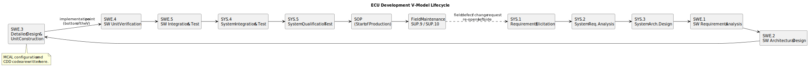

# 6.1 ECU Development Lifecycle

[← Home](0.0-Introduction.md)

## Concept Introduction

- An **ECU (Electronic Control Unit)** is a combination of hardware (MCU/MPU, PCB, connectors, sensors/actuators interface) and software (the AUTOSAR/MCAL stack discussed throughout this knowledge base) delivering one or more vehicle functions.
- Its development follows a **V-model** lifecycle, the same shape ASPICE's SYS/SWE process groups ([1.1](1.1-ASPICE-Overview.md)) are designed around — the V-model is the *engineering shape*, ASPICE is the *process-capability lens* on that same shape.
- Understanding the full lifecycle (not just the coding phase) is what lets a Technical Lead give credible estimates, negotiate scope with customers, and anticipate downstream costs of upstream decisions (JD 1.2, 3.3, 3.4).

## Scope — The V-Model Phases

- **Left side (definition, top-down)**:
  1. **Requirements Elicitation** (SYS.1) — OEM/customer requirements, often via a requirements management tool (e.g. Polarion, DOORS).
  2. **System Requirements Analysis** (SYS.2) — allocate requirements to hardware vs. software, define system-level interfaces.
  3. **System Architectural Design** (SYS.3) — partition into HW/SW components; decide e.g. "this signal is read via MCAL ADC, not an external sensor IC."
  4. **Software Requirements Analysis** (SWE.1) and **Software Architectural Design** (SWE.2) — AUTOSAR layering decisions happen here.
  5. **Detailed Design & Unit Construction** (SWE.3) — the level at which MCAL configuration and CDD code are written; for an AUTOSAR Classic ECU this is where the AUTOSAR Methodology below actually runs.
- **Bottom (implementation)**: actual coding/configuration, the "point" of the V.
- **Right side (verification, bottom-up)**:
  6. **Unit Verification** (SWE.4) — unit tests, static analysis, MISRA checks.
  7. **Software Integration & Test** (SWE.5) — bring SW-Cs/BSW/MCAL together on target or HIL (hardware-in-the-loop).
  8. **System Integration & Test** (SYS.4) — full ECU with all hardware, on a bench or vehicle mule.
  9. **System Qualification Test** (SYS.5) — formal acceptance against original requirements, often customer-witnessed.
- **Beyond the V**: **SOP (Start of Production)**, then **field maintenance** — software updates, field-issue triage (SUP.9), and eventually **End of Life**.

## AUTOSAR Methodology — From System Configuration to ECU Executable

- Inside **SWE.3 (Detailed Design & Unit Construction)**, an AUTOSAR Classic ECU is built using AUTOSAR's own **4-step methodology** — Configure System → Extract ECU-Specific Information → Configure ECU → Generate Executable — which turns a vehicle-network-wide design into a flashable binary for each individual ECU.
- Every step both consumes and produces **ARXML** files (AUTOSAR's XML schema); these files *are* the reviewed, versioned work products handed between system architects, ECU integrators, and BSW suppliers — not just intermediate clutter.

### Step 1 — Configure System

- **Goal**: unify the description of the software components with the description of hardware resources, across the whole vehicle network (not yet a single ECU).
- **Inputs**: the *System Configuration Input* (system-wide ECU resource specification and constraints) and the *Collection of Available SWC Implementations* (every software component available to place onto an ECU).
- **Activity**: map software components onto ECUs with regard to resource budget and timing, performed at system level with an AUTOSAR System Configuration Generator/Editor.
- **Outputs**: the **System Configuration Description** (bus mapping, network topology, SW-to-ECU mapping) and the **System Communication Matrix** (the data mapping between system-level signals and the frames/PDUs that carry them on the network).

### Step 2 — Extract ECU-Specific Information

- **Goal**: narrow the system-wide description down to just what one ECU needs — without this step, every ECU integrator would receive the entire vehicle network's signal list.
- **Input**: the System Configuration Description from Step 1.
- **Output**: the **ECU Extract of System Configuration** — every signal and message that one specific ECU sends, receives, or is otherwise involved with.

### Step 3 — Configure ECU

- **Goal**: configure every BSW module (Com, Can, Os, NvM, RTE, ...) running on that one ECU.
- **Inputs**: the ECU Extract from Step 2, plus each BSW supplier's **BSW Module Description (BswMD)** — a vendor-specific file declaring exactly which parameters that module exposes for configuration.
- **Three sub-activities**, all operating on one evolving work product (the ECU Configuration Values):
  1. **Generate Base ECU Configuration Value description** — every configurable parameter for every BSW module on the ECU is instantiated at its default value.
  2. **Edit ECU Configuration** — an integrator opens the result in an AUTOSAR ECU Configuration Editor and overrides specific parameters with project-specific values (e.g. a CAN baud rate, a watchdog timeout).
  3. **Generate Configured Module Code** — module code (`.c`) and headers (`.h`) are emitted for each BSW module; in practice this generator is usually supplied by the BSW vendor rather than hand-written in-house.
- **Output**: the **ECU Configuration Description** — the fully resolved, per-ECU, per-module parameter set, and the single file a code generator needs to produce real C source for that ECU.

### Step 4 — Generate Executable

- **BSW/RTE generation**: a code generator (typically implemented in Java, Xtend, Xpand, or C#) reads the ECU Configuration Description and emits `<module>_Cfg.c` / `<module>_Cfg.h` for each BSW module (RTE, Com, Os, and others).
  - **RTE generation needs more than the others**: because the RTE mediates between software components, services, and BSW, its generator additionally needs the **OS configuration**, the **BswMD** files, and the **Service Component Description (SWCD)** — all separate ARXML inputs beyond the ECU Configuration Description.
- **Compile & link**: the generated BSW/RTE code plus the hand-written SWC code is compiled and linked into the final **ECU Executable** — the binary flashed onto hardware.
- **Pre-compile vs. post-build split**: many projects separate **pre-compile-time** and **link-time** BSW parameters (baked into the main code image) from **post-build-time** parameters (e.g. variant coding, calibration) so a separate **ECU Post-Build Data Image** can be flashed independently — letting one compiled binary serve multiple vehicle variants without a full rebuild.

## XML Files That Describe an ECU's Communication Network and Configuration

- All of the above runs on **ARXML** (AUTOSAR XML) — one overarching schema, but each file plays a distinct role. The ones most relevant to *reading and mapping an ECU's communication network*:
  - **Topology** — which ECUs exist and how they're wired together: ECU instances grouped into communication clusters (CAN/LIN/FlexRay/Ethernet), each carrying bus-specific properties (e.g. baud rate, protocol). Built on **FIBEX** elements — the same schema family automotive network-description tools (e.g. Vector CANdb/DBC import) use. Each ECU in the topology references an **ECU Resource Description**, declaring that ECU's available hardware resources.
  - **Communication Matrix** — the file an engineer reads to answer "which signal travels in which frame, on which bus, to which ECU?" It maps **signals → PDUs → frames → bus channel**, per ECU — the day-to-day reference for diagnosing a bus-level integration issue.
  - **System Mapping** — maps software components onto specific ECUs and resolves the data mapping between system-level signals and the frames that carry them: the bridge between the *software architecture* view and the *network* view.
  - **Top-Level Composition** — the hierarchical description of every SW component and how their ports connect, independent of which ECU each one lands on.
  - **System Configuration Description** — the aggregate that bundles Topology + Communication Matrix + System Mapping into one system-wide source of truth (output of Step 1 above).
  - **ECU Extract of System Configuration** — the same information, sliced down to one ECU (output of Step 2 above).
  - **BSW Module Description (BswMD)** — not about the network directly, but the reference for *what's configurable* on a given BSW module; read this before configuring any new module.
  - **ECU Configuration Description** — the final, fully-resolved per-ECU configuration (output of Step 3 above) — what the code generator actually consumes.
- Practical reading order when investigating a communication issue on a real project: **Topology** (is the ECU even on the right bus/cluster?) → **Communication Matrix** (is the signal correctly packed into the expected frame/PDU?) → **ECU Extract** (does this ECU's local view agree with the system-wide Communication Matrix?) → **ECU Configuration Description** (did the generated Com/Can module configuration actually match what was specified?).

## Q&A

- **Q: Why is the V-model still used when much of the industry has moved toward Agile?**
  A: Many automotive programs run **Agile-at-team-level, V-model-at-program-level** — sprints deliver incremental work, but the overall program still needs V-model gates for safety/compliance evidence and OEM milestone commitments (PPAP-style gates, SOP dates). A Tech Lead often operates exactly at this seam.
- **Q: What's the difference between "verification" and "validation" in this context?**
  A: Verification asks "did we build the product right?" (matches the spec — SWE.4-SYS.5 activities). Validation asks "did we build the right product?" (meets the customer's actual need, often checked via vehicle-level testing/customer acceptance).
- **Q: What typically triggers re-opening the left side of the V after SOP?**
  A: A field defect (SUP.9) traced back to a requirement gap or architectural limitation, or an OEM-driven feature change for a model-year update — both flow back through the same SYS/SWE chain, just against an already-shipped baseline (requiring careful **configuration management**, SUP.8).
- **Q: How does HIL (hardware-in-the-loop) testing fit in?**
  A: Usually inserted at SWE.5/SYS.4 — the ECU under test runs in real-time against a simulated vehicle/plant model, allowing integration/system-level test before a full vehicle prototype exists; very common for early-stage automotive ECU validation.

## References

- VDA QMC, Automotive SPICE PAM v4.0 — process descriptions for SYS.1–SYS.5, SWE.1–SWE.6 map directly onto these V-model phases (see [1.1](1.1-ASPICE-Overview.md) references).
- ISO 26262 Part 4 (*Product development at the system level*) and Part 6 (*...at the software level*) — the safety-lifecycle overlay on this same V-model, for safety-relevant ECUs.
- AUTOSAR, *Specification of the AUTOSAR Methodology* (Classic Platform) — [https://www.autosar.org/standards/classic-platform](https://www.autosar.org/standards/classic-platform) — the official source for the Configure System / Extract ECU-Specific Information / Configure ECU / Generate Executable methodology and the ARXML work products described above.
- AUTOSAR, *Glossary* and *System Template* specifications (define Topology, Communication Matrix, System Mapping, and the FIBEX-derived elements) — same standards portal.
- Related: [1.1 ASPICE Overview](1.1-ASPICE-Overview.md), [7.1 Tech Lead Tech Stack](7.1-TechLead-TechStack.md) for the tools supporting each phase.
