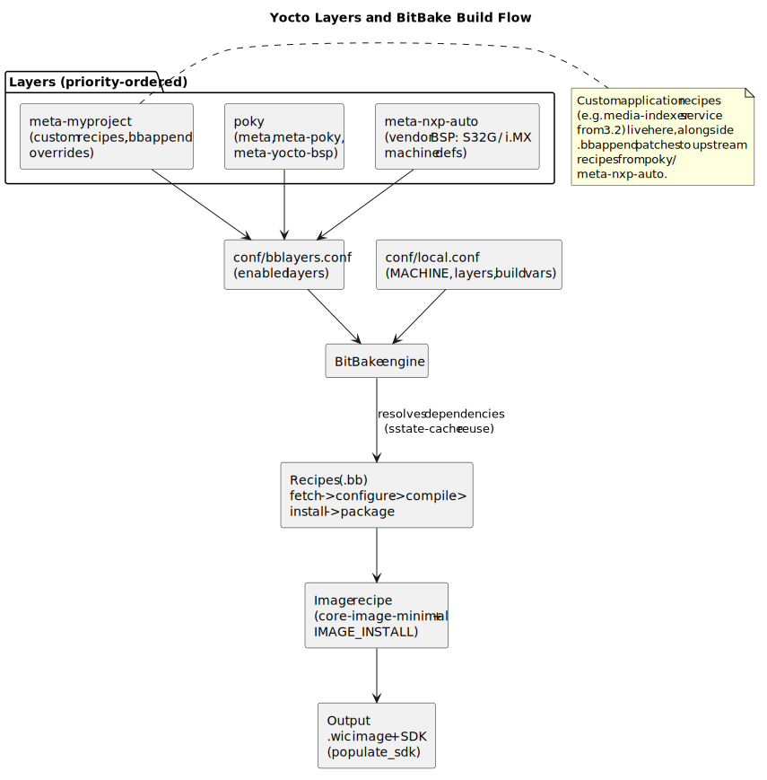

# 7.2 Yocto Build System Deep Dive

[← Home](0.0-Introduction.md) · Builds on: [4.1 MCAL Application Design](4.1-MCAL-Application-Design.md), [3.6 Linux Services & Daemons](3.6-Linux-Services-Daemons.md)

## Concept Introduction

- The **Yocto Project** is a build framework (not a Linux distribution itself) for constructing **custom embedded Linux distributions** — used for the Cortex-A side of an automotive system (gateway/infotainment companion to the Cortex-M/MCAL side built in [4.1](4.1-MCAL-Application-Design.md)).
- Where [4.1](4.1-MCAL-Application-Design.md) used `make` + `arm-none-eabi-gcc` directly against a fixed RTD source tree, Yocto's **BitBake** engine builds an entire Linux system (toolchain, kernel, bootloader, libraries, applications, root filesystem image) from declarative **recipes**, across potentially hundreds of packages, with full cross-compilation and dependency resolution.
- Core vocabulary: **Layer** (a directory of related recipes/configuration, e.g. `meta-nxp` for S32G/i.MX BSPs), **Recipe** (`.bb` file describing how to fetch/build/package one piece of software), **Append file** (`.bbappend`, modifies an existing recipe without copying it), **Image recipe** (`.bb` describing a complete root filesystem), **Machine** (target hardware definition), **Distro** (distribution-wide policy, e.g. which init system, C library).

## Scope — Layer/Build Flow Architecture



- **`poky`** — the Yocto reference distribution core (BitBake + `meta`, `meta-poky`, `meta-yocto-bsp` layers).
- **`meta-nxp`/vendor BSP layer** — NXP-supplied layer with machine definitions for S32G/i.MX (kernel config, U-Boot config, firmware packaging) — the Yocto-side counterpart to the RTD package in [5.1](5.1-NXP-Platform-Overview.md).
- **Custom project layer** (e.g. `meta-myproject`) — where the Tech Lead's team adds: custom application recipes (the `media-indexer` service from [3.6](3.6-Linux-Services-Daemons.md)), custom image recipes, `.bbappend` overrides tweaking upstream recipes (e.g. enabling a kernel config option, adding a systemd unit to an existing package).
- **`build/conf/local.conf` and `bblayers.conf`**: the two key configuration files selecting target `MACHINE`, enabled layers, and build-wide variables (parallelism, package format, image features).
- **Output**: a bootable image (e.g. `.wic`/`.sdcard`) plus an SDK (`populate_sdk`) that downstream application developers can use to cross-compile without a full Yocto build.

## Use Cases

- **Adding a new application to the image** (e.g. the `media-indexer` daemon from [3.6](3.6-Linux-Services-Daemons.md)): write a recipe, add it to the image recipe's `IMAGE_INSTALL`, rebuild — demonstrates the full recipe-to-image flow below.
- **Patching an upstream package**: e.g. fixing a Bluetooth stack bug — done via a `.bbappend` adding a patch file, never by editing upstream source directly, preserving reproducibility.
- **BSP bring-up for a new board revision**: extending/forking the vendor `meta-nxp` machine configuration — a common "platform integration" task (JD 4.2, "support integration, debugging... across NXP platforms").
- **Build time / CI strategy**: full Yocto builds can take hours; Tech Leads typically set up **shared sstate-cache and downloads mirrors** across the team/CI to keep iteration time sane — an infrastructure decision with direct productivity impact (ties to JD 2.4 capacity planning).

## Sample — Minimal Custom Layer and Recipe

```text
meta-myproject/
├── conf/
│   └── layer.conf
└── recipes-apps/
    └── media-indexer/
        ├── media-indexer_1.0.bb
        └── files/
            ├── media-indexer.c
            └── media-indexer.service
```

```bitbake
# meta-myproject/conf/layer.conf
BBPATH .= ":${LAYERDIR}"
BBFILES += "${LAYERDIR}/recipes-*/*/*.bb \
            ${LAYERDIR}/recipes-*/*/*.bbappend"
BBFILE_COLLECTIONS += "myproject"
BBFILE_PATTERN_myproject = "^${LAYERDIR}/"
BBFILE_PRIORITY_myproject = "10"
LAYERSERIES_COMPAT_myproject = "kirkstone scarthgap"
```

```bitbake
# meta-myproject/recipes-apps/media-indexer/media-indexer_1.0.bb
SUMMARY = "Media library indexer service"
LICENSE = "MIT"
LIC_FILES_CHKSUM = "file://${COMMON_LICENSE_DIR}/MIT;md5=0835ade698e0bcf8506ecda2f7b4f302"

SRC_URI = "file://media-indexer.c \
           file://media-indexer.service"

S = "${WORKDIR}"

inherit systemd

SYSTEMD_SERVICE:${PN} = "media-indexer.service"

do_compile() {
    ${CC} ${CFLAGS} ${LDFLAGS} -o media-indexer media-indexer.c
}

do_install() {
    install -d ${D}${bindir}
    install -m 0755 media-indexer ${D}${bindir}/media-indexer

    install -d ${D}${systemd_system_unitdir}
    install -m 0644 ${WORKDIR}/media-indexer.service ${D}${systemd_system_unitdir}
}

FILES:${PN} += "${systemd_system_unitdir}/media-indexer.service"
```

## Sample — Build Script (Setup → Build → Flash)

```bash
#!/usr/bin/env bash
# build-image.sh — illustrative end-to-end Yocto build script
set -euo pipefail

YOCTO_RELEASE="scarthgap"          # Yocto release codename
MACHINE="s32g274ardb2"             # NXP S32G2 RDB2 board, illustrative machine name
BUILD_DIR="build-${MACHINE}"

# 1. Fetch poky + required layers (first run only)
if [ ! -d poky ]; then
    git clone -b "${YOCTO_RELEASE}" https://git.yoctoproject.org/poky
    git clone -b "${YOCTO_RELEASE}" https://github.com/nxp-auto-linux/meta-nxp-auto.git
fi

# 2. Initialize the build environment (sources Yocto's env-setup script)
source poky/oe-init-build-env "${BUILD_DIR}"

# 3. Register layers (idempotent)
bitbake-layers add-layer ../meta-nxp-auto
bitbake-layers add-layer ../meta-myproject

# 4. Pin MACHINE + shared caches in local.conf
cat >> conf/local.conf <<EOF
MACHINE = "${MACHINE}"
SSTATE_DIR = "/srv/yocto-cache/sstate"
DL_DIR = "/srv/yocto-cache/downloads"
IMAGE_INSTALL:append = " media-indexer"
EOF

# 5. Build the target image
bitbake core-image-minimal

# 6. Output is under tmp/deploy/images/${MACHINE}/ — flash to SD card (DANGEROUS: verify /dev/sdX!)
echo "Image ready: ${BUILD_DIR}/tmp/deploy/images/${MACHINE}/core-image-minimal-${MACHINE}.wic.gz"
echo "Flash with: gunzip -c <image>.wic.gz | sudo dd of=/dev/sdX bs=4M status=progress conv=fsync"
```

- This script mirrors, at the Linux/Yocto level, exactly the same conceptual stages as the bare-metal `Makefile` in [4.1](4.1-MCAL-Application-Design.md): **fetch sources → configure target → compile → produce a flashable image** — recognizing this parallel is useful when explaining either build system to someone only familiar with the other.

## Q&A

- **Q: What is `sstate-cache` and why does it matter operationally?**
  A: BitBake's shared-state cache stores intermediate build outputs keyed by task signature (inputs hash) — reusing it (especially across a team/CI via a shared network location) avoids rebuilding unchanged packages from scratch, turning multi-hour builds into minutes for incremental changes.
- **Q: When would you use `devtool` instead of editing recipes by hand?**
  A: `devtool modify <recipe>` extracts a package's source into a working tree for iterative edit/build/test cycles, then `devtool finish` folds changes back into a proper recipe/patch — much faster than the bare `bitbake` recipe → rebuild → redeploy loop during active development.
- **Q: How does a `.bbappend` find the recipe it's modifying?**
  A: By matching filename (`recipename_version.bbappend` or `recipename_%.bbappend` as a wildcard) against an existing `.bb` recipe somewhere in the configured layers — purely a naming convention, processed by BitBake's layer-priority-aware parser.
- **Q: Why might a project use Buildroot or a hand-rolled rootfs instead of Yocto?**
  A: Yocto has a steep learning curve and longer build times; for small, single-purpose images (no need for an SDK, app layer, or long-term variant maintenance), **Buildroot** is lighter-weight — a Tech Lead should be able to justify the Yocto investment when the project actually needs its layering/maintainability benefits (JD 3.4 technical decision-making).

## References

- The Yocto Project, *Mega-Manual* — [https://docs.yoctoproject.org/](https://docs.yoctoproject.org/) (the canonical, comprehensive reference).
- *Embedded Linux Systems with the Yocto Project* by Rudolf J. Streif (book) — practical, project-oriented walkthrough.
- NXP, *meta-nxp-auto* / *meta-nxp* BSP layer — [https://github.com/nxp-auto-linux](https://github.com/nxp-auto-linux).
- BitBake User Manual — [https://docs.yoctoproject.org/bitbake/](https://docs.yoctoproject.org/bitbake/).
- Related: [3.6 Linux Services & Daemons](3.6-Linux-Services-Daemons.md), [4.1 MCAL Application Design](4.1-MCAL-Application-Design.md), [7.1 Tech Lead Tech Stack](7.1-TechLead-TechStack.md).
