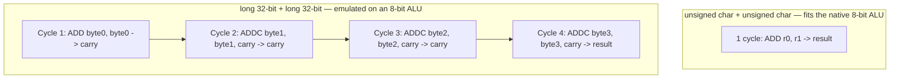

# Introduction

# Memory management:

See [Memory_Allocation.md](Memory_Allocation.md) — `malloc`/`calloc`/`realloc`/`free` compared.

# Data type:
## Concepts:
* 3 types of data types: 
  * primitive types (size is implementation-defined — C only guarantees a minimum; typical sizes below are for a common 32/64-bit desktop platform):

    | Type     |                      Typical size                      | Standard minimum                                                                             |
    | -------- | :----------------------------------------------------: | -------------------------------------------------------------------------------------------- |
    | `char`   |                         1 byte                         | 1 byte, by definition (`sizeof(char) == 1` always)                                           |
    | `short`  |                        2 bytes                         | ≥ 2 bytes (16 bits)                                                                          |
    | `int`    |                        4 bytes                         | ≥ 2 bytes (16 bits) — often 2 bytes on 8-bit MCUs                                            |
    | `long`   | 4 bytes (Windows/LLP64) or 8 bytes (Linux, macOS/LP64) | ≥ 4 bytes (32 bits)                                                                          |
    | `float`  |                        4 bytes                         | not mandated by the standard; IEEE 754 single-precision in practice                          |
    | `double` |                        8 bytes                         | not mandated by the standard; IEEE 754 double-precision in practice                          |
    | `void`   |                          n/a                           | incomplete type — has no size; `sizeof(void)` is a GCC extension (returns 1), not standard C |
  * user defined types: size_t etc
  * derived/dependent types: array, pointers, function pointers etc

* **Word size** = width of the CPU's registers/ALU (8/32/64-bit). A type maps to "one native operation, one native storage unit" only when its width matches (or is narrower than) the machine's word size — going wider costs both memory and cycles.

## Suitable usage of data type:

**Memory layout — an oversized type wastes memory:**

```
Address-space view — 8-bit machine, byte-addressable RAM
Both variables below store the value 5

Address:   0x00    0x01    0x02    0x03    0x04
         +-------+-------+-------+-------+-------+
Byte:    | 0x05  | 0x05  | 0x00  | 0x00  | 0x00  |
         +-------+-------+-------+-------+-------+
Owner:   |   c   | i:LSB |   i   |   i   | i:MSB |
         +-------+-------+-------+-------+-------+
           1 byte  \_______________________/
           used            3 wasted padding bytes
                    int i = 5 (4-byte int, little-endian)
```
- `unsigned char c = 5` occupies exactly 1 byte, all of it meaningful.
- `int i = 5` (4-byte `int`) occupies 4 bytes for the same value — byte 0 (LSB) holds the real data, bytes 1-3 are pure zero padding. Multiplied across an array of thousands of small values, this adds up fast on an MCU with only a few KB of RAM.

**Instruction cycles — an oversized type costs extra cycles:**

- Two `unsigned char` operands add in a single native instruction.
- Two `long` (32-bit) operands on the same 8-bit ALU must be emulated as 4 chained byte-wise adds (one `ADD` + three `ADDC` carrying into the next byte) — 4x the instructions/cycles for one `+`, repeated for every arithmetic op on that variable throughout the program.

**Other reasons to match the data type to the target machine:**
- **Truncation / overflow**: too narrow a type for the actual value range wraps silently (unsigned) or is undefined behavior (signed) — e.g. storing a 10GB size in `unsigned int` (see Q1 below).
- **Portability across machines**: some types change width across platforms (`long` is 32-bit on Windows/LLP64 but 64-bit on Linux-macOS/LP64). Code that assumes one width truncates values or mismatches struct layout when data crosses machines (e.g. a struct serialized on one platform and read on another).
- **Struct padding/alignment bloat**: compilers pad members to their alignment (usually their own size); an oversized member inflates `sizeof(struct)` beyond what the data needs — multiplied across every element of an array of that struct.
- **Torn / non-atomic access**: only reads/writes ≤ the machine's word size are guaranteed atomic. A variable wider than the native word (e.g. a 32-bit counter on an 8-bit MCU) shared between an ISR and main code can be read as a half-updated (torn) value if an interrupt fires mid-update — requires an explicit critical section to fix.
- **Hardware register width**: memory-mapped peripheral registers have a fixed physical width (often 8/16-bit). Accessing them with a mismatched-width type can write to unintended adjacent registers, or trigger unintended side effects on registers with write-1-to-clear or read-side-effect semantics.

## Q&A
1. **Most suitable type to store the size of a hard disk partition (10GB)?** `int` / `unsigned int` / `long` / `unsigned long`
   - 10 GB ≈ 1.07×10¹⁰ bytes — exceeds the 32-bit range (`int` max ~2.1×10⁹, `unsigned int` max ~4.3×10⁹), ruling out both 32-bit options.
   - A size can never be negative, so unsigned is semantically correct over signed.
   - **Answer: `unsigned long`** — but `long`'s width isn't fixed by the standard: 64-bit on Linux/macOS (LP64), still 32-bit on Windows (LLP64/MSVC). Portable real-world choice: `uint64_t` or `unsigned long long` (guaranteed ≥64-bit on every conforming compiler).

2. **Most suitable data type for use on an 8-bit MCU?** `char` / `unsigned char` / `int` / `unsigned int`
   - An 8-bit MCU's ALU/registers are natively 8 bits wide; `char`/`unsigned char` match that (single instruction, single byte). `int`/`unsigned int` must be ≥16 bits per the standard, costing extra instructions and RAM when the value doesn't need it.
   - Plain `char`'s signedness is implementation-defined; `unsigned char` is unambiguous (0-255), matching typical embedded use (registers, byte buffers, bit masks).
   - **Answer: `unsigned char`** — matches the native word size (efficiency) and has well-defined unsigned semantics (correctness). Reach for `int`/`unsigned int` only once a value can exceed 255.