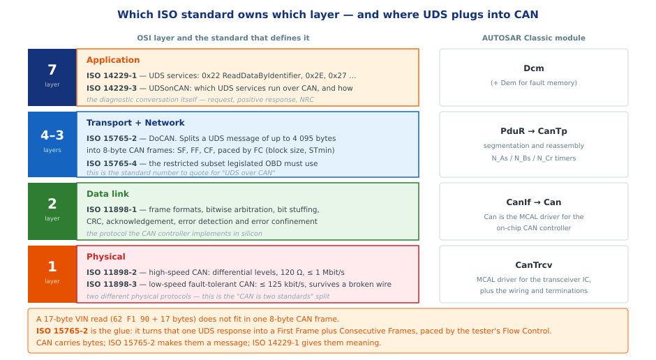
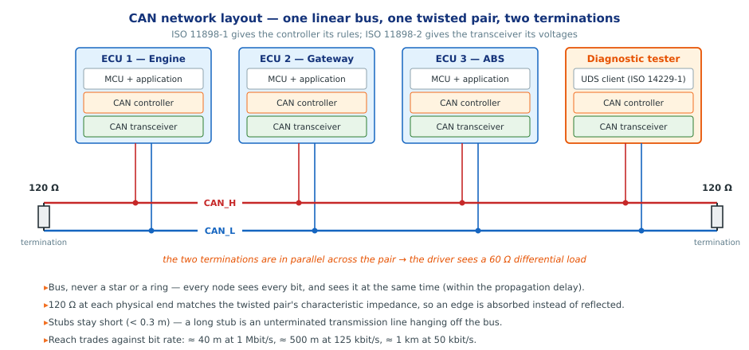
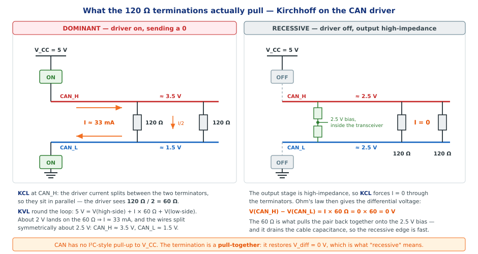
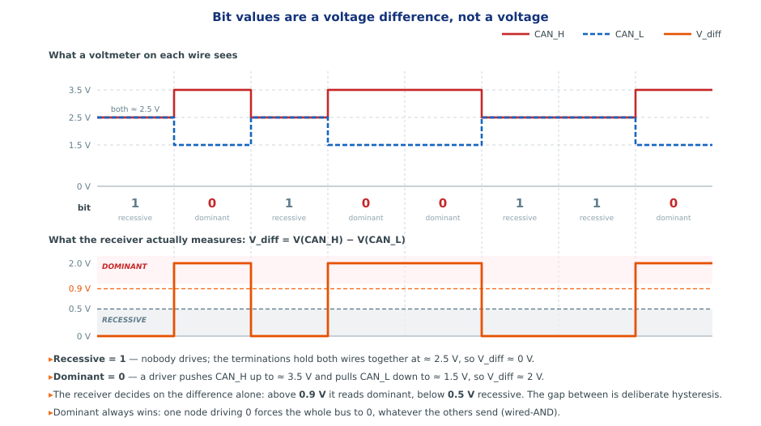
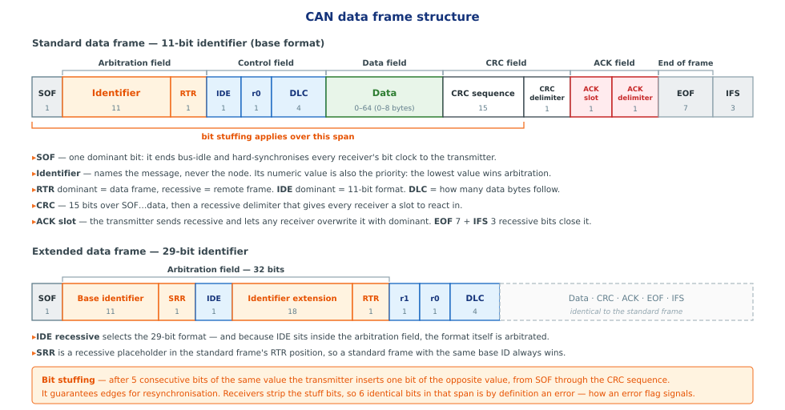
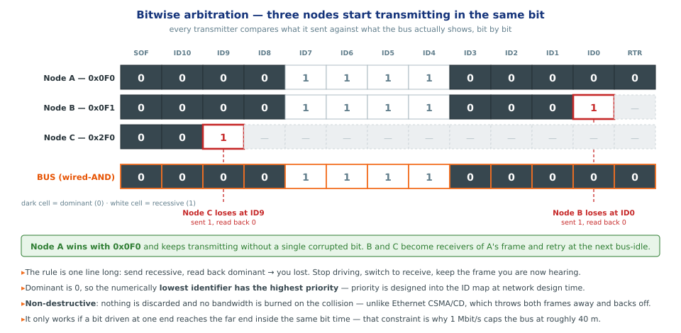
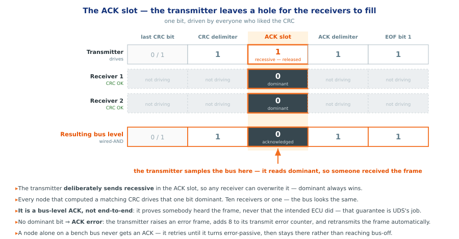

# CAN — Controller Area Network

> subtitle: ISO 11898 — the bus underneath every automotive ECU
> footer: AutomotiveNotes · doc/Standards/ISO11898-CAN

## Section 1 — What CAN is, and where it came from

**L1 and L2 — background, not mechanics.** History, motivation and positioning against other buses. The two standards being introduced are **ISO 11898-1** (data link) and **ISO 11898-2** (physical); the split between them is Section 2.

### What these slides cover

- **CAN is the wire UDS rides on.** Everything in the ISO 14229 material assumes the bus below it works.
- These slides go **bottom-up**: the wire, the voltages, the frame, then arbitration and acknowledgement.
- Written against **ISO 11898-1** (data link) and **ISO 11898-2** (high-speed physical layer).
- The link to diagnostics is **ISO 15765-2** — the last section shows exactly where it sits.

### Who invented CAN

- **Robert Bosch GmbH**, Stuttgart. Development started in **1983**; lead engineer **Uwe Kiencke**, with Siegfried Dais and Martin Litschel.
- Presented publicly at the **SAE congress in Detroit, February 1986**.
- First silicon in **1987** — Intel 82526, then Philips 82C200. Before that it was a paper protocol.
- First production car: the **Mercedes-Benz W140 S-Class, 1991**. Bosch published **CAN 2.0** the same year; ISO standardised it as **ISO 11898 in 1993**.

> note: The motivation was pure cost and weight. A 1980s luxury car was accumulating kilometres of point-to-point wiring; Bosch's pitch was that one twisted pair could replace a harness. That is still the argument today, which is why CAN survived Ethernet's arrival rather than being replaced by it.

### The problem it was invented to solve

- Point-to-point wiring grows as **n²** — every new function meant new copper through the bulkhead.
- Existing serial buses assumed a **quiet, short, single-board** environment. A car is none of those.
- The requirement Bosch wrote down: **multi-master, prioritised, error-confining, two wires, no central arbiter**.
- The design consequence: address the **message**, not the node — so a new listener costs nothing.

### Who uses it today

- **Every passenger car and truck built since the mid-1990s.** Typically several buses: powertrain, chassis, body, diagnostics.
- **Agriculture and construction** — ISOBUS (ISO 11783) is CAN.
- **Industrial automation** — CANopen and DeviceNet are CAN.
- **Marine** (NMEA 2000), **medical**, **lifts**, **building automation**, **rail**.
- Even in cars moving to Automotive Ethernet, CAN stays for **sensors, actuators and diagnostics** — it is cheaper per node and its worst-case latency is provable.

### CAN against SPI, I²C and UART

| | UART | I²C | SPI | **CAN** |
|---|---|---|---|---|
| Topology | point-to-point | multi-drop, master-driven | 1 master + N slaves | **multi-master bus** |
| Wires | 2 | 2 | 4 + 1 select **per slave** | **2, whatever the node count** |
| Signalling | single-ended | single-ended, open-drain | single-ended | **differential pair** |
| Who is addressed | the node | the node | the pin | **the message** |
| Two talkers at once | garbage | master backs off | not possible | **arbitration, no data lost** |
| Error handling | optional parity | ACK bit | none | **CRC-15 + 4 more checks + confinement** |
| Practical reach | ~15 m | ~1 m | centimetres | **40 m @ 1 Mbit/s, 1 km @ 50 kbit/s** |

`[ISO 11898-1, ISO 11898-2]`

### What that table actually buys you

- **No bus master and no arbiter chip.** Any node may start at any bus-idle; the protocol resolves the clash itself.
- **Message addressing** — add a data logger or a second consumer of the same signal and *not one transmitter changes*.
- **Deterministic worst case.** The highest-priority frame's latency is provable, so CAN is usable in a safety argument. SPI and I²C have no such property.
- **It confines its own faults.** A node with a broken transmitter counts its own errors and takes itself off the bus. Nothing on I²C does this.
- **Two wires stay two wires.** SPI needs another chip select per device; CAN needs a connector.

> note: The honest counterpoint for an interview: CAN is slow and its payload is tiny — 8 bytes classical, 64 with FD. If you need bandwidth you use Ethernet. You choose CAN for robustness, determinism and cost per node, never for throughput.

## Section 2 — Two protocols, two standards

**L1 and L2 — where the line is drawn.** **ISO 11898-1** governs L2, the data link layer, plus the physical signalling sublayer; **ISO 11898-2** governs L1, the physical medium. **ISO 15765-2** sits above both, at the transport layer, and is what carries UDS.

### CAN is not one standard

- The name "CAN" covers **two separate things**, standardised separately — this is the split people get wrong.
- **ISO 11898-1 — data link layer and physical signalling.** Frame formats, arbitration, bit stuffing, CRC, acknowledgement, error confinement, bit timing. *This is what the CAN controller implements.*
- **ISO 11898-2 — high-speed medium access unit.** Differential levels, 120 Ω terminations, bus topology, common-mode range. *This is what the transceiver and the wire do.*
- One is **logic**, the other is **electricity**. A single MCU pairs an 11898-1 controller with an 11898-2 transceiver.

`[ISO 11898-1, ISO 11898-2]`

### And two physical-layer protocols

| | **High-speed CAN** | **Low-speed fault-tolerant CAN** |
|---|---|---|
| Standard | **ISO 11898-2** | **ISO 11898-3** |
| Bit rate | up to **1 Mbit/s** | up to **125 kbit/s** |
| Termination | 120 Ω at **each end** | distributed, in every node |
| One wire breaks | bus down | **keeps running single-wire** |
| Typical use | powertrain, chassis, **diagnostics** | body / comfort |

- ISO 11898-3 has since been **withdrawn as a standard**, but low-speed CAN is still in service in vehicles built while it was current.
- **Diagnostics always uses high-speed CAN** — assume ISO 11898-2 unless told otherwise.

`[ISO 11898-2, ISO 11898-3]`

### UDS on CAN — the number to quote

### UDS on CAN (cont.)

- **`ISO 15765-2`** — *Diagnostic communication over CAN (DoCAN), Part 2: transport protocol and network layer services*. **This is the answer** when someone asks how UDS runs on CAN.
- It exists because a UDS message does not fit in a CAN frame: it segments up to **4 095 bytes** into 8-byte frames — SF, FF, CF — paced by the receiver's **Flow Control**.
- **`ISO 15765-4`** — the restricted subset that legislated OBD must use (fixed bit rates, fixed IDs, the OBD connector pins).
- **`ISO 14229-3`** — *UDSonCAN*: which UDS services are available over CAN and how they map onto ISO 15765-2.
- In AUTOSAR that layer is **CanTp**, sitting between **PduR** and **CanIf**.

`[ISO 15765-2:2016, ISO 15765-4, ISO 14229-3]`

> note: A common interview trap: "which standard defines UDS over CAN?" — 14229-1 is the service catalogue and 11898 is the bus; neither answers the question. ISO 15765-2 is the transport protocol that makes the two meet, and 14229-3 is the formal mapping document.

## Section 3 — Layer 1: the wire

**L1 — physical layer.** Governed by **ISO 11898-2**: the medium, the linear topology, the driver and receiver levels, and the common-mode range. The transceiver's half of CAN.

### What layer 1 defines

- The **medium**: a twisted pair with nominal **120 Ω characteristic impedance**. No shield required.
- The **topology**: a **linear bus**, terminated at both physical ends, with short stubs.
- The **levels**: driver output and receiver threshold voltages, and the **common-mode range (−2 V to +7 V)** the receiver must tolerate.
- The **timing envelope**: bit rate against bus length, and the propagation delay budget that arbitration depends on.
- What it **does not** define: connectors and cable part numbers. Those come from the OEM — or from ISO 15765-4 for the OBD connector.

`[ISO 11898-2]`

### CAN network layout

### Why a bus, and why terminated

- **Bus, not star or ring** — every node sees every bit at the same time, which is what makes bitwise arbitration possible at all.
- Each node is three parts: **application → CAN controller (ISO 11898-1) → CAN transceiver (ISO 11898-2)**.
- **120 Ω at each end** matches the cable's characteristic impedance, so an edge arriving at the end is *absorbed* instead of reflected back as ringing.
- The two terminations are in parallel across the pair → a transmitter drives **60 Ω**.
- **Stubs stay under ~0.3 m.** A long stub is an unterminated transmission line hanging off your bus.

> note: The two classic field faults: only one terminator fitted (bus works at low speed, fails intermittently at 500 kbit/s) and a terminator fitted in the middle rather than at the end. Measuring resistance across a powered-down bus should read ~60 Ω — that is the standard first check.

### CAN_H and CAN_L — why two wires

- The receiver does not measure a voltage. It measures a **difference**: `V_diff = V(CAN_H) − V(CAN_L)`.
- An interference spike couples into **both** wires nearly equally — it is *common mode*, and the subtraction cancels it.
- **Twisting** is what makes the coupling equal along the whole run; without the twist the two wires would see different fields.
- **Emission** falls for the same reason: in the dominant state the currents in the two wires are equal and opposite, so their far fields cancel.
- Ground potential between two ECUs in a car can differ by volts. The **−2 V to +7 V common-mode range** absorbs that; a single-ended bus would not.

`[ISO 11898-2]`

## Section 4 — Recessive, dominant, and what the resistor pulls

**L1 — physical layer, and the hook L2 hangs on.** The voltages and the 0.9 V / 0.5 V thresholds come from **ISO 11898-2**; the dominant-beats-recessive bus value they encode is **ISO 11898-1**, and is what arbitration and the ACK slot are built from.

### What the termination actually pulls

### Kirchhoff, step by step

- **Dominant.** The transceiver closes a high-side switch to V_CC and a low-side switch to ground.
    - **KCL** at CAN_H: the driver's current splits between the two 120 Ω terminators — they are in parallel, so the driver sees **60 Ω**.
    - **KVL** round the loop: `5 V = V(high-side) + I × 60 Ω + V(low-side)`. About **2 V** lands on the 60 Ω, so **I ≈ 33 mA**.
    - The pair splits symmetrically about 2.5 V: **CAN_H ≈ 3.5 V, CAN_L ≈ 1.5 V**.

- **Recessive.** Both switches open — the output is **high impedance**.
    - **KCL** now forces **I = 0** through the terminators.
    - Ohm's law finishes it: `V(CAN_H) − V(CAN_L) = I × 60 Ω = 0 × 60 = 0 V`.
    - So the resistor **pulls the two wires back together**, onto the transceiver's internal 2.5 V bias.

- **CAN has no I²C-style pull-up to V_CC.** The termination is a *pull-together*: what it restores is `V_diff = 0`, and that **is** the recessive state.

> note: There is a second job people forget. Recessive is passive — nothing drives it — so the only thing that discharges the cable capacitance after a dominant bit is that 60 Ω. Remove the terminations and the recessive edge decays on an RC instead of being driven, the bit gets sampled before it has recovered, and you get stuff errors that look like noise. The 60 Ω is doing what a pull-up does in I²C, but differentially.

### Split termination — the version you will see on a schematic

- Real ECUs often split each 120 Ω into **two 60 Ω in series**, with the midpoint tied to ground through **~4.7 nF**.
- Differentially it is unchanged — still 120 Ω per end.
- For **common-mode** noise it is now a low-impedance path to ground, which damps the common-mode resonance the twisted pair otherwise has.
- Cheap EMC win: two resistors and a capacitor, no change to the protocol.

### What defines a 1 and a 0

### The numbers

| State | Bit | CAN_H | CAN_L | V_diff |
|---|:---:|---|---|---|
| **Recessive** | **1** | ≈ 2.5 V | ≈ 2.5 V | **≈ 0 V** |
| **Dominant** | **0** | ≈ 3.5 V | ≈ 1.5 V | **≈ 2 V** |

- Receiver decision: **above 0.9 V → dominant**, **below 0.5 V → recessive**. The gap between is deliberate hysteresis.
- Note the inversion that trips people up: **logical 0 is the *active*, driven state**; logical 1 is nobody driving.
- That is what makes the bus a **wired-AND** — and everything in the next two sections follows from it.

`[ISO 11898-2]`

### A node transmits — follow the voltage

- **Bus idle.** No driver is on. The 60 Ω holds both wires at ≈ 2.5 V, `V_diff ≈ 0`. Every receiver reads recessive.
- **SOF, the first dominant bit.** The transmitter closes both switches. ≈ 33 mA leaves CAN_H, crosses the terminations, returns on CAN_L.
- **The whole bus moves together.** CAN_H rises to ≈ 3.5 V, CAN_L falls to ≈ 1.5 V, `V_diff` snaps to ≈ 2 V — everywhere along the cable, within a fraction of a bit time.
- **Back to recessive.** Both switches open. The 60 Ω drains the differential charge and the pair relaxes to 2.5 V.
- **The transmitter reads its own bit back.** Anything other than what it drove — outside the arbitration field and the ACK slot — is a **bit error**.

### And if two nodes transmit at once

- Both driving **dominant**: the currents simply add. No contention, no damage — the transceivers are current-limited by design.
- One **dominant**, one **recessive**: the recessive node is not driving anything, so the dominant node sets the bus alone.
- **Dominant wins, always.** The node that sent recessive reads back dominant, and immediately knows it.
- That single asymmetry is the whole basis of **arbitration** and of the **ACK slot**.

## Section 5 — The frame

**L2 — data link layer.** Governed by **ISO 11898-1**: frame formats, field order, DLC, CRC and bit stuffing. This is what the CAN controller implements, whatever the wire below it looks like.

### CAN frame structure

### Field by field

- **SOF** — one dominant bit. Ends bus-idle and **hard-synchronises** every receiver's bit clock to the transmitter.
- **Arbitration field** — the 11-bit identifier plus RTR. Names the *message*, never the node; its value is also its **priority**.
- **Control field** — IDE (which ID length), r0 (reserved), and **DLC**, the number of data bytes to follow.
- **Data field** — **0 to 8 bytes** in classical CAN, up to 64 with CAN FD.
- **CRC field** — a **15-bit CRC** over SOF…data, then a recessive delimiter that gives receivers a slot to react in.
- **ACK field** — the slot the receivers fill (Section 7), then its delimiter.
- **EOF** 7 recessive bits, then **IFS** 3 more before the bus may be claimed again.

`[ISO 11898-1]`

### Standard and extended

- **Standard (base) format** — 11-bit identifier, 2 048 values. IDE dominant.
- **Extended format** — 29-bit identifier, IDE recessive. Used where a large flat ID space is needed, e.g. **J1939** on trucks.
- **SRR** is a recessive placeholder sitting in the standard frame's RTR position — so a standard frame with the same base ID **always wins** against an extended one.
- Because IDE lives inside the arbitration field, **the frame format itself is arbitrated**. Both formats coexist on one bus.

### The four frame types

| Frame | Purpose |
|---|---|
| **Data frame** | carries data. The one that matters. |
| **Remote frame** | RTR recessive — asks another node to send that ID. Largely avoided in modern designs. |
| **Error frame** | **6 dominant bits** — deliberately illegal, so every node sees it and discards the frame. |
| **Overload frame** | a receiver asking for delay. Rare with modern controllers. |

- The error frame's trick is worth remembering: it works **because** it violates bit stuffing.

### Bit stuffing

- After **5 consecutive bits of the same value**, the transmitter inserts one bit of the opposite value.
- Applies from **SOF through the CRC sequence** — not to the delimiters, ACK, EOF or IFS.
- **Why:** CAN has no separate clock line. Receivers resynchronise on edges, so the protocol has to guarantee edges.
- Receivers strip the stuff bits before interpreting anything, so it is invisible above the data link layer.
- Consequence: **6 identical bits inside that span is by definition an error** — which is exactly how the error frame signals.
- Practical consequence: frame length is **data-dependent**. Budget worst case, not nominal.

## Section 6 — Arbitration

**L2 — data link layer, medium access.** Priority and bus access are **ISO 11898-1**, but the rule only holds because a bit reaches every node within one bit time — a propagation budget set at L1 by **ISO 11898-2**.

### The problem arbitration solves

- Any node may start transmitting at any bus-idle. Sooner or later **two start in the same bit**.
- Ethernet's answer (CSMA/CD) is to detect the collision, **throw both frames away** and back off randomly. That destroys determinism.
- CAN's answer is **CSMA/CR** — collision *resolution*. The clash is settled **while transmitting**, and the winner never stops.
- It works only because of the wired-AND: **dominant overwrites recessive, and every transmitter reads the bus back**.

### Bitwise arbitration

### What the diagram shows

- The rule is one line: **send recessive, read back dominant → you have lost.** Stop driving, switch to receive, keep the frame you are now hearing.
- Node C loses at **ID9**, Node B at **ID0** — the very last identifier bit. Node A transmits on **without a single corrupted bit**.
- **Dominant is 0**, so the **numerically lowest identifier has the highest priority**.
- **Non-destructive**: nothing is discarded, no bandwidth is burned on the collision. The losers retry at the next bus-idle, automatically, in hardware.

### What it costs, and what it buys

- **Buys:** provable worst-case latency for high-priority frames. This is what lets CAN into a timing or safety argument.
- **Costs:** a bit driven at one end must reach the far end **within the same bit time** — the reason 1 Mbit/s caps the bus at roughly 40 m.
- **Costs:** the ID map becomes a **design artefact**. Priority is allocated at network design time and reviewed like code.
- **Watch the tail:** the *lowest*-priority frame is the one whose deadline you have to prove. Keep bus load in the 50–70 % region.
- **Hard rule:** two nodes must **never** transmit the same identifier. Arbitration cannot separate them, and the frames corrupt each other past the arbitration field.

> note: This is where a tech lead adds value on a CAN project. ID allocation, bus load budget and worst-case response time analysis are review items, not implementation details — and they are far cheaper to fix in the DBC than after integration.

## Section 7 — Acknowledgement

**L2 — data link layer.** The ACK slot, the error frame and the TEC/REC counters are all **ISO 11898-1**. End-to-end delivery is not a CAN layer at all: it belongs to UDS, above **ISO 15765-2**.

### The ACK slot

### How ACK works

- The transmitter **deliberately sends recessive** in the ACK slot — it releases the bus for one bit.
- **Every** node that computed a matching CRC drives that bit **dominant**. Dominant wins, so one receiver looks the same as ten.
- The transmitter samples the bus in that slot. **Dominant read back ⇒ somebody received the frame intact.**
- No dominant bit ⇒ **ACK error**: the transmitter raises an error frame, adds **8** to its transmit error counter, and **retransmits automatically**.

### What ACK does not prove

- It is a **bus-level** acknowledgement, not an end-to-end one. It proves *somebody* heard the frame — **never that the intended ECU did**.
- Delivery to a specific server is a **higher-layer** guarantee: that is UDS's positive/negative response, not CAN's ACK.
- The counters that matter: **TEC** and **REC**. Above 127 a node goes **error-passive**; above 255 it goes **bus-off** and stops transmitting entirely.
- **Bench gotcha:** one node alone on a bus never gets an ACK. It retries until it turns error-passive, then stays there rather than reaching bus-off — so you see endless retransmission of the same frame. Add a second node, or a tester in listen-and-ack mode.

> note: The reason it stalls at error-passive rather than going bus-off is an explicit exception in the error-counting rules: an error-passive transmitter that sees an ACK error, and detects no dominant bit while sending its passive error flag, does not increment TEC. Worth knowing — it explains a symptom that otherwise looks like a broken controller.

## Section 8 — Takeaways

**L1 and L2 together.** **ISO 11898-2** is the wire, **ISO 11898-1** is the controller, and **ISO 15765-2** is the transport layer that carries UDS across both.

### Takeaways

- **Two standards, two jobs.** ISO 11898-1 is the controller's protocol; ISO 11898-2 is the transceiver's electricity. High-speed (11898-2) and low-speed fault-tolerant (11898-3) are two different physical protocols.
- **Everything follows from wired-AND.** Dominant 0 beats recessive 1 — that one asymmetry gives you arbitration, the ACK slot and the error frame.
- **The termination is not a pull-up.** By KCL, zero current through 60 Ω means zero differential volts: it pulls the pair *together*, back to recessive.
- **Priority is the identifier.** Lowest ID wins, non-destructively. The ID map is a design artefact worth reviewing.
- **ACK proves reception by somebody, not by the right somebody.** End-to-end delivery belongs to UDS.
- **UDS meets CAN at ISO 15765-2.** That is the standard number to have ready.

### References

- **ISO 11898-1** — Road vehicles, CAN: data link layer and physical signalling
- **ISO 11898-2** — high-speed medium access unit
- **ISO 11898-3** — low-speed, fault-tolerant medium-dependent interface *(withdrawn)*
- **ISO 15765-2:2016** — Diagnostic communication over CAN (DoCAN): transport protocol and network layer services
- **ISO 15765-4** — DoCAN requirements for emissions-related systems
- **ISO 14229-1 / ISO 14229-3** — UDS services, and UDSonCAN
- **Bosch CAN Specification 2.0** (1991) — the original, still the clearest description of arbitration
