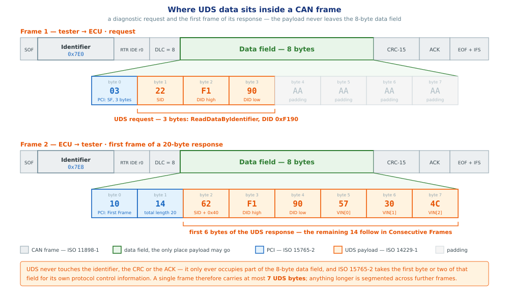

# CAN — Controller Area Network

> subtitle: ISO 11898 — the bus underneath every automotive ECU
> footer: AutomotiveNotes · doc/Standards/ISO11898-CAN

## Section 1 — What CAN is, and where it came from

**L1 and L2 — background, not mechanics.** History, motivation and positioning against other buses. The two standards being introduced are **ISO 11898-1** (data link) and **ISO 11898-2** (physical); the split between them is Section 2.

### Scope and approach

- **CAN is the wire UDS rides on.** Everything in the ISO 14229 material assumes the bus below it works.
- These slides go **bottom-up**: the wire, the voltages, the frame, then arbitration and acknowledgement.
- Written against **ISO 11898-1** (data link) and **ISO 11898-2** (high-speed physical layer).
- The link to diagnostics is **ISO 15765-2** — the last section shows exactly where it sits.

### Origin and standardisation

- **Robert Bosch GmbH**, Stuttgart. Development started in **1983**; lead engineer **Uwe Kiencke**, with Siegfried Dais and Martin Litschel.
- Presented publicly at the **SAE congress in Detroit, February 1986**.
- First silicon in **1987** — Intel 82526, then Philips 82C200. Before that it was a paper protocol.
- First production car: the **Mercedes-Benz W140 S-Class, 1991**. Bosch published **CAN 2.0** the same year; ISO standardised it as **ISO 11898 in 1993**.

> note: The motivation was pure cost and weight. A 1980s luxury car was accumulating kilometres of point-to-point wiring; Bosch's pitch was that one twisted pair could replace a harness. That is still the argument today, which is why CAN survived Ethernet's arrival rather than being replaced by it.

### Design motivation

- Point-to-point wiring grows as **n²** — every new function meant new copper through the bulkhead.
- Existing serial buses assumed a **quiet, short, single-board** environment. A car is none of those.
- The requirement Bosch wrote down: **multi-master, prioritised, error-confining, two wires, no central arbiter**.
- The design consequence: address the **message**, not the node — so a new listener costs nothing.

### Application domains today

- **Every passenger car and truck built since the mid-1990s.** Typically several buses: powertrain, chassis, body, diagnostics.
- **Agriculture and construction** — ISOBUS (ISO 11783) is CAN.
- **Industrial automation** — CANopen and DeviceNet are CAN.
- **Marine** (NMEA 2000), **medical**, **lifts**, **building automation**, **rail**.
- Even in cars moving to Automotive Ethernet, CAN stays for **sensors, actuators and diagnostics** — it is cheaper per node and its worst-case latency is provable.

### Bus comparison — CAN, SPI, I²C, UART

| | UART | I²C | SPI | **CAN** |
|---|---|---|---|---|
| **Topology** | point-to-point, 1:1 | 1 master – N slaves | 1 master – N slaves | **peer-to-peer, multi-master, N nodes** |
| **Wires** | 2 — TX, RX | 2 — SDA, SCL | 3 + 1 per slave — SCLK, MOSI, MISO, SS | **2 — CAN_H, CAN_L** |
| **Duplex** | full | half | full | **half** |
| **Transmission** | serial | serial | serial | **serial** |
| **Clock line** | none | SCL | SCLK | **none — bit-synchronous** |
| **Clock source** | independent baud generators | master; slave may stretch | master only | **no single node; edge resynchronisation** |
| **Bus drive** | one push-pull driver per line | open-drain, wired-AND | master; selected slave on MISO | **all nodes, wired-AND** |
| **Addressing** | implicit — the link | 7/10-bit slave address | chip-select line | **11/29-bit message identifier** |
| **Error handling** | parity, framing, overrun | ACK / NACK per byte | none defined | **CRC-15 + 4 checks, retransmit, bus-off** |
| **Bus length** | ≈ 15 m (RS-232) | < 1 m | centimetres | **40 m @ 1 Mbit/s, 1 km @ 50 kbit/s** |
| **Bit rate** | ≤ 1 Mbit/s | ≤ 3.4 Mbit/s | 10 – 50 Mbit/s | **1 Mbit/s; 5 Mbit/s FD data phase** |

`[ISO 11898-1, ISO 11898-2]`

> note: Qualifications the cells omit. I²C does define multi-master arbitration on SDA; it is simply rare in deployment. UART is asynchronous in the strict sense — no shared bit clock — whereas CAN has no clock line but is bit-synchronous: the whole network shares one bit time, hard-synchronised on SOF and resynchronised on the recessive-to-dominant edges bit stuffing guarantees. That distinction is what makes arbitration possible. The transmission row is uniform on purpose: none of the four is parallel, so the differences all sit in clocking, bus access and error handling.

### Advantages of CAN

- **Distributed bus access.** No master and no arbiter chip. Any node transmits at bus idle; contention resolves bitwise and non-destructively.
- **Message addressing.** The identifier labels the frame, not the node. Adding a receiver changes no transmitter — only that node's acceptance filter and the communication matrix.
- **Analysable worst-case response time.** Frame latency is *boundable*, not constant, and the bound holds only under stated assumptions — next slide.
- **Error detection in hardware.** CRC-15, form, stuff, bit-monitor and ACK checks, with automatic retransmission.
- **Error confinement.** A transmitter that detects its own errors increments its transmit error counter and disconnects at bus-off, TEC > 255.
- **Constant wiring cost.** Two wires whatever the node count; the ceiling is transceiver drive capability, not the protocol.

`[ISO 11898-1]`

### Limitation of CANs

- **Arbitration does not preempt.** A ready high-priority message waits for the frame already in transmission. Worst-case blocking is one maximum-length frame: `55 + 10n` bit times standard format, so **135 bits ≈ 270 µs at 500 kbit/s**.
- **The original timing analysis was wrong for 12 years.** Tindell et al. (1995) was optimistic; Davis, Burns, Bril and Lukkien refuted and corrected it in 2007. Confirm which analysis a tool implements before trusting its numbers.
- **FIFO transmit queues invalidate the analysis.** A driver that queues by arrival rather than priority inverts priority inside the node, before arbitration ever sees the frame *(Davis et al., ECRTS 2011)*.
- **The bound assumes an error model.** Automatic retransmission ties latency to an assumed error rate. Unbounded errors, unbounded latency.
- **Error confinement does not stop a babbling node.** Well-formed frames sent too often, or under the wrong identifier, raise no error counters at all. Containment needs a gateway or a bus guardian.
- **Error detection is not a safety argument.** Residual error probability is non-zero, and bit stuffing interacts with the CRC to admit undetected multi-bit errors *(Tran and Koopman, CMU 1999)*. Safety-related signals carry E2E protection above the protocol.

`[Davis et al. 2007; Tran & Koopman 1999 — see References]`

> note: Correcting a common overstatement: CAN is not "more deterministic than SPI". Under a single master SPI has no contention at all, so its schedule is fixed and trivially predictable. What CAN offers is a latency bound for a bus with *many independent transmitters* — a problem SPI and I²C do not attempt to solve. The counterpoint on capability: 8 data bytes classical, 64 with FD. CAN is selected for robustness, analysability and cost per node, not for throughput.

## Section 2 — Governing standards and rules

**L1 and L2 — where the line is drawn.** **ISO 11898-1** governs L2, the data link layer, plus the physical signalling sublayer; **ISO 11898-2** governs L1, the physical medium. **ISO 15765-2** sits above both, at the transport layer, and is what carries UDS.

### Division of scope between the two standards

- The name "CAN" covers **two separate things**, standardised separately — this is the split people get wrong.
- **ISO 11898-1 — data link layer and physical signalling.** Frame formats, arbitration, bit stuffing, CRC, acknowledgement, error confinement, bit timing. *This is what the CAN controller implements.*
- **ISO 11898-2 — high-speed medium access unit.** Differential levels, 120 Ω terminations, bus topology, common-mode range. *This is what the transceiver and the wire do.*
- One is **logic**, the other is **electricity**. A single MCU pairs an 11898-1 controller with an 11898-2 transceiver.

`[ISO 11898-1, ISO 11898-2]`

### Physical-layer variants

| | **High-speed CAN** | **Low-speed fault-tolerant CAN** |
|---|---|---|
| Standard | **ISO 11898-2** | **ISO 11898-3** |
| Bit rate | up to **1 Mbit/s** | up to **125 kbit/s** |
| Termination | 120 Ω at **each end** | distributed, in every node |
| One wire breaks | bus down | **keeps running single-wire** |
| Typical use | powertrain, chassis, **diagnostics** | body / comfort |

- ISO 11898-3 has since been **withdrawn as a standard**, but low-speed CAN is still in service in vehicles built while it was current.
- **Diagnostics always uses high-speed CAN** — assume ISO 11898-2 unless told otherwise.

`[ISO 11898-2, ISO 11898-3]`

### UDS on CAN — layer mapping

### UDS on CAN — the governing standards

- **ISO 14229-1 defines the services.** It specifies requests, positive responses and negative response codes, and says nothing about CAN.
- **ISO 15765-2 defines the transport protocol.** It segments a UDS message of up to 4 095 bytes into 8-byte CAN frames — Single, First and Consecutive Frame — and paces them with the receiver's Flow Control frame.
- **ISO 14229-3 defines the mapping.** It states which UDS services run over CAN and how each one uses ISO 15765-2.
- **AUTOSAR implements ISO 15765-2 as CanTp**, between PduR and CanIf.

`[ISO 15765-2:2016, ISO 14229-3]`

> note: ISO 14229-1 is the service catalogue and ISO 11898 is the bus; neither defines how one runs over the other. ISO 15765-2 supplies the transport protocol and ISO 14229-3 supplies the mapping. Quote 15765-2 when asked how UDS runs on CAN.

### OBD — on-board diagnostics

- **What it is:** a regulator-mandated diagnostic interface. Every road vehicle must expose its emissions-related fault data to *any* scan tool, not only to the manufacturer's equipment.
- **Who mandates it:** the US EPA required OBD-II on light-duty vehicles from model year **1996**; the EU required EOBD on petrol vehicles from **2001** and on diesel from **2003**.
- **What it does:** it monitors the emissions control systems while the engine runs, and lights the malfunction indicator lamp when a monitor fails.
- **What it records:** a diagnostic trouble code, plus a freeze frame of the operating conditions at the moment the fault was confirmed.
- **What it answers:** a fixed, public request set — live sensor values, stored and pending DTCs, readiness monitors, clear-codes, and the VIN.

`[ISO 15031-5 / SAE J1979; ISO 15031-6 / SAE J2012]`

### OBD on CAN — the fixed interface

- **SAE J1962 fixes the connector**: a 16-pin socket within reach of the driver's seat, carrying **CAN_H on pin 6** and **CAN_L on pin 14**.
- **ISO 15765-4 fixes the CAN layer**: 250 or 500 kbit/s, functional request identifier **`0x7DF`**, physical responses **`0x7E8`–`0x7EF`**.
- **Fixing all of it is the point.** A generic scan tool connects and communicates without being configured for the vehicle.
- **OBD uses the same transport as UDS** — ISO 15765-2 — on the same physical bus.
- **OBD is not UDS.** OBD is a small legislated emissions-only service set with its own service identifiers; UDS is the manufacturer's full diagnostic protocol. A production ECU answers both.

`[ISO 15765-4:2016; SAE J1962]`

> note: The service sets differ as well as the scope. OBD uses the ten "modes" of ISO 15031-5 / SAE J1979 — mode 0x01 for live data, 0x03 for stored DTCs — not the UDS service identifiers of ISO 14229-1. A production ECU distinguishes the two by request identifier and service identifier.

## Section 3 — Layer 1: the physical medium

**L1 — physical layer.** Governed by **ISO 11898-2**: the medium, the linear topology, the driver and receiver levels, and the common-mode range. The transceiver's half of CAN.

### Scope of layer 1

- The **medium**: a twisted pair with nominal **120 Ω characteristic impedance**. No shield required.
- The **topology**: a **linear bus**, terminated at both physical ends, with short stubs.
- The **levels**: driver output and receiver threshold voltages, and the **common-mode range (−2 V to +7 V)** the receiver must tolerate.
- The **timing envelope**: bit rate against bus length, and the propagation delay budget that arbitration depends on.
- What it **does not** define: connectors and cable part numbers. Those come from the OEM — or from ISO 15765-4 for the OBD connector.

`[ISO 11898-2]`

### CAN network topology

### Bus topology and termination placement

- **Bus, not star or ring** — every node sees every bit at the same time, which is what makes bitwise arbitration possible at all.
- **Terminate at both physical ends, and only there.** 120 Ω per end; the pair then presents 60 Ω to a transmitting driver.
- **Stubs stay under ~0.3 m.** A stub is an unterminated line hanging off the bus.
- **Field check:** measured across a powered-down bus, CAN_H to CAN_L reads ≈ 60 Ω. A reading near 120 Ω means one terminator is missing.

> note: The two classic field faults: only one terminator fitted (bus works at low speed, fails intermittently at 500 kbit/s) and a terminator fitted in the middle rather than at the end. Measuring resistance across a powered-down bus should read ~60 Ω — that is the standard first check.

### Impedance matching in three formulas

**Inductance** — the magnetic flux a conductor links per unit current, in henries:

$$L = \frac{N\Phi}{I}$$

**Characteristic impedance** — what the cable presents to a travelling wave. Set by inductance and capacitance *per metre*, so it does not change with cable length:

$$Z_0 = \sqrt{\frac{L}{C}}$$

**Reflection coefficient** — the fraction of an edge that returns from a load $Z_L$:

$$\Gamma = \frac{Z_L - Z_0}{Z_L + Z_0}$$

$\Gamma = 0$ no reflection · $\Gamma = +1$ full reflection, in phase · $\Gamma = -1$ full reflection, inverted

For CAN cable $L \approx 0.5$ µH/m and $C \approx 40$ pF/m give $Z_0 \approx 112$ Ω — hence the **nominal 120 Ω** of ISO 11898-2. **Set $Z_L = Z_0$ and the numerator vanishes: $\Gamma = 0$, and nothing reflects.**

`[ISO 11898-2]`

> note: This is why the terminator value is not arbitrary and why fitting only one, or fitting the wrong value, produces reflections that read downstream as stuff and CRC errors. An open end is Z_L = ∞, so Γ = +1 and the edge returns in full.

### CAN_H and CAN_L — rationale for differential signalling

- The receiver does not measure a voltage. It measures a **difference**: `V_diff = V(CAN_H) − V(CAN_L)`.
- An interference spike couples into **both** wires nearly equally — it is *common mode*, and the subtraction cancels it.
- **Twisting** is what makes the coupling equal along the whole run; without the twist the two wires would see different fields.
- **Emission** falls for the same reason: in the dominant state the currents in the two wires are equal and opposite, so their far fields cancel.
- Ground potential between two ECUs in a car can differ by volts. The **−2 V to +7 V common-mode range** absorbs that; a single-ended bus would not.

`[ISO 11898-2]`

## Section 4 — Recessive and dominant states

**L1 — physical layer, and the hook L2 hangs on.** The voltages and the 0.9 V / 0.5 V thresholds come from **ISO 11898-2**; the dominant-beats-recessive bus value they encode is **ISO 11898-1**, and is what arbitration and the ACK slot are built from.

### Driver states and the termination network

### Bit encoding on the bus

## Section 5 — The frame

**L2 — data link layer.** Governed by **ISO 11898-1**: frame formats, field order, DLC, CRC and bit stuffing. This is what the CAN controller implements, whatever the wire below it looks like.

### CAN frame structure

### Frame fields

- **SOF** — one dominant bit. Ends bus-idle and **hard-synchronises** every receiver's bit clock to the transmitter.
- **Arbitration field** — the 11-bit identifier plus RTR. Names the *message*, never the node; its value is also its **priority**.
- **Control field** — IDE (which ID length), r0 (reserved), and **DLC**, the number of data bytes to follow.
- **Data field** — **0 to 8 bytes** in classical CAN, up to 64 with CAN FD.
- **CRC field** — a **15-bit CRC** over SOF…data, then a recessive delimiter that gives receivers a slot to react in.
- **ACK field** — the slot the receivers fill (Section 7), then its delimiter.
- **EOF** 7 recessive bits, then the **interframe space** separates this frame from the next.

`[ISO 11898-1]`

### CRC — coverage and computation

- **CRC-15**, generator polynomial `0x4599` — x¹⁵ + x¹⁴ + x¹⁰ + x⁸ + x⁷ + x⁴ + x³ + 1, register starting at zero.
- **Covers SOF, arbitration field, control field and data field.** Not the CRC itself, and not the ACK, EOF or IFS that follow it.
- **Computed on the destuffed bit stream** — in classical CAN the stuff bits are not fed into the CRC. CAN FD reverses this and includes them, in CRC-17 or CRC-21.
- **Strength:** Hamming distance 6 over a classical frame — it detects any 5 randomly distributed bit errors, and any burst shorter than 15 bits.
- **Every receiver computes it independently** and compares its result against the 15 bits in the frame. The transmitter does not check its own CRC; it checks the bus by bit monitoring instead.

`[ISO 11898-1]`

### CRC result — ACK, error frame, no NACK

| Receiver's comparison | ACK slot | What follows |
|---|---|---|
| **CRC matches** | that node drives it **dominant** | frame accepted; nothing further happens |
| **CRC mismatches** | that node leaves it **recessive** | that node sends an **error frame**; its REC increases by 1; the transmitter retransmits |

- **No CRC value means "reject".** The check is a comparison, not a magic number — your computed CRC either equals the 15 bits in the frame or it does not.
- **CAN has no NACK frame.** The only negative signal is the **error frame**, sent at the bit after the ACK delimiter.
- **The ACK slot alone cannot report failure.** It is wired-AND: one receiver with a good CRC drives it dominant, so the transmitter sees an ACK even when another node's CRC failed.
- **The error frame is what actually protects the bus.** It destroys the frame for every node, so the failing receiver forces a retransmission that the ACK slot would have hidden.

`[ISO 11898-1]`

> note: This is the answer to "which CRC value gives a NACK" — none, because no such frame exists. Worth keeping straight against UDS, where a negative response 0x7F *is* a real message with a reason code. CAN's rejection is anonymous and carries no diagnosis: an error frame says only "this frame was bad", never which node objected or why.

### IFS — the interframe space

- **What it is:** the mandatory gap between one frame and the next. Every data and remote frame is separated from whatever preceded it — data, remote, error or overload frame — by this space.
- **What it is for:** it gives every controller time to move the frame it just received into a receive buffer and finish its housekeeping before the next frame arrives.
- **Intermission — 3 recessive bits.** No node may *start* a data or remote frame here. This is the "3 bits" quoted in frame-length arithmetic.
- **Bus idle — any length, including none.** The bus is free; any node may start. A dominant bit here is a start-of-frame.
- **Suspend transmission — 8 recessive bits, error-passive nodes only.** After transmitting, an error-passive node must wait this extra window before starting again.

`[ISO 11898-1]`

> note: Two details worth having. First, a dominant bit in the first or second intermission bit is an overload condition and triggers an overload frame; a dominant bit in the *third* intermission bit is instead read as a start-of-frame, and a node with a message pending will begin transmitting its identifier immediately without sending its own SOF. Second, suspend transmission is error confinement in action: it does not disconnect a faulty node, it just degrades its bus access, which means a busy error-active network can starve an error-passive node indefinitely.

### Standard and extended formats

- **Standard (base) format** — 11-bit identifier, 2 048 values. IDE dominant.
- **Extended format** — 29-bit identifier, IDE recessive. Used where a large flat ID space is needed, e.g. **J1939** on trucks.
- **SRR** is a recessive placeholder sitting in the standard frame's RTR position — so a standard frame with the same base ID **always wins** against an extended one.
- Because IDE lives inside the arbitration field, **the frame format itself is arbitrated**. Both formats coexist on one bus.

### The four frame types

| Frame | Purpose |
|---|---|
| **Data frame** | carries data. The one that matters. |
| **Remote frame** | RTR recessive and **no data field** — asks whoever produces a given identifier to transmit it. Largely avoided in modern designs. |
| **Error frame** | **6 dominant bits** — deliberately illegal, so every node sees it and discards the frame. |
| **Overload frame** | a receiver asking for delay. Rare with modern controllers. |

- The error frame's trick is worth remembering: it works **because** it violates bit stuffing.

### The remote frame, and why it fell out of use

- **It is a request for a message, not a request to a node.** The remote frame carries an identifier and no payload; the node configured to produce that identifier answers with a data frame carrying **the same identifier**.
- **Identical to a data frame except for two things:** RTR is recessive rather than dominant, and the data field is absent entirely — the frame runs control field straight into CRC.
- **Arbitration resolves the collision for free.** A remote frame and the data frame it is asking for are bit-identical up to RTR. Dominant beats recessive, so the data frame wins — the requester loses arbitration to the very answer it wanted, and simply receives it.
- **Why designs avoid it:** DLC handling is inconsistent between controllers, and some answer remote frames automatically from a mailbox — shipping stale data with no software involvement.
- **CAN FD removes it.** In FD frames the RTR position becomes **RRS**, always transmitted dominant. Remote frames exist only in classical CAN.

`[ISO 11898-1]`

> note: The standard states the remote frame has no data field regardless of what its DLC says, which is the root of the inconsistency — the DLC is meant to match the expected reply, but nothing enforces it. Modern designs replace the whole mechanism with either cyclic transmission or an explicit request/response message pair, which is also what UDS does over ISO 15765-2.

### Bit stuffing

- After **5 consecutive bits of the same value**, the transmitter inserts one bit of the opposite value.
- Applies from **SOF through the CRC sequence** — not to the delimiters, ACK, EOF or IFS.
- **Why:** CAN has no separate clock line. Receivers resynchronise on edges, so the protocol has to guarantee edges.
- Receivers strip the stuff bits before interpreting anything, so it is invisible above the data link layer.
- Consequence: **6 identical bits inside that span is by definition an error** — which is exactly how the error frame signals.
- Practical consequence: frame length is **data-dependent**. Budget worst case, not nominal.

## Section 6 — Arbitration

**L2 — data link layer, medium access.** Priority and bus access are **ISO 11898-1**, but the rule only holds because a bit reaches every node within one bit time — a propagation budget set at L1 by **ISO 11898-2**.

### Purpose of arbitration

- Any node may start transmitting at any bus-idle. Sooner or later **two start in the same bit**.
- Ethernet's answer (CSMA/CD) is to detect the collision, **throw both frames away** and back off randomly. That destroys determinism.
- CAN's answer is **CSMA/CR** — collision *resolution*. The clash is settled **while transmitting**, and the winner never stops.
- It works only because of the wired-AND: **dominant overwrites recessive, and every transmitter reads the bus back**.

### Bitwise arbitration

### Arbitration sequence

- The rule is one line: **send recessive, read back dominant → you have lost.** Stop driving, switch to receive, keep the frame you are now hearing.
- Node C loses at **ID9**, Node B at **ID0** — the very last identifier bit. Node A transmits on **without a single corrupted bit**.
- **Dominant is 0**, so the **numerically lowest identifier has the highest priority**.
- **Non-destructive**: nothing is discarded, no bandwidth is burned on the collision. The losers retry at the next bus-idle, automatically, in hardware.

### Advantages and disadvantages

- **Buys:** provable worst-case latency for high-priority frames. This is what lets CAN into a timing or safety argument.
- **Costs:** a bit driven at one end must reach the far end **within the same bit time** — the reason 1 Mbit/s caps the bus at roughly 40 m.
- **Costs:** the ID map becomes a **design artefact**. Priority is allocated at network design time and reviewed like code.
- **Watch the tail:** the *lowest*-priority frame is the one whose deadline you have to prove. Keep bus load in the 50–70 % region.
- **Hard rule:** two nodes must **never** transmit the same identifier. Arbitration cannot separate them, and the frames corrupt each other past the arbitration field.

> note: This is where a tech lead adds value on a CAN project. ID allocation, bus load budget and worst-case response time analysis are review items, not implementation details — and they are far cheaper to fix in the DBC than after integration.

## Section 7 — Acknowledgement

**L2 — data link layer.** The ACK slot, the error frame and the TEC/REC counters are all **ISO 11898-1**. End-to-end delivery is not a CAN layer at all: it belongs to UDS, above **ISO 15765-2**.

### The ACK slot

### ACK mechanism

- The transmitter **deliberately sends recessive** in the ACK slot — it releases the bus for one bit.
- **Every** node that computed a matching CRC drives that bit **dominant**. Dominant wins, so one receiver looks the same as ten.
- The transmitter samples the bus in that slot. **Dominant read back ⇒ somebody received the frame intact.**
- No dominant bit ⇒ **ACK error**: the transmitter raises an error frame, adds **8** to its transmit error counter, and **retransmits automatically**.

### Limitations of the ACK mechanism

- It is a **bus-level** acknowledgement, not an end-to-end one. It proves *somebody* heard the frame — **never that the intended ECU did**.
- Delivery to a specific server is a **higher-layer** guarantee: that is UDS's positive/negative response, not CAN's ACK.
- The counters that matter: **TEC** and **REC**. Above 127 a node goes **error-passive**; above 255 it goes **bus-off** and stops transmitting entirely.
- **Bench gotcha:** one node alone on a bus never gets an ACK. It retries until it turns error-passive, then stays there rather than reaching bus-off — so you see endless retransmission of the same frame. Add a second node, or a tester in listen-and-ack mode.

> note: The reason it stalls at error-passive rather than going bus-off is an explicit exception in the error-counting rules: an error-passive transmitter that sees an ACK error, and detects no dominant bit while sending its passive error flag, does not increment TEC. Worth knowing — it explains a symptom that otherwise looks like a broken controller.

## Section 8 — Carrying UDS in CAN frames

**Where the two worlds meet.** The CAN frame of Section 5 is the container; **ISO 15765-2** decides how a UDS message of arbitrary length is packed into a sequence of those containers. This section shows the byte-level result.

### UDS data inside two CAN frames

### Reading the two frames

- **The identifier is not an address for UDS.** `0x7E0` and `0x7E8` are a request/response pair fixed by ISO 15765-4; the UDS service identifier lives in the data field, not in the CAN ID.
- **The first byte or two are never UDS.** They are the ISO 15765-2 **PCI**: frame type in the high nibble, length in the rest.
- **Frame 1 is a Single Frame.** PCI `03` means "single frame, 3 payload bytes", so `22 F1 90` — ReadDataByIdentifier on DID `0xF190` — fits with four bytes of padding left over.
- **Frame 2 is a First Frame.** PCI `10 14` means "first frame, 20 bytes total", leaving room for only the first 6 UDS bytes.
- **A UDS message therefore has no natural frame boundary.** Its bytes are cut wherever the 8-byte field runs out.

`[ISO 15765-2:2016]`

### Payload arithmetic

| Frame type | PCI bytes | UDS bytes carried |
|---|:---:|:---:|
| **Single Frame** (≤ 7 bytes total) | 1 | **up to 7** |
| **First Frame** (start of a long message) | 2 | **6** |
| **Consecutive Frame** (each continuation) | 1 | **7** |

- The 20-byte VIN response above needs **one First Frame plus two Consecutive Frames** — 6 + 7 + 7 = 20.
- **Overhead is not negligible.** Reading a 20-byte record costs three frames and roughly 400 bits on the wire.
- Padding to a full 8 bytes is common but not universal; ISO 15765-4 requires it for OBD, and OEMs usually mandate it elsewhere.

> note: The flow control frame is the fourth PCI type and carries no payload at all — the receiver sends it after a First Frame to state its block size and minimum separation time. That is why a long UDS transfer is paced by the *receiver*, not the sender, and why a tester that never sends flow control will stall an ECU mid-response.

## Section 9 — Takeaways

**L1 and L2 together.** **ISO 11898-2** is the wire, **ISO 11898-1** is the controller, and **ISO 15765-2** is the transport layer that carries UDS across both.

### Takeaways

- **Two standards, two jobs.** ISO 11898-1 is the controller's protocol; ISO 11898-2 is the transceiver's electricity. High-speed (11898-2) and low-speed fault-tolerant (11898-3) are two different physical protocols.
- **Everything follows from wired-AND.** Dominant 0 beats recessive 1 — that one asymmetry gives you arbitration, the ACK slot and the error frame.
- **The termination is not a pull-up.** By KCL, zero current through 60 Ω means zero differential volts: it pulls the pair *together*, back to recessive.
- **Priority is the identifier.** Lowest ID wins, non-destructively. The ID map is a design artefact worth reviewing.
- **ACK proves reception by somebody, not by the right somebody.** End-to-end delivery belongs to UDS.
- **UDS meets CAN at ISO 15765-2.** That is the standard number to have ready.

### References — standards

- **ISO 11898-1** — Road vehicles, CAN: data link layer and physical signalling
- **ISO 11898-2** — high-speed medium access unit
- **ISO 11898-3** — low-speed, fault-tolerant medium-dependent interface *(withdrawn)*
- **ISO 15765-2:2016** — Diagnostic communication over CAN (DoCAN): transport protocol and network layer services
- **ISO 15765-4:2016** — DoCAN requirements for emissions-related systems
- **ISO 14229-1 / ISO 14229-3** — UDS services, and UDSonCAN
- **ISO 15031-5 / SAE J1979** — OBD services; **SAE J2012 / ISO 15031-6** — DTC format; **SAE J1962** — diagnostic connector
- **Bosch CAN Specification 2.0** (1991) — the original description of arbitration

### References — timing and error analysis

- **Tindell, Burns, Wellings**, "Calculating Controller Area Network (CAN) message response times", *Control Engineering Practice* 3(8), 1163–1169, 1995 — the original analysis, **since superseded**
- **Davis, Burns, Bril, Lukkien**, "Controller Area Network (CAN) schedulability analysis: Refuted, revisited and revised", *Real-Time Systems* 35(3), 239–272, 2007 — shows the 1995 analysis can guarantee messages that then miss their deadlines, and gives the corrected form
- **Davis, Kollmann, Pollex, Slomka**, "Controller Area Network (CAN) schedulability analysis with FIFO queues", *ECRTS 2011*, 45–56 — analysis for drivers that queue FIFO rather than by priority
- **Charzinski**, "Performance of the error detection mechanisms in CAN", *1st International CAN Conference*, 1994 — residual error probability; shows the quoted 4.7×10⁻¹¹ is optimistic at high bit error rates
- **Tran, E.** (advisor Koopman), *Multi-Bit Error Vulnerabilities in the Controller Area Network Protocol*, MS thesis, Carnegie Mellon University, 1999 — bit stuffing interacting with the CRC gives a double-bit error a ≈1.3×10⁻⁷ probability of undetected corruption
