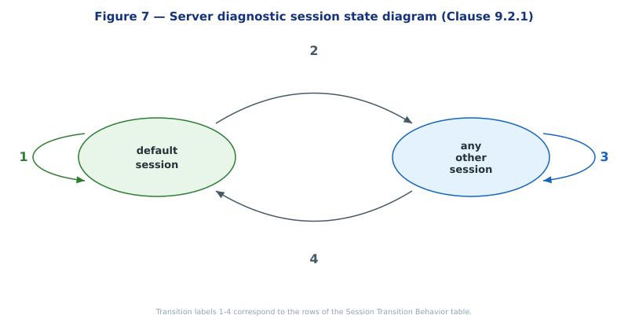
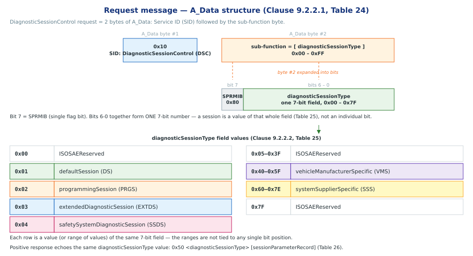
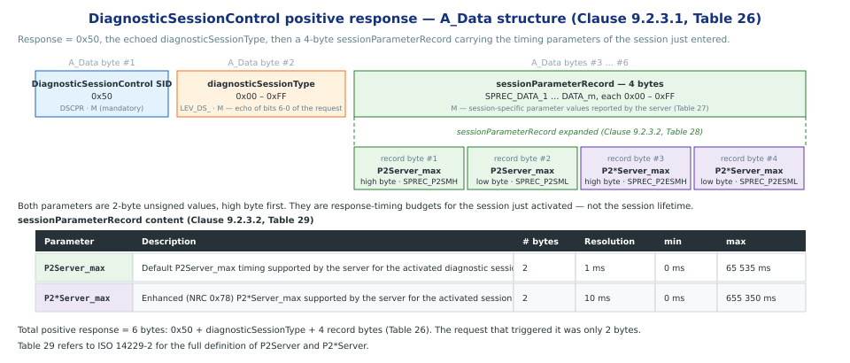
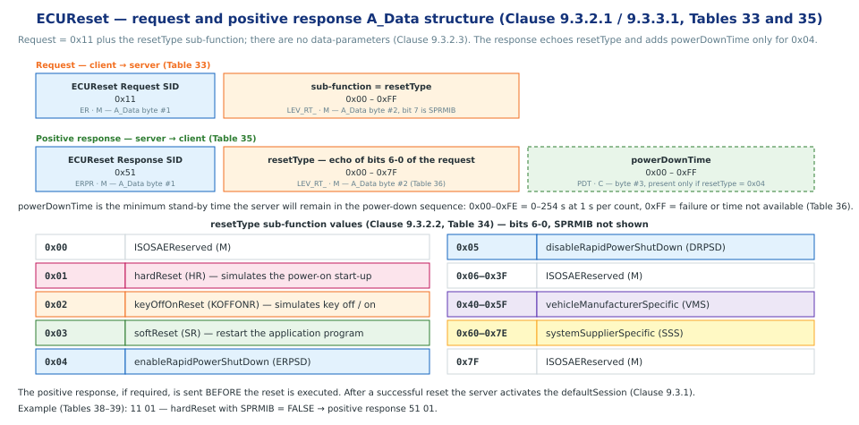
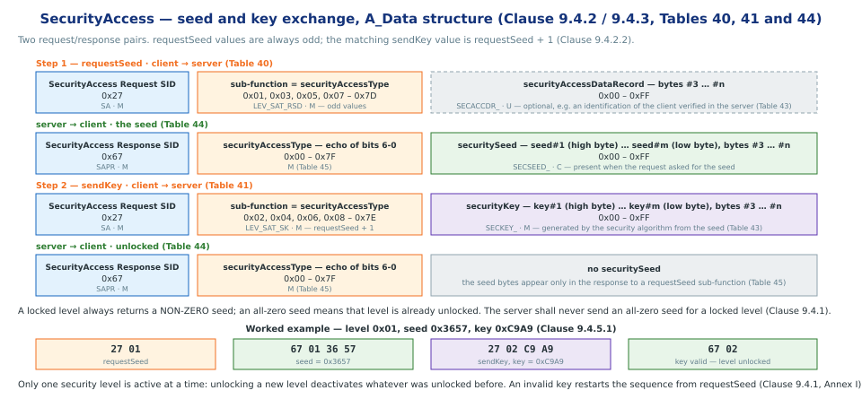
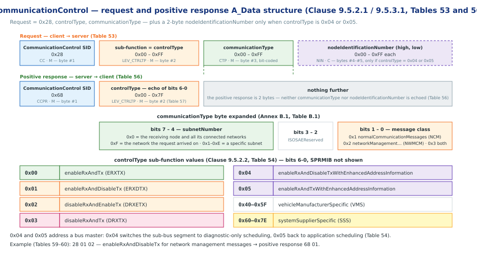

# Diagnostic and Communication Management functional unit

> subtitle: ISO 14229-1:2013 — Service 0x10

## Section 1 — Diagnostic Session Control service

### Introduction

- **Service:** `DiagnosticSessionControl` (SID **0x10**) [Clause 9.2]
- **Purpose:** enables different *diagnostic sessions* in the server (ECU) [Clause 9.2.1]
- A diagnostic session enables a *specific set of services / functionality* in the server [Clause 9.2.1]
- Server may also report data-link timing parameters valid for the active session [Clause 9.2.1]

### Session — Key Concepts

- **One session at a time**
    - There shall **always be exactly one** diagnostic session active in a server [Clause 9.2.1]
    - Server **always starts in `defaultSession`** on power-up [Clause 9.2.1]
    - Stays in `defaultSession` unless another session is explicitly requested [Clause 9.2.1]

- **Identifying field**
    - Sub-function byte **`diagnosticSessionType`** (request byte #2, range `0x00–0xFF`) [Clause 9.2.2.1, Table 24]
    - This value both **selects** and **reports back** (in the positive response) the active session [Clause 9.2.2.2, Table 25; Clause 9.2.3.1, Table 26]

- **How to enter a session**
    - Client sends request: `0x10 <diagnosticSessionType>` [Clause 9.2.2.1, Table 24]
    - Server replies positive: `0x50 <diagnosticSessionType> [sessionParameterRecord]` [Clause 9.2.3.1, Table 26]
    - Server may impose entry conditions (examples from the standard) [Clause 9.2.1]:
        - Restricted to a specific **client diagnostic address**
        - **Safety conditions** (e.g. vehicle not moving, engine off)
    - If conditions aren't met → **negative response**, current session continues unchanged [Clause 9.2.1]

- **Non-default sessions are supersets**
    - Functionality of `defaultSession` is included in every non-default session (**except `programmingSession`**) [Clause 9.2.1]
    - Non-default sessions require an active **session timer**, kept alive by `TesterPresent` (0x3E) [Clause 9.2.1, Table 23]

### Session Transition Behavior 

| Label | Transition | Server Action |
|:---:|---|---|
| **1** | `default` → `default` (re-request) |   Full re-initialization of the session;   reset all activated/changed settings,    no changes to non-volatile memory |
| **2** | `default` → `other` | Stop all events configured via `ResponseOnEvent` (0x86) |
| **3** | `other` → `other` (same or different) |    Stop RoE events;    **re-lock security** and reset any dependent active diagnostic functionality;    keep other active functionality (e.g. periodic scheduler, CommunicationControl, ControlDTCSetting) |
| **4** | `other` → `default` |   Stop all events configured via `ResponseOnEvent` (0x86);   terminate/reset functionality not supported in defaultSession (e.g. restore normal communication, DTC setting);   no changes to non-volative memory |

### Non-default Session Expiry

* per Table 23 note (Clause 9.2.1):

> "Any non-defaultSession is tied to a diagnostic session timer that has to be kept active by the client."

* a server in non-default session kept an internal timer and falls back to default session per timer expiry.
* The client keeps the timer from expiring either by:
  * sending other diagnostic service requests, or
  * sending TesterPresent (0x3E) periodically when no other diagnostic traffic is happening (Clause 9.6.1)

### Session List — Overview 

* sub-function param on diagnosticSessionType req msg indicates the requested session type.
* available session types listed on Clause 9.2.2.2, Table 25: 

| Value | Session | Mnemonic | Cvt | Purpose |
|---|---|---|---|---|
| `0x00` | ISOSAEReserved | ISOSAERESRVD | M | Reserved |
| **`0x01`** | **defaultSession** | DS | M | Normal operating mode; no timeout handling needed; entered automatically at power-up |
| `0x02` | programmingSession | PRGS | U | Enables services for **memory programming** (flashing) of the server |
| `0x03` | extendedDiagnosticSession | EXTDS | U | Enables services for adjusting functions (e.g. idle speed, CO value) and other non-default/timed services |
| `0x04` | safetySystemDiagnosticSession | SSDS | U | Enables services supporting **safety-system** functions (e.g. airbag deployment) |
| `0x05–0x3F` | ISOSAEReserved | ISOSAERESRVD | M | Reserved |
| `0x40–0x5F` | vehicleManufacturerSpecific | VMS | U | OEM-defined sessions |
| `0x60–0x7E` | systemSupplierSpecific | SSS | U | Supplier-defined sessions |
| `0x7F` | ISOSAEReserved | ISOSAERESRVD | M | Reserved |

*(Cvt: M = Mandatory, U = User-optional per implementation)*

* Clause 9.2.1, Table 23 maps the services to allowable defaultSession and non-defaultSession.

> note: The session value above is embedded in **bits 6-0** of the sub-function byte of the UDS request (bit 7 is the separate SPRMIB flag). Further detail of the message structure is in the next slide.

### DiagnosticSessionControl UDS Request

### DiagnosticSessionControl UDS Request ( Cont )
- **A_Data byte #1** — Service ID: `0x10` (DiagnosticSessionControl / DSC) [Clause 9.2.2.1, Table 24]

- **A_Data byte #2** — the sub-function byte, `sub-function = [diagnosticSessionType]` [Clause 9.2.2.1, Table 24]
    - **Bit 7** — `SPRMIB` (suppressPosRspMsgIndicationBit), `0x80`
    - **Bits 6-0** — together form **one 7-bit field**, `diagnosticSessionType`, range `0x00 – 0x7F`; a session is a *value* of that whole field, not a single bit [Clause 9.2.2.2, Table 25]

- The positive response echoes the same value: `0x50 <diagnosticSessionType> [sessionParameterRecord]` [Clause 9.2.3.1, Table 26]

### DiagnosticSessionControl UDS Response

### DiagnosticSessionControl UDS Response (Cont)

- **A_Data byte #1** — Response SID `0x50` (`DSCPR` = 0x10 + 0x40), mandatory — the *fixed* positive-response ID for `DiagnosticSessionControl` [Clause 9.2.3.1, Table 26]

- **A_Data byte #2** — `diagnosticSessionType` (`LEV_DS_`), mandatory — an *echo of bits 6-0* of the request's sub-function byte, i.e. the session now active [Clause 9.2.3.2, Table 27]

- **A_Data bytes #3 – #6** — `sessionParameterRecord` (`SPREC_`), mandatory — *session specific parameter values reported by the server*, structure in Table 28, meaning in Table 29 [Clause 9.2.3.2, Tables 27–29]
    - record bytes #1–#2 — **`P2Server_max`** (high, low): *default* response timing for the activated session; resolution **1 ms**, range `0 – 65 535 ms` [Table 28, Table 29]
    - record bytes #3–#4 — **`P2*Server_max`** (high, low): *enhanced* timing that applies once the server has answered **NRC 0x78**; resolution **10 ms**, range `0 – 655 350 ms` [Table 28, Table 29]

- The positive response is therefore **6 bytes** in total, against a 2-byte request [Clause 9.2.3.1, Table 26]

`[Clause 9.2.3, Tables 26–29]`

> note: P2Server_max and P2*Server_max are response-timing budgets — how long the client waits for the server's answer — not the lifetime of the session. The session itself is held open by the S3 timer, which TesterPresent (0x3E) keeps alive. Table 29 refers to ISO 14229-2 for the full definition of P2Server and P2*Server.

### Special Notes: programmingSession Exit 

Clause 9.2.2.2, Table 25 — 0x02 programmingSession:

- Only exit routes when `programmingSession` runs in **boot software**:
  1. `ECUReset` (0x11) initiated by client
  2. `DiagnosticSessionControl` with `sessionType = defaultSession`
  3. Session layer timeout
- On exit (defaultSession request or timeout), if valid application software exists → server **restarts the application**

## Section 2 — ECU Reset Service

### Introduction

- **Service:** `ECUReset` (SID **0x11**) [Clause 9.3]
- **Purpose:** the client requests a *server reset* [Clause 9.3.1]
- The server performs the reset based on the **`resetType`** value carried in the request [Clause 9.3.1]
- The positive response, *if required*, is sent **before** the reset is executed [Clause 9.3.1]
- After a successful reset the server **activates the `defaultSession`** [Clause 9.3.1]

- **Behaviour during the reset is not defined by this document** [Clause 9.3.1]
    - the standard says nothing about the ECU from the positive response until the reset completes
    - it *recommends* that during this time the ECU accepts no request messages and sends no response messages

`[Clause 9.3.1]`

> note: Because the positive response precedes the reset, a client that needs to know the ECU came back cannot rely on this service alone — it has to poll afterwards. The standard deliberately leaves that window undefined.

### ECUReset UDS Message

### ECUReset UDS Message (Cont)

- **Request** — 2 bytes: SID `0x11` (`ER`) then the sub-function `resetType` (`LEV_RT_`); this service has **no data-parameters** [Clause 9.3.2.1, Table 33; Clause 9.3.2.3]

- **Positive response** — SID `0x51` (`ERPR`), then `resetType` as an *echo of bits 6-0* of the request sub-function [Clause 9.3.3.1, Table 35; Clause 9.3.3.2, Table 36]
    - **`powerDownTime`** (`PDT`) is a *conditional* third byte, present **only** when `resetType = 0x04` [Clause 9.3.3.1, Table 35]
    - it reports the *minimum* stand-by time the server will stay in the power-down sequence: `0x00–0xFE` = 0–254 s at **1 s per count**, `0xFF` = failure or time not available [Clause 9.3.3.2, Table 36]
- **negative responses** for this service [Clause 9.3.4, Table 37]

### ECUReset UDS Message Example

* worked example — `hardReset` with SPRMIB = FALSE [Clause 9.3.5, Tables 38–39]:

| Direction | A_Data bytes |
|---|---|
| client → server | `11 01` |
| server → client | `51 01` |

> note: Clause 9.3.5 sets the example's precondition as ignition on and the system not in an operational mode — for an engine controller, engine off. That is exactly the kind of entry condition Clause 9.2.1 allows a server to impose.

## Section 3 — Security Access

### Introduction

- **Service:** `SecurityAccess` (SID **0x27**) [Clause 9.4]
- **Purpose:** provide a means to access data and/or diagnostic services that have *restricted access* for **security, emissions or safety** reasons [Clause 9.4.1]
- Typical situations needing it: downloading/uploading routines or data, and reading specific memory locations — improper data could damage electronics or risk compliance [Clause 9.4.1]
- **The security concept uses a *seed and key* relationship** [Clause 9.4.1]

- **The exchange** [Clause 9.4.1]
    - client requests the *seed* → server sends the *seed*
    - client sends the *key* appropriate for that seed → server confirms the key was valid and unlocks itself
    - the server compares the key against one internally stored or calculated; a mismatch is a **false access attempt**
    - an invalid key requires the client to **start over** from `requestSeed` (see Annex I)

`[Clause 9.4.1]`

### Security Access — Key Concepts

- **Sub-function numbering is a fixed pair**
    - `requestSeed` values are **always odd**; the `sendKey` value for the same level is **`requestSeed` + 1** [Clause 9.4.1, Clause 9.4.2.2]
    - `0x01` ↔ `0x02`, `0x03` ↔ `0x04`, and so on [Clause 9.4.2.2]
    - level numbering is *arbitrary* and implies **no relationship between levels** [Clause 9.4.1]

- **Only one level active at a time**
    - if the level for `requestSeed 0x03` is active and the client then unlocks `requestSeed 0x01`, only `0x01`'s functionality is unlocked — `0x03`'s is **no longer active** [Clause 9.4.1]

- **A zero seed means "already unlocked"**
    - if the requested level is *already unlocked*, the server answers with a seed value **equal to zero** [Clause 9.4.1]
    - the server **shall never** send an all-zero seed for a level that is currently *locked* [Clause 9.4.1]
    - the client uses this to *determine whether a level is locked* — by checking for a non-zero seed [Clause 9.4.1]

- **Delay timer** *(vehicle manufacturer optional)*
    - a delay may be required before the server can positively respond to `requestSeed` after power up/reset and after a number of false access attempts [Clause 9.4.1]
    - the delay is only required if the server is **locked** when powered up/reset; the vehicle manufacturer selects whether it is supported [Clause 9.4.1]

> note: Clause 9.4.1 also says attempts to access security shall not prevent normal vehicle communication or other diagnostic communication, and that servers providing security shall reject a secure service requested while the server is locked.

### SecurityAccess UDS Message

### SecurityAccess UDS Message (Cont)

- **requestSeed request** — SID `0x27` (`SA`), sub-function `0x01, 0x03, 0x05, 0x07–0x7D` (`LEV_SAT_RSD`), then an *optional* `securityAccessDataRecord` (`SECACCDR_`) [Clause 9.4.2.1, Table 40]
    - the record can e.g. carry an *identification of the client* that the server verifies [Clause 9.4.2.3, Table 43]

- **seed response** — SID `0x67` (`SAPR`), the `securityAccessType` echo, then `securitySeed` (`SECSEED_`) [Clause 9.4.3.1, Table 44]
    - the seed bytes are **conditional**: present only when the request asked for the seed [Clause 9.4.3.2, Table 45]

- **sendKey request** — SID `0x27`, sub-function `0x02, 0x04, 0x06, 0x08–0x7E` (`LEV_SAT_SK`), then `securityKey` (`SECKEY_`), *mandatory* [Clause 9.4.2.1, Table 41]
    - the key is the value generated by the security algorithm corresponding to that specific seed [Clause 9.4.2.3, Table 43]

- **unlock response** — SID `0x67` plus the echoed `securityAccessType`; **no seed bytes** [Clause 9.4.3.1, Table 44]

- **negative responses** for this service [Clause 9.4.4, Table 46]:

### SecurityAccess UDS Message example

* worked example — level `0x01`, seed `0x3657`, key `0xC9A9` [Clause 9.4.5.1]:

| Step | Direction | A_Data bytes |
|---|---|---|
| requestSeed | client → server | `27 01` |
| seed | server → client | `67 01 36 57` |
| sendKey | client → server | `27 02 C9 A9` |
| unlocked | server → client | `67 02` |

> note: Clause 9.4.5.1 gives the key as "e.g. 2's complement of the seed value" — an illustration only. The real algorithm is vehicle manufacturer specific and the standard never defines it.

## Section 4 — Communication Control

### Introduction

- **Service:** `CommunicationControl` (SID **0x28**) [Clause 9.5]
- **Purpose:** switch **on/off the transmission and/or the reception** of certain messages of a server — e.g. application communication messages [Clause 9.5.1]
- Controlled by two parameters working together [Clause 9.5.2.1, Table 53]:
    - **`controlType`** (sub-function) — *how* to modify the communication
    - **`communicationType`** (data-parameter) — *which* kind of communication is affected
- `communicationType` is a **bit-coded** value, so several communication types can be controlled at once [Clause 9.5.2.3, Table 55]

`[Clause 9.5.1]`

### CommunicationControl UDS Message

### CommunicationControl UDS Message (Cont)

- **A_Data byte #1** — SID `0x28` (`CC`), mandatory [Clause 9.5.2.1, Table 53]
- **A_Data byte #2** — sub-function `controlType` (`LEV_CTRLTP`), mandatory, `0x00 – 0xFF` [Clause 9.5.2.1, Table 53]
- **A_Data byte #3** — `communicationType` (`CTP`), mandatory, bit-coded per Annex B.1 [Clause 9.5.2.1, Table 53; Clause 9.5.2.3, Table 55]
- **A_Data bytes #4–#5** — `nodeIdentificationNumber` (`NIN`), **conditional**: present *only* when `controlType` is `0x04` or `0x05` [Clause 9.5.2.1, Table 53]
    - a 2-byte parameter identifying a node on a sub-network that **cannot be addressed** by OSI layers 1 to 6 [Clause 9.5.2.3, Table 55; Annex B.4]

- **Positive response** — SID `0x68` (`CCPR`) plus `controlType` as an *echo of bits 6-0*; **2 bytes**, nothing else is echoed [Clause 9.5.3.1, Table 56; Clause 9.5.3.2, Table 57]

- **Negative responses** for this service [Clause 9.5.4, Table 58]

### Communication Type

- `communicationType` coding [Annex B.1, Table B.1]:

| Bits | Value | Meaning |
|---|---|---|
| 1 – 0 | `0x1` | normalCommunicationMessages (NCM) — inter-application signal exchange |
| 1 – 0 | `0x2` | networkManagementCommunicationMessages (NWMCM) |
| 1 – 0 | `0x3` | both of the above |
| 3 – 2 | `0x0–0x3` | ISOSAEReserved |
| 7 – 4 | `0x0` | the receiving node, including communication to all its connected networks |
| 7 – 4 | `0x1–0xE` | a specific subnet identified by subnet number |
| 7 – 4 | `0xF` | the network the request was received on |

### CommunicationControl Example

- disable transmission of network management messages  sample in Clause 9.5.5, Tables 59–60:

| Direction | A_Data bytes |
|---|---|
| client → server | `28 01 02` |
| server → client | `68 01` |

> note: `controlType` 0x04 and 0x05 address a bus master rather than an ordinary node — 0x04 switches the related sub-bus segment to diagnostic-only scheduling mode, 0x05 back to application scheduling mode (Table 54). Those are the only two values that carry a nodeIdentificationNumber.
