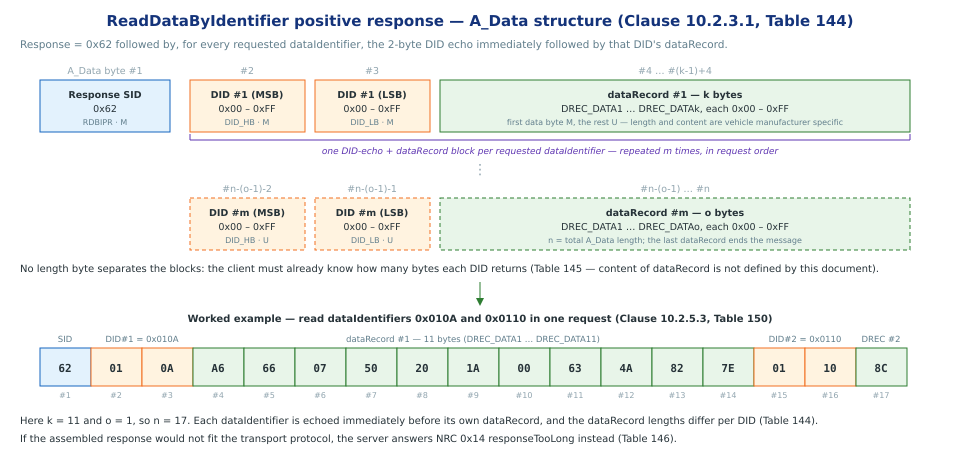
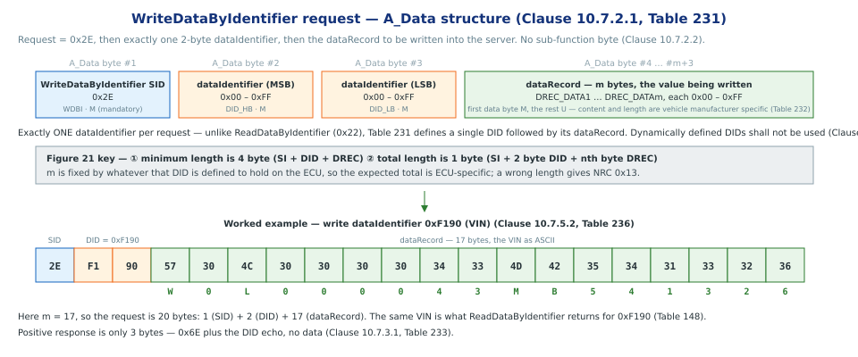

# Data Transmission functional unit

> subtitle: ISO 14229-1:2013 — Clause 10, Services 0x22 / 0x2E

### The Data Transmission functional unit

- **What it is:** the functional unit grouping the services that move *dataRecord* values between client (tester) and server (ECU) [Clause 10.1, Table 141]

- **What it does:** reads and writes current *dataRecord* values, addressed in two ways:
    - by *dataIdentifier (DID)* — a 16-bit label for a data record the ECU publishes
    - by *memory address* — a raw address + size range in the server's memory map

- **Seven services** in the unit — this presentation covers **`0x22`** and **`0x2E`**
    - the seven services of the unit presented in Clause 10.1, Table 141

> Note: diagnostic fault information (DTCs, captured data) is not in this unit — it belongs to **Stored Data Transmission** [Clause 10.1, Table 141; Clause 11.1, Table 249]

| SID | Service | What the client asks for | In this deck |
|---|---|---|:---:|
| **`0x22`** | **ReadDataByIdentifier** | read the current value of a record identified by a **dataIdentifier** | **Section 2** |
| **`0x2E`** | **WriteDataByIdentifier** | write a record specified by a **dataIdentifier** | **Section 3** |
`[Clause 10.1, Table 141]`

## Section 1 — Data Identifier

### Data Identifier (DID) — Key Concepts

- **What a DID is**
    - A *16-bit value*, *2-byte* that logically represents **one object** (e.g. Air Inlet Door Position) or a *collection of objects* or *dataRecord*
    - The content of the *dataRecord* is not defined in this document and is vehicle manufacturer specifics.
    - The referenced data shall be *available in the server's memory* — fixed, or in RAM when defined dynamically by `DynamicallyDefineDataIdentifier` (0x2C)

- **A DID transmission**
    - Range `0x0000 – 0xFFFF`, transmitted **high byte first**; allowed values are assigned in **Table C.1** (Annex C, *normative*) [Table C.1]
    - The same DID number is used across **0x22 (read)**, **0x2E (write)** and **0x2F (IO control)**, and appears in responses such as `ReadDTCInformation` snapshot records

- **Consistency rule** *(IMPORTANT note in Clause C.1)*

    > "Regardless of which service a dataIdentifier is used with, it shall consistently represent the same thing (i.e., a given object with a given size / meaning / etc.) on a given ECU."

    - Only exception: **dynamically defined DIDs** (`0xF300–0xF3FF`), which are not predefined in the ECU but built by the client via 0x2C

`[Clause C.1]`

> note: Annex C is normative. Table C.1 reserves the ISOSAEReserved and ReservedForLegislativeUse ranges, and assigns vehicle-manufacturer DIDs to the VehicleManufacturerSpecific ranges and system-supplier DIDs to 0xFD00–0xFEFF.

## Section 2 — ReadDataByIdentifier service

### Introduction

- **Service:** `ReadDataByIdentifier` (SID **0x22**) [Clause 10.2]
- **Purpose:** lets the client request *dataRecord* from the server, identified by one or more *dataIdentifiers (DIDs)* [Clause 10.2.1]
- The client may request a *dataIdentifier* at any time, independent of the status of the server. [Clause 10.2.5.1]
- The server may limit the number of DIDs requested by OEM specs.
- The client may request the DIDs in the same request.
- The server shall treat each DID as a separate param and respond with data for each.

`[Clause 10.2.1–10.2.3]`

### ReadDataByIdentifier Request

### ReadDataByIdentifier Request (Cont)

- **A_Data byte #1** — Service ID: `0x22` (ReadDataByIdentifier / RDBI), mandatory [Clause 10.2.2.1, Table 142]
- **A_Data bytes #2–#n** — `dataIdentifier`,[Clause 10.2.2.1, Table 142]

- **Request length** — SID + *whole 2-byte DIDs*, i.e. an *odd byte count ≥ 3*; anything else is malformed → **NRC 0x13** [Figure 15]
- **No sub-function byte** — unlike `DiagnosticSessionControl` (0x10), this service carries data parameters only [Clause 10.2.2.2]

`[Clause 10.2.2, Tables 142–143; Annex C, Table C.1]`

### ReadDataByIdentifier Response

### ReadDataByIdentifier Response (Cont)

- **A_Data byte #1** — Response SID `0x62` (`RDBIPR` = 0x22 + 0x40), mandatory [Clause 10.2.3.1, Table 144]
- **Blocks repeat**: each DID echo  is followed by its own dataRecord 

worked example — read a single DID `0xF190` (VIN) [Clause 10.2.5.2, Tables 147–148]:

| Direction | A_Data bytes |
|---|---|
| client → server | `22 F1 90` |
| server → client | `62 F1 90` + 17 data bytes `57 30 4C 30 30 30 30 34 33 4D 42 35 34 31 33 32 36` |

- **negative responses** for this service is defined in Clause 10.2.4, Table 146
    - sample err code (NRC): incorrectMessageLengthOrInvalidFormat, conditionsNotCorrect
    - the NRC code should be queried agains Clause 10.2.4 Fig 15 for scenario leading to the error code.

## Section 3 — WriteDataByIdentifier service

### Introduction

- **Service:** `WriteDataByIdentifier` (SID **0x2E**) [Clause 10.7]
- **Purpose:** writes a *dataRecord* into the server at an internal location identified by a *dataIdentifier*
- The write **may or may not be secured**
- *Dynamically defined dataIdentifiers* **shall not be used** with this service
- It is the **vehicle manufacturer's responsibility** to assure the server conditions are met when performing this service

- **Possible uses** listed by the standard
    - programming configuration information into the server (e.g. *VIN number*)
    - resetting learned values
    - clearing non-volatile memory
    - setting option content

`[Clause 10.7.1]`

> note: Clause 10.7.1 NOTE — the server may restrict or prohibit write access to certain dataIdentifier values, as defined by the system supplier or vehicle manufacturer for read-only identifiers.

### WriteDataByIdentifier Request

### WriteDataByIdentifier Request (Cont)
- **A_Data byte #1** — Service ID `0x2E` (`WDBI`), mandatory [Clause 10.7.2.1, Table 231]
- **A_Data bytes #2–#3** — the *dataIdentifier*: #2 is the **MSB** (`DID_HB`), #3 the **LSB** (`DID_LB`), both mandatory [Clause 10.7.2.1, Table 231]
- **A_Data bytes #4 … #m+3** — the *dataRecord* being written (`DREC_DATA1 … DREC_DATAm`); first data byte mandatory, the rest optional-by-length [Clause 10.7.2.1, Table 231]
- **Exactly one DID per request** — Table 231 defines a single *dataIdentifier* followed by its *dataRecord*, unlike `ReadDataByIdentifier` which accepts several [Clause 10.7.2.1, Table 231]
- **No sub-function byte** — this service carries data parameters only [Clause 10.7.2.2]
- **Request length** — *minimum 4 bytes*: SID + DID + at least one *dataRecord* byte [Figure 21]

`[Clause 10.7.2, Tables 231–232]`

> note: Figure 21 keys the two checks as "minimum length is 4 byte (SI + DID + DREC)" and "total length is 1 byte (SI + 2 byte DID + nth byte DREC)" — SID, a 2-byte DID, then however many dataRecord bytes that DID is defined to hold. The dataRecord content and format are not defined by this document (Table 232, C.1), so the expected length is ECU-specific.

### WriteDataByIdentifier Response

- **A_Data byte #1** — Response SID `0x6E` (`WDBIPR` = 0x2E + 0x40), mandatory [Clause 10.7.3.1, Table 233]
- **A_Data bytes #2–#3** — **echo** of the request's *dataIdentifier* (`DID_HB`, `DID_LB`) [Clause 10.7.3.2, Table 234]
- **The positive response carries no data** — 3 bytes in total, the DID echo *is* the whole response [Clause 10.7.3.1, Table 233]

* worked example — write *dataIdentifier* `0xF190` (VIN) [Clause 10.7.5.2, Tables 236–237]:

| Direction | A_Data bytes |
|---|---|
| client → server | `2E F1 90` + 17 data bytes `57 30 4C 30 30 30 30 34 33 4D 42 35 34 31 33 32 36` |
| server → client | `6E F1 90` |

- **negative responses** for this service are defined in Clause 10.7.4, Table 235
    - `0x13` incorrectMessageLengthOrInvalidFormat — the length of the message is wrong
    - `0x22` conditionsNotCorrect — server operating conditions not met

`[Clause 10.7.3–10.7.5, Tables 233–237]`

> note: Table 235 lists 0x72 generalProgrammingFailure, which Table 146 for ReadDataByIdentifier does not — it covers the case where the write itself fails at the memory location. The evaluation order for all of these is Figure 21.
