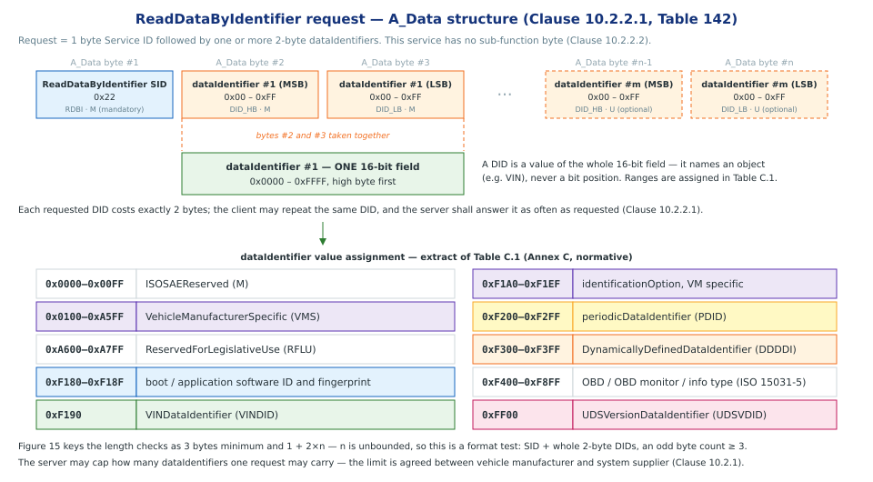

# Data Transmission functional unit

> subtitle: ISO 14229-1:2013 — Clause 10, Services 0x22 / 0x23

### The Data Transmission functional unit

- **What it is:** the functional unit grouping the services that move *dataRecord* values between client (tester) and server (ECU) [Clause 10.1, Table 141]

- **What it does:** reads and writes current *dataRecord* values, addressed in two ways:
    - by *dataIdentifier (DID)* — a 16-bit label for a data record the ECU publishes
    - by *memory address* — a raw address + size range in the server's memory map

- **Seven services** in the unit — this presentation covers **`0x22`** and **`0x23`**
    - the seven services of the unit presented in Clause 10.1, Table 141

> Note: diagnostic fault information (DTCs, captured data) is not in this unit — it belongs to **Stored Data Transmission** [Clause 10.1, Table 141; Clause 11.1, Table 249]

| SID | Service | What the client asks for | In this deck |
|---|---|---|:---:|
| **`0x22`** | **ReadDataByIdentifier** | current value of a record identified by a **dataIdentifier** | **Section 1** |
| **`0x23`** | **ReadMemoryByAddress** | current value of a provided *memory range* | **Section 2** |
`[Clause 10.1, Table 141]`

## Section 1 — Data Identifier

### Data Identifier (DID) — Key Concepts

- **What a DID is**
    - A *16-bit value*, *2-byte* that logically represents **one object** (e.g. Air Inlet Door Position) or a *collection of objects* or *dataRecord* [Clause C.1]
    - The content of the *dataRecord* is not defined in this document and is vehicle manufacturer specifics.
    - The referenced data shall be *available in the server's memory* — fixed, or in RAM when defined dynamically by `DynamicallyDefineDataIdentifier` (0x2C) [Clause C.1]

- **A DID transmission**
    - Range `0x0000 – 0xFFFF`, transmitted **high byte first**; allowed values are assigned in **Table C.1** (Annex C, *normative*) [Clause C.1, Table C.1]
    - The same DID number is used across **0x22 (read)**, **0x2E (write)** and **0x2F (IO control)**, and appears in responses such as `ReadDTCInformation` snapshot records [Clause C.1]

- **Consistency rule** *(IMPORTANT note in Clause C.1)*

    > "Regardless of which service a dataIdentifier is used with, it shall consistently represent the same thing (i.e., a given object with a given size / meaning / etc.) on a given ECU."

    - Only exception: **dynamically defined DIDs** (`0xF300–0xF3FF`), which are not predefined in the ECU but built by the client via 0x2C [Clause C.1]

> note: Annex C is normative. Table C.1 reserves the ISOSAEReserved and ReservedForLegislativeUse ranges, and assigns vehicle-manufacturer DIDs to the VehicleManufacturerSpecific ranges and system-supplier DIDs to 0xFD00–0xFEFF.

## Section 2 — ReadDataByIdentifier service

### Introduction

- **Service:** `ReadDataByIdentifier` (SID **0x22**) [Clause 10.2]
- **Purpose:** lets the client request *dataRecord* from the server, identified by one or more *dataIdentifiers (DIDs)* [Clause 10.2.1]
- The client may request a *dataIdentifier* at any time, independent of the status of the server. [Clause 10.2.5.1]
- The server may limit the number of DIDs requested by OEM specs.
- The client may request the DIDs in the same request.
- The server shall treat each DID as a separate param and respond with data for each.

`[Clause 10.2.1–10.2.3]`

### DID in UDS Request

### DID in UDS Request (Cont)

- **A_Data byte #1** — Service ID: `0x22` (ReadDataByIdentifier / RDBI), mandatory [Clause 10.2.2.1, Table 142]
- **A_Data bytes #2–#n** — `dataIdentifier`,[Clause 10.2.2.1, Table 142]

- **Request length** — SID + *whole 2-byte DIDs*, i.e. an *odd byte count ≥ 3*; anything else is malformed → **NRC 0x13** [Figure 15]
- **No sub-function byte** — unlike `DiagnosticSessionControl` (0x10), this service carries data parameters only [Clause 10.2.2.2]

`[Clause 10.2.2, Tables 142–143; Annex C, Table C.1]`

> note: Figure 15 keys the two checks as "minimum length is 3 byte (SI + DID)" and "maximum length is 1 byte (SI) + 2*n bytes (DID(s))". But n is unbounded there, so 1 + 2*n caps nothing — it is a format test, which is why the flowchart pairs the minimum-length check with a modulo 2 division. Since 1 + 2*n is always odd, an even-length request is malformed and answered with NRC 0x13.

> note: What actually bounds a request: the dataIdentifier field is 16-bit, so DID values run 0x0000-0xFFFF. Beyond that the limits are practical, not arithmetic — the server may cap how many dataIdentifiers can be requested simultaneously, as agreed between vehicle manufacturer and system supplier (Clause 10.2.1), and exceeding that cap is an NRC 0x13 case alongside an invalid length (Table 146). A response too large for the transport protocol gives NRC 0x14.

### DID in UDS Response

### DID in UDS Response (Cont)

- **A_Data byte #1** — Response SID `0x62` (`RDBIPR` = 0x22 + 0x40), mandatory [Clause 10.2.3.1, Table 144]
- **Blocks repeat**: each DID echo  is followed by its own dataRecord 

worked example — read a single DID `0xF190` (VIN) [Clause 10.2.5.2, Tables 147–148]:

| Direction | A_Data bytes |
|---|---|
| client → server | `22 F1 90` |
| server → client | `62 F1 90` + 17 data bytes `57 30 4C 30 30 30 30 34 33 4D 42 35 34 31 33 32 36` |

- **negative responses** for this service is defined in Clause 10.2.4, Table 146
    - sample err code (NRC): incorrectMessageLengthOrInvalidFormat, conditionsNotCorrect
    - the NRC code should be queried agains Clause 10.2.4 Fig 15 for scenario leading to the error code.

## Section 3 — ReadMemoryByAddress service
