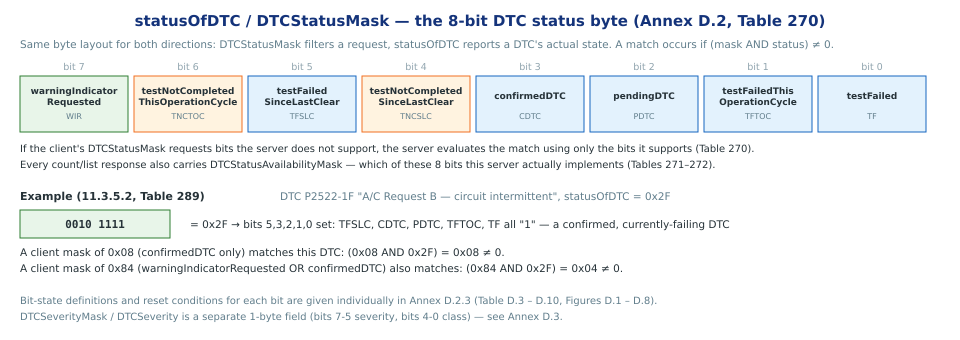
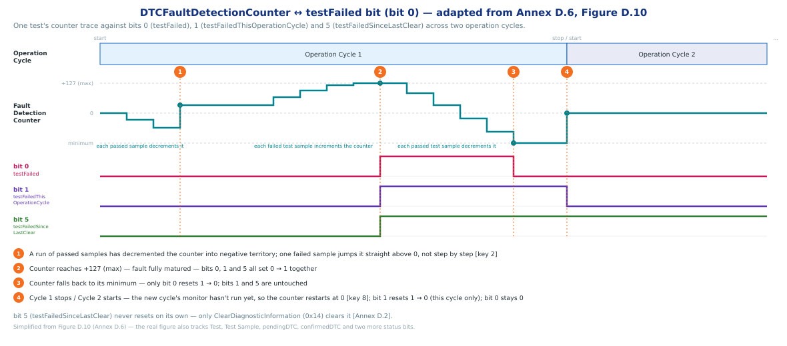
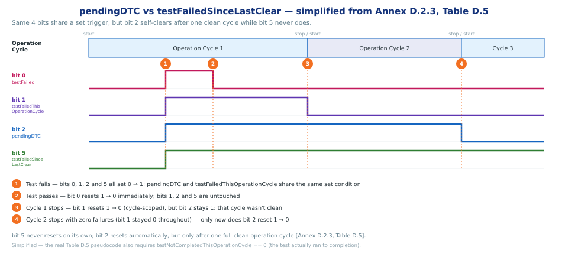
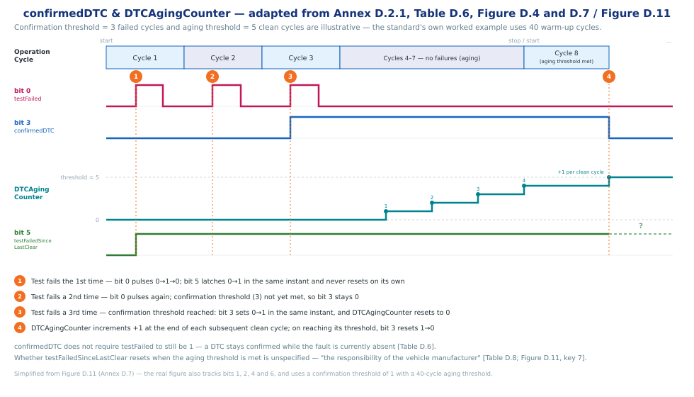
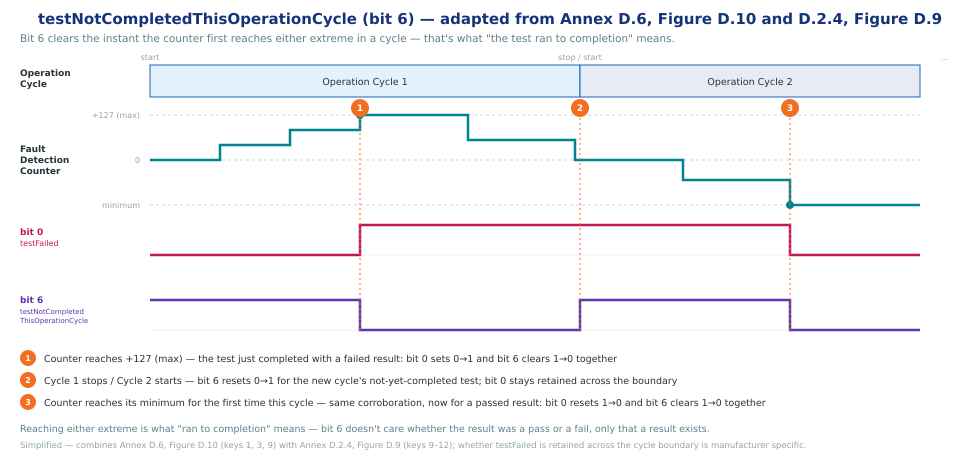
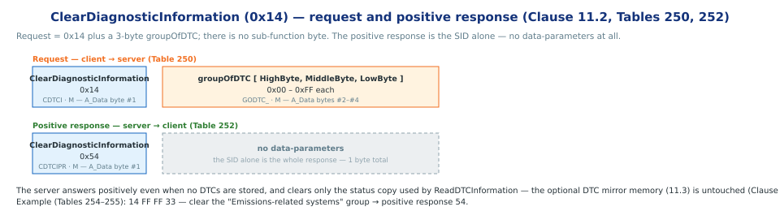
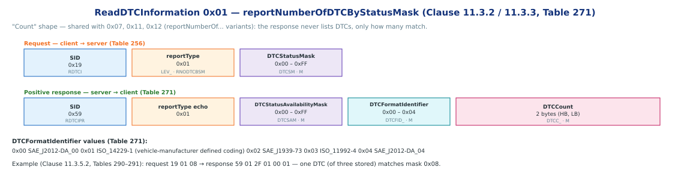
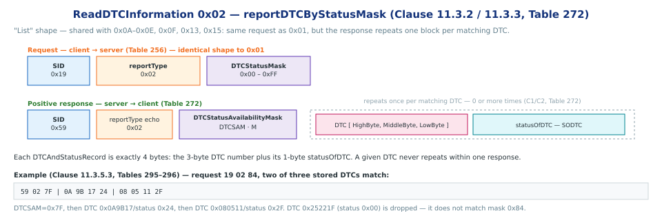
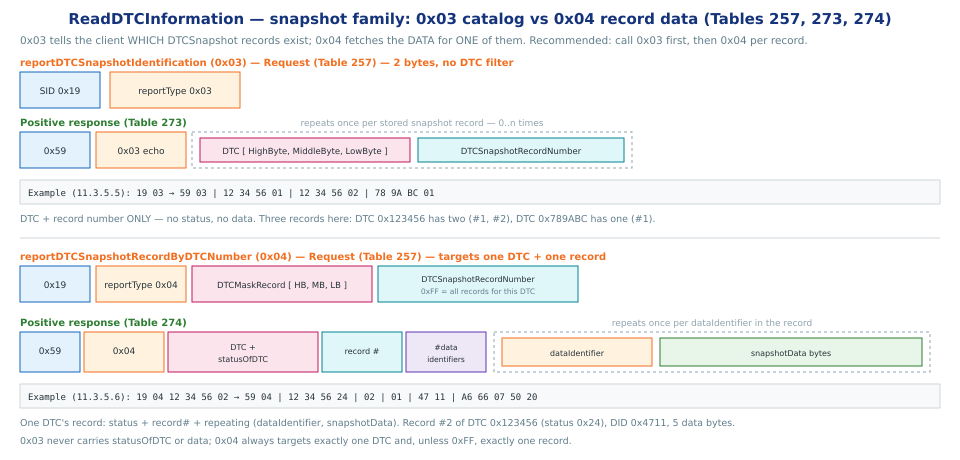
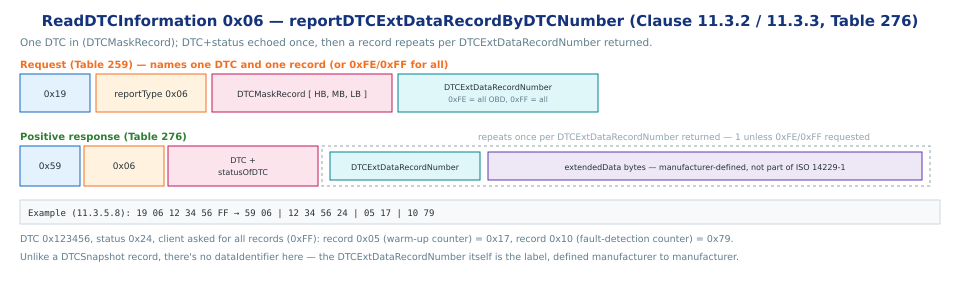

# Stored Data Transmission functional unit

> subtitle: ISO 14229-1:2013 — Clause 11, Services 0x14 / 0x19

### The Stored Data Transmission functional unit

- **What it is:** the functional unit grouping the two services that read and clear server-resident DTC (fault) information [Clause 11.1, Table 249]
- **ClearDiagnosticInformation (0x14)** — clears DTC status, snapshot data, extended data and related counters for a client-chosen group of DTCs
- **ReadDTCInformation (0x19)** — by far the largest service in ISO 14229-1: one SID, **27 sub-functions**, covering counts, lists, snapshots, extended data and severity

> Note: reading/writing a *dataRecord* by identifier lives in **Data Transmission** (Clause 10), not here — see the [Data Transmission presentation](UDS_DataTransmission_functional_unit.html).

| SID | Service | What the client asks for | In these slides |
|---|---|---|:---:|
| **`0x14`** | **ClearDiagnosticInformation** | clear DTCs and their associated stored data for a groupOfDTC | **Section 2** |
| **`0x19`** | **ReadDTCInformation** | read DTC status, counts, snapshots or extended data | **Section 3** |
`[Clause 11.1, Table 249]`

## Section 1 — DTC & Status Concepts

### The DTC number and DTCFormatIdentifier

- A **DTC** is a **3-byte value** (DTCHighByte, DTCMiddleByte, DTCLowByte) uniquely identifying a diagnostic trouble code supported by the server [Clause 11.3.2.3, Table 270]
- ISO 14229-1 does **not** define how those 3 bytes decode — that is flagged per response by **DTCFormatIdentifier**: `0x00` SAE J2012-DA_00, `0x01` ISO 14229-1 (vehicle-manufacturer defined), `0x02` SAE J1939-73, `0x03` ISO 11992-4, `0x04` SAE J2012-DA_04 [Table 271]
- A given DTC value **shall never be reported twice** in one positive response — the one exception is `DTCSnapshotRecord`, which may repeat the same DTC across several snapshot records [Clause 11.3.1.1]

`[Clause 11.3.2.3, Table 270; Clause 11.3.3.1, Table 271]`

### statusOfDTC / DTCStatusMask — the 8-bit status byte

> note: The bit convention (meaning, mask semantics) is identical across every server — ontestly the *triggering* conditions per bit are manufacturer-specific; each bit's exact set/reset pseudocode is normative (Annex D.2.3, Tables D.3–D.10, Figures D.1–D.8).

`[Annex D.2, Table 270]`

### DTCFaultDetectionCounter ↔ testFailed bit (bit 0)

`[Annex D.6, Figure D.10 — keys 2, 3, 7, 8; simplified]`

### DTCFaultDetectionCounter — a threshold-crossing signal

- **Purpose:** `reportDTCFaultDetectionCounter` (sub-function `0x14`) lists current "prefailed" DTCs — a way to see a fault *maturing* before any `statusOfDTC` bit would show it [Table 269]
- Reported as a **scaled 1-byte signed value**: `+127` (`0x7F`) = test result "failed"; any other non-zero positive value = "prefailed" [Table 269]
- "A reported DTCFaultDetectionCounter value greater than zero and less than +127 (i.e., `0x01`–`0x7E`) indicates that the DTC enable criteria was met and that a non completed test result prefailed at least in one condition or threshold" — **only DTCs in that range are reported**; `0x7F` itself is excluded, since that DTC is now failed, not prefailed [Table 269]
- "If the DTCFaultDetectionCounter is decremented to zero or below the DTC shall no longer be reported in the positive response message" — a passing test run decrements the counter until it drops out of the reportable range [Table 269]

`[Clause 11.3.2.2, Table 269]`

### pendingDTC (bit 2) and testFailedThisOperationCycle (bit 1)

- `pendingDTC` and `testFailedThisOperationCycle` share the same set condition — a failed test sets both
- `testFailedThisOperationCycle` clears at the start of every operation cycle; `pendingDTC` stays latched until an entire cycle completes with the test run and never failing — `testNotCompletedThisOperationCycle == 0 AND testFailedThisOperationCycle == 0` at cycle stop, a **fully clean** cycle, not just "the fault went away"

`[Annex D.2.3, Table D.5, Figure D.3]`

### pendingDTC vs testFailedSinceLastClear (bit 5)

- Practically: after a one-off glitch, `pendingDTC` self-heals on its own within a cycle or two; `testFailedSinceLastClear` is the one bit a technician trusts to mean "this has failed at some point since we last cleared codes," however long ago

`[Annex D.2.3, Tables D.5, D.8 — simplified]`

### confirmedDTC (bit 3) — confirmation threshold

- **Confirmation Threshold:** `confirmedDTC` only sets after the test has failed and run to completion for a set number of operation cycles — not on the first failure alone
- A **Trip Counter** counts up to `confirmation threshold` and sets `confirmedDTC` to 1, then sets itself to 0.
- `confirmedDTC` means the fault was seen enough times to be worth long-term storage — it does **not** mean the fault is present right now, that's what `testFailed` (bit 0) is for
- **Aging status and DTCAgingCounter:** once confirmed, a `DTCAgingCounter` counts consecutive clean operation cycles to track how long the fault has stayed dormant
  - **Increases** by one at the end of every operation cycle where the test ran and passed
  - **Resets to zero** whenever `confirmedDTC` newly sets, or whenever the test fails again while aging is in progress
- Once `DTCAgingCounter` reaches its threshold (40 warm-up cycles in the standard's example), `confirmedDTC` resets **1 → 0** and the DTC becomes eligible for erasure — the same reset also happens on `ClearDiagnosticInformation` or fault-memory overflow

`[Annex D.2.1, Table D.6, Figure D.4]`

### confirmedDTC & DTCAgingCounter

`[Annex D.7, Figure D.11 — simplified, confirmation/aging thresholds illustrative]`

### testNotCompletedThisOperationCycle (bit 6)

- Bit 6 latches to 0 the moment the test first runs to completion — passed or failed — during the current operation cycle; it only cares that a result exists, not what it was
- Resets to 1 at the start of every new operation cycle, mirroring `testNotCompletedSinceLastClear` (bit 4) but scoped to "this cycle" instead of "since `ClearDiagnosticInformation`"
- Tied directly to the `DTCFaultDetectionCounter`: reaching either extreme (`+127` or its minimum) is what "completion" means at the counter level

`[Annex D.2.3, Table D.9, Figure D.7]`

### testNotCompletedThisOperationCycle ↔ DTCFaultDetectionCounter — timeline

`[Annex D.6, Figure D.10 — keys 1, 3, 8, 9; Annex D.2.4, Figure D.9 — keys 9–12; simplified]`

### groupOfDTC — addressing a group instead of one DTC

- A **3-byte** value, used by `ClearDiagnosticInformation` and several `ReadDTCInformation` sub-functions to select a DTC group rather than a single code [Annex D.1, Table D.1]
- The **Powertrain / Chassis / Body / Network Communication** group byte ranges are **vehicle-manufacturer defined**
- Two ranges are fixed by the standard: `0xFFFF33` = *Emissions* group, `0xFFFFD0` = *Safety* group (low byte = FunctionalGroupIdentifier, Annex D.5) — `0xFFFFFF` = **all groups** (every DTC)

`[Annex D.1, Table D.1]`

### DTCStatusAvailabilityMask

- **Purpose:** reports which `statusOfDTC` bits the server implements — "provides an indication of DTC status bits that are supported by the server for masking purposes" [Clause 11.3.1.2]
- **Placement:** returned in every count/list `ReadDTCInformation` response, immediately after the `reportType` echo — same 8-bit layout as `statusOfDTC` (Section 1)
- **Effect on matching:** bits the client's `DTCStatusMask` sets but the server doesn't implement are dropped from the AND, not rejected — "If the client specifies a status mask that contains bits that the server does not support, then the server shall process the DTC information using only the bits that it does support" [Clause 11.3.1.3]
- **Not `DTCStatusMask`:** `DTCStatusMask` is a **request** parameter — the client-supplied filter; `DTCStatusAvailabilityMask` is a **response** parameter — the server-reported capability. Same bit positions, opposite direction, never both present in one message

`[Clause 11.3.1.2–11.3.1.3, Tables 271–272]`

## Section 2 — ClearDiagnosticInformation (0x14) service

### Introduction

- **Service:** `ClearDiagnosticInformation` (SID **0x14**) [Clause 11.2]
- **Purpose:** the client clears diagnostic information — status, DTCSnapshot data, DTCExtendedData, and other DTC-related counters/timers/flags — in one or multiple servers [Clause 11.2.1]
- The server **answers positively even if no DTCs are stored** — absence of a fault is not an error
- Clears the status copy used by `ReadDTCInformation` reporting; any optional backup copy (e.g. EEPROM) follows its own backup strategy
- Does **not** affect the optional DTC **mirror memory** (see 11.3) — that is a separate store

`[Clause 11.2.1]`

### ClearDiagnosticInformation UDS Message

### ClearDiagnosticInformation UDS Message (Cont)

- **A_Data byte #1** — Service ID `0x14` (`CDTCI`), mandatory [Clause 11.2.2.1, Table 250]
- **A_Data bytes #2–#4** — `groupOfDTC` (`GODTC_`), mandatory — the group or single DTC to clear (Annex D.1) [Table 250]
- **No sub-function byte** — this service carries a data-parameter only [Clause 11.2.2.2]
- **Positive response** — SID `0x54` (`CDTCIPR`) alone; **no data-parameters at all**, 1 byte total [Clause 11.2.3.1, Table 252]

`[Clause 11.2.2–11.2.3, Tables 250–252]`

### ClearDiagnosticInformation — Negative Responses

| NRC | Mnemonic | When |
|---|---|---|
| `0x13` | IMLOIF | incorrectMessageLengthOrInvalidFormat — message is not 4 bytes |
| `0x22` | CNC | conditionsNotCorrect — internal server conditions prevent clearing |
| `0x31` | ROOR | requestOutOfRange — the specified `groupOfDTC` is not supported |
| `0x72` | GPF | generalProgrammingFailure — server error writing to a memory location |

- Evaluation order is Figure 23 — length check, then group support, then condition check, then the memory write itself

`[Clause 11.2.4, Table 253, Figure 23]`

### ClearDiagnosticInformation Example

- worked example — clear the "Emissions-related systems" group `0xFFFF33` [Clause 11.2.5, Tables 254–255]:

| Direction | A_Data bytes |
|---|---|
| client → server | `14 FF FF 33` |
| server → client | `54` |

> note: This is the smallest positive response in the whole standard — one byte, the SID, nothing else.

## Section 3 — ReadDTCInformation (0x19) service — General info

### Introduction

- **Service:** `ReadDTCInformation` (SID **0x19**) [Clause 11.3]
- **Purpose:** read server-resident DTC information — status, counts, snapshots, extended data, severity — from any server or group of servers [Clause 11.3.1.1]
- One sub-function byte, `reportType`, selects the report shape — **27 defined values** (`0x01–0x19`, plus `0x42` and `0x55` for WWH-OBD)
- Unless a sub-function restricts it, the server reports **all** DTCs (emissions- and non-emissions-related alike)
- Paged-buffer handling note: if the DTC count shrinks while the response is being built, the server pads with DTC `0x000000` / status `0x00`, which the client must treat as "not present"

`[Clause 11.3.1.1]`

### The 27 report types — count and list shapes

| reportType range | Family | What it returns |
|---|---|---|
| `0x01, 0x07, 0x11, 0x12` | **Count** | how many DTCs match a status/severity mask — no DTC list |
| `0x02, 0x0A–0x0E, 0x0F, 0x13, 0x15, 0x17` | **List** | repeating `DTC + statusOfDTC` blocks |

- `0x01` and `0x02` each get their own diagram and worked example next in this section — every other reportType in these two rows reuses one of those two shapes against a different mask, memory, or implicit selection

`[Clause 11.3.2.2, Table 269]`

### The 27 report types — snapshot, stored data, extended data

| reportType range | Family | What it returns |
|---|---|---|
| `0x03, 0x04, 0x18` | **Snapshot** | • `0x03` lists which DTCSnapshot records exist (DTC + record number, no data); `0x04`/`0x18` return the captured record itself — data "stored upon detection of a system malfunction" that acts as "a snapshot of data values from the time of the... malfunction occurrence" [11.3.1.1]. • A **DTCSnapshot record** holds one or more `dataIdentifier`/data pairs — parameters that "can be used to reconstruct the vehicle conditions (e.g. B+, RPM, time-stamp) at the time of the failure occurrence" [11.3.1.5]. |
| `0x05` | **Stored data** | • Addressed differently from a snapshot: the request carries only a `DTCStoredDataRecordNumber` — **no DTC number at all**. The server searches its own stored records for that number and reports which DTC it belongs to; "the DTCStoredDataRecordNumber does not share the same address space as the DTCSnapshotRecordNumber" [11.3.1.6]. • A **DTCStoredData record** holds the *same kind* of payload as a DTCSnapshot record — parameters that "can be used to reconstruct the vehicle conditions (e.g. B+, RPM, time-stamp) at the time of the failure occurrence" [11.3.1.6] — the distinction is purely in how the record is looked up, not what it contains. |
| `0x06, 0x10, 0x16, 0x19` | **Extended data** | raw counters/timers associated with one DTC |

- `0x04` and `0x06` each get their own diagram and worked example later in this section; `0x05` is placed here, next to Snapshot, because the two are easy to conflate — same record content, different addressing

`[Clause 11.3.2.2, Table 269; Clause 11.3.1.6]`

### The 27 report types — remaining families

| reportType range | Family | What it returns |
|---|---|---|
| `0x08, 0x09` | **Severity** | adds a `DTCSeverityMask` / severity byte to the list or single-DTC shape |
| `0x14` | **Fault detection counter** | pre-failed DTCs not yet pending/confirmed |
| `0x42, 0x55` | **WWH-OBD** | legislated report shapes scoped by `FunctionalGroupIdentifier` |

- None of these are new shapes — each reuses the count, list, snapshot or extended-data layout from the previous slide, just against a different memory, filter, or mask. Covered together in "Severity, mirror memory, and the rest" later in this section

`[Clause 11.3.2.2, Table 269]`

> note: Mirror-memory (0x0F–0x11), user-defined-memory (0x17–0x19) and emissions-only-OBD (0x12–0x13) sub-functions are not new shapes either — they run the count or list report against a different DTC store or a legislated subset.

## Section 4 — Report Number Of DTCs — count DTC report

### reportNumberOfDTCByStatusMask (0x01) - Message Structure

- Request = SID + `reportType` + `DTCStatusMask`; response = SID + `reportType` + `DTCStatusAvailabilityMask` + `DTCFormatIdentifier` + 2-byte `DTCCount` [Table 271]
- Shared shape with `0x07` (by severity), `0x11` (mirror memory), `0x12` (emissions-only OBD)

`[Clause 11.3.1.2, Table 271]`

### reportNumberOfDTCByStatusMask (0x01) — Example

- worked example — 3 stored DTCs, mask `0x08` (confirmedDTC), server's `DTCStatusAvailabilityMask = 0x2F` [Clause 11.3.5.2, Tables 290–291]:

**Request** `19 01 08`

| A_Data byte | Value | Meaning |
|---|---|---|
| #1 | `19` | SID |
| #2 | `01` | reportType = reportNumberOfDTCByStatusMask |
| #3 | `08` | DTCStatusMask — bit 3 (confirmedDTC) |

**Response** `59 01 2F 01 00 01`

| A_Data byte | Value | Meaning |
|---|---|---|
| #1 | `59` | Response SID |
| #2 | `01` | reportType echo |
| #3 | `2F` | DTCStatusAvailabilityMask — bits this server implements |
| #4 | `01` | DTCFormatIdentifier = ISO_14229-1_DTCFormat |
| #5–#6 | `00 01` | DTCCount = 1 |

- Only DTC P2522-1F (`statusOfDTC = 0x2F`) matches `0x08 AND 0x2F ≠ 0` → count = 1

### DTC labels — the "Pxxxx-YY" notation

- ISO 14229-1 only ever transmits the raw **3-byte DTC** (`0x080511`, `0x0A9B17`, `0x25221F`) — it never defines what a DTC number *means*
- The standard's own worked examples label DTCs in the familiar **SAE J2012 / ISO 15031-6** scan-tool notation instead, purely for readability
- **Letter** — functional group encoded in the DTC's top bits: `P` Powertrain, `C` Chassis, `B` Body, `U` Network Communication
- **4 hex digits** — the specific fault, from DTC bytes 1–2
- **`-YY` suffix** — the failure-type byte, DTC byte 3 (the specific fault mode: short-to-ground, circuit-intermittent, etc.)

| Label | Raw DTC | Byte breakdown | Fault |
|---|---|---|---|
| P0805-11 | `0x080511` | `08 05` `·` `11` | Clutch Position Sensor — circuit short to ground |
| P0A9B-17 | `0x0A9B17` | `0A 9B` `·` `17` | Hybrid Battery Temperature Sensor — circuit voltage above threshold |
| P2522-1F | `0x25221F` | `25 22` `·` `1F` | A/C Request "B" — circuit intermittent |

`[Clause 11.3.5.2, Tables 287–289]`

> note: These three are illustrative example DTCs chosen by the standard's authors to make the byte examples concrete — not a defined catalog. Actual DTC-to-fault mappings are vehicle-manufacturer (or SAE/ISO 15031 registry) specific; ISO 14229-1 itself is silent on the meaning of any DTC number.

## Section 5 — Report List of DTC

### reportDTCByStatusMask (0x02) 

- **Identical request** to 0x01 — same SID, `reportType`, `DTCStatusMask`
- Response repeats a **4-byte `DTCAndStatusRecord`** once per matching DTC, after the `DTCStatusAvailabilityMask` — a composite block, **not** the same as `statusOfDTC` alone: 3-byte DTC + 1-byte `statusOfDTC` [Table 272]
- Shared shape with `reportSupportedDTC`, the four first/most-recent sub-functions (`0x0B–0x0E`), `reportMirrorMemoryDTCByStatusMask` (0x0F), emissions-only OBD (0x13), and `reportDTCWithPermanentStatus` (0x15)

`[Clause 11.3.1.3, Table 272]`

### reportDTCByStatusMask (0x02) — Example

- worked example — same 3 DTCs, mask `0x84`; server supports all status bits except bit 7 (`DTCStatusAvailabilityMask = 0x7F`) [Clause 11.3.5.3, Tables 295–296]:

| Direction | A_Data bytes |
|---|---|
| client → server | `19 02 84` |
| server → client | `59 02 7F` + `0A 9B 17 24` + `08 05 11 2F` |

- DTC `0x0A9B17` (status `0x24`) and DTC `0x080511` (status `0x2F`) match; DTC `0x25221F` (status `0x00`) does **not** — the server bypasses masking on status bits it doesn't support

## Section 6 — Report DTC Snapshot Record

### reportDTCSnapshotRecordByDTCNumber (0x04) — Snapshot report

- **Purpose:** returns the DTCSnapshot (freeze-frame) records captured for one client-defined DTC — data "stored upon detection of a system malfunction," acting as "a snapshot of data values from the time of the... malfunction occurrence," meant "to ease the fault isolation process by the technician" [Clause 11.3.1.1]
- Request adds a `DTCMaskRecord` (3-byte DTC) and a `DTCSnapshotRecordNumber` to the SID + sub-function [Table 257]
- **`DTCSnapshotRecordNumber`** semantics: `0x00` reserved for legislated use, `0x01–0xFE` vehicle-manufacturer specific, `0xFF` = *report all stored records at once* [Table 270]
- Response repeats, per record: record number → number of data-identifiers in it → that many `(dataIdentifier, snapshotData)` pairs — the **same DID catalog used by `ReadDataByIdentifier` (0x22)** [Table 274]

`[Clause 11.3.1.5, Tables 257, 274]`

> note: This is the one case where the same DTC value may legitimately repeat in a response — once per snapshot record — because a DTC can have multiple stored freeze frames.

### DTCMaskRecord — addressing one specific DTC

- A **3-byte value** — DTCHighByte, DTCMiddleByte, DTCLowByte — "which together represent a unique identification number for a specific diagnostic trouble code supported by a server" [Table 270]
- It's the **same 3 bytes** as the raw DTC number
- Used by every **"...ByDTCNumber"** sub-function — `0x04`, `0x06`, `0x09`, `0x10`, `0x18`, `0x19` — to pick exactly one DTC, unlike `DTCStatusMask` (Section 1), which filters *many* DTCs at once by their status bits

`[Clause 11.3.2.3, Table 270]`

### Snapshot vocabulary

| Term | Role | Meaning |
|---|---|---|
| `DTCSnapshot` | concept | data "stored upon detection of a system malfunction" — "a snapshot of data values from the time of the... malfunction occurrence" [Clause 11.3.1.1] |
| `DTCSnapshotRecord` | payload | one captured instance of that snapshot for one DTC — "holds one or more `dataIdentifier`/data pairs" [Clause 11.3.1.5]; a DTC can have several |
| `DTCSnapshotRecordNumber` | request field | which stored `DTCSnapshotRecord` to fetch — `0x00` reserved, `0x01–0xFE` vehicle-manufacturer specific, `0xFF` = all records [Table 270] |
| `DTCMaskRecord` | request field | which DTC (3-byte DTC number) — previous slide [Table 270] |

- `DTCMaskRecord` + `DTCSnapshotRecordNumber` together address one `DTCSnapshotRecord` of one DTC's `DTCSnapshot` data — that's the full request for `0x04`

`[Clause 11.3.1.1, 11.3.1.5; Tables 270, 274]`

### reportDTCSnapshotIdentification (0x03) vs reportDTCSnapshotByDTCNumber (0x04)

- **0x03 is a catalog.** No `DTCMaskRecord` in the request — the client hasn't picked a DTC yet. The server returns "the list of DTCSnapshot record identification information for all stored DTCSnapshot records": DTC + record number pairs only — **no status, no captured data** [Clause 11.3.1.4]
- **0x04 is a fetch.** Request supplies a `DTCMaskRecord` + a `DTCSnapshotRecordNumber` (or `0xFF` for *all* records of that DTC). The server returns the actual `dataIdentifier`/`snapshotData` pairs for that one DTC's record [Clause 11.3.1.5]
- The standard states the intended workflow directly: "It is recommended that the client first requests the identification of DTCSnapshot records stored using the sub-function parameter `reportDTCSnapshotIdentification` before requesting a specific `DTCSnapshotRecordNumber` via the `reportDTCSnapshotRecordByDTCNumber` request" [Clause 11.3.1.5]

`[Clause 11.3.1.4–11.3.1.5]`

### ReadDTCInformation Snapshot family — Message Structure

- Same `reportType` byte position, wildly different payload — `0x03`'s response never grows past 4 bytes per DTC; `0x04`'s grows with however many `dataIdentifier` pairs the record holds

`[Clause 11.3.2.1 / 11.3.3.1, Tables 257, 273, 274]`

### reportDTCSnapshotIdentification (0x03) — Example

- DTC `0x123456` has 2 stored snapshot records, `0x789ABC` has 1 [Clause 11.3.5.5]
- **Request** `19 03` — SID + `reportType` only, no DTC filter

| Value | Field | Meaning |
|---|---|---|
| `59 03` | SID + reportType echo | |
| `12 34 56 01` | DTC + record# | `0x123456`, record `#1` |
| `12 34 56 02` | DTC + record# | `0x123456` **again**, record `#2` |
| `78 9A BC 01` | DTC + record# | `0x789ABC`, record `#1` |

- Same DTC repeats once per stored record — the one place a DTC may appear twice [Clause 11.3.1.1]
- No `statusOfDTC`, no data — `0x03` is a catalog only, never the payload

> note: This response is the client's shopping list — the next slide fetches record `#2` of `0x123456` with `0x04`.

### reportDTCSnapshotRecordByDTCNumber (0x04) — Example

- continuation of the previous slide — fetch record `#2` of DTC `0x123456` [Clause 11.3.5.6]
- **Request** `19 04 12 34 56 02` — same DTC + record# the `0x03` catalog just revealed

| Value | Field | Meaning |
|---|---|---|
| `59 04` | SID + reportType echo | |
| `12 34 56 24` | DTC + statusOfDTC | `0x123456`, status `0x24` — new vs `0x03` |
| `02` | record# echo | |
| `01` | #dataIdentifiers | 1 follows |
| `47 11` | dataIdentifier | `0x4711` |
| `A6 66 07 50 20` | snapshotData | ECT, TP, RPM (2B), MAP [Table 303] |

- Data-byte decoding (ECT/TP/RPM/MAP) is vehicle-manufacturer defined, not part of ISO 14229-1

> note: `0x03`'s block was 4 bytes (DTC + record#); `0x04` adds status, echoes the record#, then delivers the data `0x03` only promised existed.

## Section 7 — DTCExtendedData Record

### reportDTCExtDataRecordByDTCNumber (0x06) — Purpose

- **Purpose:** retrieve `DTCExtendedData` for one client-defined DTC + one record number — raw counters/timers the manufacturer attaches to a DTC: occurrence counters, aging counters, time-of-last-occurrence, fault-detection counters [Clause 11.3.1.7]
- **`DTCExtDataRecordNumber`** selects *which* record: `0x00` reserved, `0x01–0x8F` OEM-specific, `0x90–0xEF` legislated OBD, `0xFE` = all OBD records in one response, `0xFF` = all records in one response [Table 270]
- Server returns **one** record normally — only `0xFE`/`0xFF` trigger multiple records in a single response [Clause 11.3.1.7]
- **Content is manufacturer-defined**: "the structure of the data reported in the DTCExtDataRecord is defined by the DTCExtDataRecordNumber in a similar way to the definition of data within a record DataIdentifier" — ISO 14229-1 never specifies the bytes [Clause 11.3.1.7]
- Negative-response nuance: requesting `0xFE` when the server supports **no** OBD extended-data records (`0x90–0xEF`) is itself a negative response, not an empty positive one [Clause 11.3.1.7]

`[Clause 11.3.1.7]`

### reportDTCExtDataRecordByDTCNumber (0x06) — Message Structure

- Request always names one DTC (`DTCMaskRecord`); response always echoes that DTC + `statusOfDTC` once, then repeats `(recordNumber, extendedData)` per record returned

`[Clause 11.3.2.1 / 11.3.3.1, Tables 259, 276]`

### reportDTCExtDataRecordByDTCNumber (0x06) — Example

- DTC `0x123456`, status `0x24`, client requests **all** records (`0xFF`) [Clause 11.3.5.8]
- **Request** `19 06 12 34 56 FF` — `19`: SID; `06`: reportType; `12 34 56`: DTCMaskRecord (the DTC, `0x123456`); `FF`: DTCExtDataRecordNumber = *all records*
- **positive response**: explained in table below

| Value | Field | Meaning |
|---|---|---|
| `59 06` | SID + reportType echo | |
| `12 34 56 24` | DTC + statusOfDTC | echo of `0x123456`, status `0x24` |
| `05 17` | record# + data | record `0x05` = warm-up-cycle counter, value `0x17` |
| `10 79` | record# + data | record `0x10` = fault-detection counter, value `0x79` |

- Two records returned because the request used `0xFF` — here each record happens to hold 1 data byte, but a server may pack many bytes per record
- Contrast with Snapshot (`0x04`): that shape labels each value with a `dataIdentifier`; here the `DTCExtDataRecordNumber` itself *is* the label, defined manufacturer to manufacturer

`[Clause 11.3.5.8, Tables 311–312]`

## Section 8 — Severity, mirror memory report

### Severity, mirror memory, and the rest

- **Severity family (0x07–0x09)** — adds a `DTCSeverityMask` byte to the request: bits 7–5 are the optional severity flags `checkImmediately` / `checkAtNextHalt` / `maintenanceOnly`, bits 4–0 are the mandatory WWH-OBD **class** (A/B1/B2/C) [Annex D.3]
- **Mirror memory (0x0F, 0x10, 0x11)** and **user-defined memory (0x17, 0x18, 0x19)** sub-functions reuse the exact count/list/snapshot/extended-data shapes above — they just read a different store instead of primary DTC memory
- **Emissions-only OBD (0x12, 0x13)** filter to legislated emissions-related DTCs only, using the same count/list shapes
- **WWH-OBD (0x42, 0x55)** add a `FunctionalGroupIdentifier` byte so the client can scope the request to one functional group (e.g. Emissions) in a multi-ECU architecture
- **Single-DTC pointer sub-functions (0x0A–0x0E)**, `reportDTCFaultDetectionCounter` (0x14) and `reportDTCWithPermanentStatus` (0x15) reuse the list shape with an implicit, server-chosen selection instead of a client-supplied mask

`[Clause 11.3.1.8–11.3.1.26; Annex D.3]`

### ReadDTCInformation — Negative Responses

| NRC | Mnemonic | When |
|---|---|---|
| `0x12` | SFNS | sub-functionNotSupported — the `reportType` value isn't supported |
| `0x13` | IMLOIF | incorrectMessageLengthOrInvalidFormat — message length is wrong |
| `0x31` | ROOR | requestOutOfRange — unrecognized `DTCMaskRecord`, snapshot/extended-data record number, `FunctionalGroupIdentifier`, or `MemorySelection` |

`[Clause 11.3.4, Table 286]`

> note: ROOR is explicitly *not* used when a record number is supported but currently has no data — that case gets a positive response with an empty record, not a negative response.

### Takeaways

- `ReadDTCInformation` is **one service parameterized 27 ways** — but only a handful of message shapes: count, list, snapshot, extended data, severity.
- Three payload primitives to remember: the **3-byte DTC**, the **1-byte statusOfDTC**, and **DTCStatusAvailabilityMask** — what the server supports, versus what's currently true.
- `ClearDiagnosticInformation` is the one service that **always** answers positively — absence of DTCs is not an error condition.
- Mirror memory, user-defined memory, and emissions-only-OBD sub-functions don't introduce new concepts — they re-run an existing report shape against a different store or filter.
